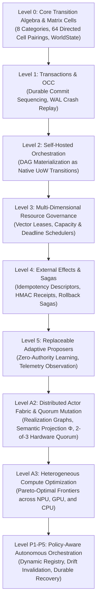

# Unit-of-Work (UoW) v2.0

[](https://github.com/NB11B/UoW-v2/actions)
[](https://opensource.org/licenses/MIT)
[](https://www.python.org/downloads/)
[](qualification/artifacts/final-physical-campaign-summary.json)

> **A typed, certifiable Unit-of-Work architecture for deterministic authority over flexible computation across heterogeneous distributed hardware.**

---

## Table of Contents

1. [Theoretical Architecture](#1-theoretical-architecture)
   - [The Unit-of-Work Formalism](#the-unit-of-work-formalism)
   - [The Core Authority Invariant](#the-core-authority-invariant)
   - [Theoretical Levels Hierarchy](#theoretical-levels-hierarchy)
2. [Clean API Quickstart & Guide](#2-clean-api-quickstart--guide)
   - [Installation](#installation)
   - [Level 0: Core Transition Algebra & Lifecycle](#level-0-core-transition-algebra--lifecycle)
   - [Level 1: OCC Transactions & WAL Crash Replay](#level-1-occ-transactions--wal-crash-replay)
   - [Level 2: Self-Hosted DAG Orchestration](#level-2-self-hosted-dag-orchestration)
   - [Level 3: Multi-Dimensional Resource Governance & Leases](#level-3-multi-dimensional-resource-governance--leases)
   - [Level 4: External Effects, Idempotency & Sagas](#level-4-external-effects-idempotency--sagas)
   - [Level 5: Replaceable & Adaptive Proposers](#level-5-replaceable--adaptive-proposers)
   - [Level A2: Distributed Actor Fabric & Quorum-Certified Mutation](#level-a2-distributed-actor-fabric--quorum-certified-mutation)
   - [Level P1–P5: Policy-Aware Autonomous Orchestration](#level-p1p5-policy-aware-autonomous-orchestration)
3. [Heterogeneous Hardware & Distributed Deployment](#3-heterogeneous-hardware--distributed-deployment)
   - [Target Hardware Architecture](#target-hardware-architecture)
   - [Node A: ESP32-S3 Dual-Core FreeRTOS Firmware](#node-a-esp32-s3-dual-core-freertos-firmware)
   - [Node B: Arduino UNO Q (STM32U585) Embedded Authority](#node-b-arduino-uno-q-stm32u585-embedded-authority)
   - [Node C: HTTP Authority Microservice](#node-c-http-authority-microservice)
   - [Accelerators: Intel AI Boost NPU & NVIDIA CUDA GPU](#accelerators-intel-ai-boost-npu--nvidia-cuda-gpu)
4. [Verification, Testing & Chain of Custody](#4-verification-testing--chain-of-custody)
   - [Running the Repository Suite](#running-the-repository-suite)
   - [Running the Full Physical Qualification Campaign](#running-the-full-physical-qualification-campaign)
   - [Cryptographic Provenance & Invariants](#cryptographic-provenance--invariants)

---

## 1. Theoretical Architecture

### The Unit-of-Work Formalism

Every unit of computational progress in the UoW architecture is an immutable, mathematically typed 7-tuple:

$$U = (H, \Gamma, M, R, B, E, T)$$

| Element | Formal Name | Description |
|:---:|---|---|
| **$H$** | **Header** | Identity, version, epoch, lineage ancestry, and immutable content fingerprint. |
| **$\Gamma$** | **Guards** | Preconditions over `WorldState` that must evaluate to `True` for legal execution. |
| **$M$** | **Mutations** | Deterministic state transition functions mapping $S_t \to S_{t+1}$. |
| **$R$** | **Routing** | Directed successor emission criteria ($\text{CONTINUE}, \text{HALT}, \text{DELEGATE}, \text{FAIL}$). |
| **$B$** | **Boundary** | Authority constraints, leases, and resource boundary requirements. |
| **$E$** | **Evidence** | Cryptographic hash links and witness obligations proving execution validity. |
| **$T$** | **Timing** | Local causal timing domain (strictly decoupled from any global wall clock). |

### The Core Authority Invariant

The fundamental principle governing all UoW systems is the separation of **proposal** from **authority**:

$$\boxed{\text{PROPOSE} \longrightarrow \text{CERTIFY} \longrightarrow \text{COMMIT}}$$

- **PROPOSE ($P_\theta(S_t) \to \pi_t$):** Candidate transitions may originate from anywhere: untrusted stochastic samplers, neural network policies (NPU/GPU), heuristic schedulers, distributed network agents, or external microservices. Proposers possess **zero authoritative mutation power**.
- **CERTIFY ($\text{CERTIFY}(\pi_t, S_t) \to \sigma_t$):** Authoritative validators verify guards, validate optimistic concurrency control (OCC) footprints, check lease legitimacy, and authenticate cryptographic signatures.
- **COMMIT ($\text{COMMIT}(\sigma_t, S_t) \to S_{t+1}$):** State is atomically advanced and recorded into an immutable, hash-linked write-ahead log (WAL) and evidence ledger.

### Theoretical Levels Hierarchy



1. **Level 0 — Core Primitives:** Pure transition contracts, 8 work categories, 64 directed semantic cells, immutable hash-bound `WorldState`, and evidence ledgers.
2. **Level 1 — OCC & Transactions:** Optimistic concurrency control, footprint validation, deterministic sequencing, write-ahead logging (WAL), and crash replay.
3. **Level 2 — Self-Hosted Orchestration:** Workflows modeled as DAGs where scheduler decisions and task completions are themselves first-class UoW transitions.
4. **Level 3 — Resource Governance:** Multi-dimensional resource tracking (CPU, GPU, NPU, memory), deterministic lease lifetimes, and capacity-aware scheduling policies.
5. **Level 4 — External Effects & Sagas:** Non-idempotent real-world interaction modeled via intent descriptors, cryptographic receipt authentication, and compensating rollback sagas.
6. **Level 5 — Replaceable Adaptive Proposers:** Machine learning and reinforcement policies operate through an abstract proposer seam without altering the state validation kernel.
7. **Level A2 — Composition & Quorum Mutation:** Semantic projection $\Phi(G, U)$ guaranteeing equivalence across realizations (sequential, parallel, accelerator, distributed quorum) and threshold multi-party quorum signatures (`RuntimeMutationQC`).
8. **Level A3 — Heterogeneous Compute Frontier:** Multi-objective cost, energy, and latency Pareto optimization.
9. **Level P1–P5 — Policy-Aware Architecture:** Dynamic versioned policy registries, prospective qualification, live drift detection, atomic requalification, and durable recovery with zero duplicate external effects.

---

## 2. Clean API Quickstart & Guide

### Installation

Requires Python 3.10+ (tested on Python 3.10, 3.11, 3.12, 3.13):

```bash
git clone https://github.com/NB11B/UoW-v2.git
cd UoW-v2
python -m pip install -e .
python -m pip install pytest
```

---

### Level 0: Core Transition Algebra & Lifecycle

Every atomic state change is expressed as a `UoW`, containing typed `Guard` and `Mutation` operations over a `WorldState`.

```python
from uow import (
    WorldState,
    make_uow,
    propose,
    certify,
    commit,
    GuardOp,
    MutationOp,
    WorkCategory,
)

# 1. Initialize an immutable WorldState
initial_state = WorldState({"balance": 100, "status": "ACTIVE"})

# 2. Construct a Unit of Work
uow = make_uow(
    uow_id="transfer_tx_001",
    guards=[
        ("balance", GuardOp.GREATER_EQUAL, 30),
        ("status", GuardOp.EQUAL, "ACTIVE"),
    ],
    mutations=[
        ("balance", MutationOp.SUBTRACT, 30),
        ("transfers_completed", MutationOp.ADD, 1),
    ],
    category=WorkCategory.TRANSACTION,
)

# 3. PROPOSE: Generate candidate transition proposal
proposal = propose(uow, initial_state)
assert proposal.is_valid

# 4. CERTIFY: Authoritatively verify guards and invariants
cert = certify(proposal, initial_state)
assert cert.is_certified

# 5. COMMIT: Atomically apply mutations and yield updated WorldState
new_state, record = commit(cert, initial_state)
print("Updated State:", new_state.to_dict())
# Output: {'balance': 70, 'status': 'ACTIVE', 'transfers_completed': 1}
```

---

### Level 1: OCC Transactions & WAL Crash Replay

UoW provides built-in Optimistic Concurrency Control (OCC) and Write-Ahead Logging (WAL) for transactional crash-recovery.

```python
from uow.transactions import (
    WALSequencer,
    create_transaction_descriptor,
    apply_transaction,
)
from uow import WorldState, MutationOp

state = WorldState({"account_A": 500, "account_B": 200})
sequencer = WALSequencer(wal_path="transactions.wal")

# Create transaction with explicit read/write footprint
tx = create_transaction_descriptor(
    tx_id="tx_transfer_01",
    read_keys=["account_A"],
    write_mutations=[
        ("account_A", MutationOp.SUBTRACT, 100),
        ("account_B", MutationOp.ADD, 100),
    ],
    expected_read_versions={"account_A": state.get_version("account_A")},
)

# Atomically commit and record to WAL
success, new_state, error = apply_transaction(tx, state, sequencer)
assert success
assert new_state["account_A"] == 400
assert new_state["account_B"] == 300

# Crash replay recovers authoritative state from the WAL
recovered_state = sequencer.replay_all(WorldState({"account_A": 500, "account_B": 200}))
assert recovered_state == new_state
```

---

### Level 2: Self-Hosted DAG Orchestration

Workflows are modeled as directed acyclic graphs where scheduling, dispatching, and completion are self-hosted UoW transitions.

```python
from uow.orchestration import (
    create_initial_orchestration_state,
    make_domain_task,
    run_orchestration,
)

# Define tasks with causal dependencies
task1 = make_domain_task(
    task_id="extract_features",
    dependencies=[],
    payload={"source": "telemetry.csv"},
)
task2 = make_domain_task(
    task_id="train_model",
    dependencies=["extract_features"],
    payload={"epochs": 10},
)
task3 = make_domain_task(
    task_id="publish_metrics",
    dependencies=["train_model"],
    payload={"target": "dashboard"},
)

# Execute the DAG through self-hosted UoW transitions
initial_orch = create_initial_orchestration_state([task1, task2, task3])
final_orch, ledger = run_orchestration(initial_orch)

assert final_orch.is_all_completed
print("Completed Tasks:", final_orch.completed_tasks)
```

---

### Level 3: Multi-Dimensional Resource Governance & Leases

Tasks acquire certified, authoritative leases over physical resources (CPU, GPU, NPU, memory).

```python
from uow.resources import (
    ResourceState,
    ResourceRequirement,
    ResourceBoundTask,
    CostEnergySchedulingPolicy,
    run_resource_orchestration,
)

# Define total physical node capacity
cluster_resources = ResourceState(
    capacities={
        "cpu_cores": 16.0,
        "gpu_vram_gb": 8.0,
        "npu_engines": 2.0,
    }
)

# Bind resource demands to tasks
npu_task = ResourceBoundTask(
    task_id="inference_batch",
    dependencies=[],
    resource_requirement=ResourceRequirement(
        demands={"cpu_cores": 2.0, "npu_engines": 1.0},
        lease_duration_ms=50.0,
    ),
)

# Schedule using energy/cost-aware scheduling policy
final_state, ledger = run_resource_orchestration(
    initial_resources=cluster_resources,
    tasks=[npu_task],
    policy=CostEnergySchedulingPolicy(),
)
```

---

### Level 4: External Effects, Idempotency & Sagas

External interactions (such as hardware actuators, external network APIs, or disk writes) are encapsulated in idempotency descriptors and reversible sagas.

```python
from uow.effects import (
    EffectDescriptor,
    SagaStep,
    SagaCoordinator,
    MockExternalClient,
)

client = MockExternalClient()
coordinator = SagaCoordinator(client=client)

# Define forward action and compensating rollback
step = SagaStep(
    step_id="provision_storage",
    forward_effect=EffectDescriptor(
        target_service="storage_svc",
        action="allocate",
        params={"volume_id": "vol_42", "size_gb": 100},
    ),
    compensation_effect=EffectDescriptor(
        target_service="storage_svc",
        action="deallocate",
        params={"volume_id": "vol_42"},
    ),
)

# Execute with automated atomic rollback upon failure
receipt = coordinator.execute_saga([step])
assert receipt.is_success
```

---

### Level 5: Replaceable & Adaptive Proposers

Machine learning models, heuristic algorithms, or external neural networks propose transitions via an abstract seam without acquiring authority.

```python
from uow.proposer import (
    PortableAdaptiveProposer,
    ProposerOrchestrationEngine,
    ModelIdentity,
)

# The adaptive proposer tracks runtime telemetry and adapts scheduling
proposer = PortableAdaptiveProposer(
    model_id=ModelIdentity(name="minsky_adaptive_v2", version="2.1.0"),
    alpha=0.1,  # Learning rate
)

engine = ProposerOrchestrationEngine(proposer=proposer)
final_state, trace = engine.execute_adaptive_workload(tasks=[...])
```

---

### Level A2: Distributed Actor Fabric & Quorum-Certified Mutation

In multi-node heterogeneous environments, runtime mutations require a Quorum Certificate (QC) verified across independent physical nodes.

```python
from uow.composition import (
    QuorumMutationCoordinator,
    RuntimeMutationProposal,
    assemble_mutation_qc,
    verify_mutation_qc,
    AuthorityClass,
)

coordinator = QuorumMutationCoordinator(
    quorum_threshold=2,  # 2-of-3 threshold consensus
    known_authorities=["authority_esp32", "authority_uno_q", "authority_node_c"],
)

# Propose a topological mutation
proposal = RuntimeMutationProposal(
    proposal_id="mut_epoch_004",
    parent_contract_hash="7b17c150...",
    candidate_graph_hash="ce64760a...",
    epoch=4,
)

# Collect cryptographic threshold signatures from physical authorities
# (Node A: ESP32, Node B: UNO Q, Node C: Host C)
votes = [
    coordinator.vote_authority("authority_esp32", proposal, secret_key=b"k1"),
    coordinator.vote_authority("authority_uno_q", proposal, secret_key=b"k2"),
]

# Assemble and verify Quorum Certificate (QC)
qc = assemble_mutation_qc(proposal, votes, threshold=2)
assert verify_mutation_qc(qc, known_authorities=coordinator.known_authorities)
print("Quorum Certificate Certified:", qc.qc_id)
```

---

### Level P1–P5: Policy-Aware Autonomous Orchestration

Autonomous policy-aware orchestration decouples execution policies from the core engine:

```python
from uow.policy import (
    PolicyRegistry,
    PolicyAwareOrchestrator,
    PolicyDriftDetector,
)

# Register qualified, versioned policies
registry = PolicyRegistry()
# Autonomous orchestrator detects live drift and triggers hot-replacement
orchestrator = PolicyAwareOrchestrator(
    registry=registry,
    drift_detector=PolicyDriftDetector(latency_threshold_ms=15.0),
)
```

---

## 3. Heterogeneous Hardware & Distributed Deployment

The UoW reference implementation coordinates across a 6-tier heterogeneous hardware fabric:

```
+---------------------------------------------------------------------------------------+
|                                    UoW Host System                                    |
|   +--------------------------+  +--------------------------+  +-------------------+   |
|   |   Intel AI Boost NPU     |  | NVIDIA GeForce RTX GPU   |  |   x86_64 CPU      |   |
|   | (OpenVINO ONNX Runtime)  |  |   (PyTorch CUDA Driver)  |  | (Deterministic)   |   |
|   +--------------------------+  +--------------------------+  +-------------------+   |
+------------------------------+------------------------------+-------------------------+
                               |              |
                      USB CDC  |              | ADB / Serial
                      (COM10)  |              | (COM5)
                               v              v
               +-----------------------+  +-----------------------+
               | Node A: ESP32-S3      |  | Node B: Arduino UNO Q |
               | Dual-Core FreeRTOS    |  | STM32U585 Micro       |
               +-----------------------+  +-----------------------+
                               \              /
                                \   HTTP     /
                                 v  :9527   v
                        +---------------------------+
                        | Node C: Authority Service |
                        | (Distributed 2-of-3 Quorum)|
                        +---------------------------+
```

### Node A: ESP32-S3 Dual-Core FreeRTOS Firmware

The ESP32-S3 authority runs native C++ FreeRTOS firmware (`qualification/embedded/esp32_dual_core`):
- **Core 0:** Protocol parsing, cryptographic validation, and command framing.
- **Core 1:** Deterministic state machine, transaction reservation, and commit logging.

```bash
# Build and flash via PlatformIO
cd qualification/embedded/esp32_dual_core
pio run -e esp32s3_p0_a1 -t upload --upload-port COM10
```

### Node B: Arduino UNO Q (STM32U585) Embedded Authority

The Arduino UNO Q authority runs embedded firmware (`qualification/embedded/uno_q_authority`):

```bash
# Build and upload via ADB / arduino-cli
adb push qualification/embedded/uno_q_authority /tmp/
adb shell "arduino-cli compile --fqbn arduino:zephyr:unoq /tmp/uno_q_authority"
adb shell "arduino-cli upload -p /dev/ttyACM0 --fqbn arduino:zephyr:unoq /tmp/uno_q_authority"
```

### Node C: HTTP Authority Microservice

The third authority node runs an independent HTTP service:

```bash
python qualification/distributed_authority/authority_service_c.py --port 9527
```

### Accelerators: Intel AI Boost NPU & NVIDIA CUDA GPU

The runtime dynamically schedules neural proposal models across:
- **Intel AI Boost NPU:** Native OpenVINO execution (`integrations/openvino_npu`).
- **NVIDIA GPU:** PyTorch CUDA device acceleration.
- **CPU:** Deterministic fallback when accelerators are undergoing dynamic hot-swaps.

---

## 4. Verification, Testing & Chain of Custody

### Running the Repository Suite

Run the 280-test automated verification suite:

```bash
python -m pytest -q
```

All 280 tests pass across all architectural modules:
- `tests/test_contracts.py`: Core algebraic invariant tests
- `tests/test_timing_independence.py`: 1,000-run clock drift perturbation tests
- `tests/test_universal_computation.py`: Minsky two-counter universal kernel lowering
- `tests/test_composition_*.py`: Actor fabric, network partitions, and quorum mutation
- `tests/test_npu_*.py`: OpenVINO NPU adaptive proposer and dynamic hot-swap failovers
- `tests/test_policy_orchestrator.py`: P1–P5 policy-aware orchestrator invariants

---

### Running the Full Physical Qualification Campaign

The complete end-to-end physical campaign exercises the live ESP32-S3, Arduino UNO Q, Authority Node C, Intel NPU, and NVIDIA GPU:

```bash
python qualification/final_physical_campaign.py --execute
```

This campaign executes 9 distinct phases:
- **Phase F0:** Source code cryptographic attestation (18/18 blobs) & live physical flashing of ESP32 and UNO Q.
- **Phase F1:** Standalone diagnostics & 2-of-3 physical quorum verification.
- **Phase F2:** Heterogeneous router qualification across 13 capability gates (G0–G12), 2,400 SHA-256 evidence links, and 4 live adversarial rollbacks.
- **Phase F3:** Intel AI Boost NPU adaptive execution.
- **Phase F4:** Dynamic NPU $\leftrightarrow$ GPU $\leftrightarrow$ CPU hot-swap and recovery.
- **Phase F5:** Continuous drift adaptation.
- **Phase F6:** Adaptive physical quorum rebalancing.
- **Phase F7:** Frozen A3 oracle regression test.
- **Phase F8:** Exact candidate shadow seal (279 tests) and P1–P5 policy suite (44 tests).

---

### Cryptographic Provenance & Invariants

The campaign seals an immutable chain of custody captured in [`final-physical-campaign-summary.json`](qualification/artifacts/final-physical-campaign-summary.json):

```json
{
  "schema_version": "uow-final-physical-campaign-v1.0",
  "candidate_ref": "archive/uow-reduction-software-candidate-v4",
  "candidate_commit": "9d95c11f4b09c34769e1f3a1e6d7b915291d43c8",
  "passed": true,
  "physical_claims_promotable": true
}
```

- **ESP32 Firmware SHA-256:** `900e2942aaceb7bc9f98a40d601381d8d4a25aa08199a50a9637f232b44b4208`
- **UNO Q Firmware ELF SHA-256:** `f2ae3b1983e52fb1ed416fe2ab6ca7f81a641cad9addefa2a75969fde6148910`
- **Mandatory Invariants:** 13/13 satisfied
- **Evidence Verification:** 2,400/2,400 cryptographic links intact

---

## License

This project is licensed under the MIT License — see the [LICENSE](LICENSE) file for details.
