# Unit-of-Work (UoW) v2.0

[](https://github.com/NB11B/UoW-v2/actions)
[](https://opensource.org/licenses/MIT)
[](https://www.python.org/downloads/)
[](qualification/artifacts/final-physical-campaign-summary.json)

> **A typed, certifiable Unit-of-Work architecture for deterministic authority over flexible computation across heterogeneous distributed hardware.**

---

## Table of Contents

1. [Theoretical Architecture](#1-theoretical-architecture)
   - [The Unit-of-Work Formalism](#the-unit-of-work-formalism)
   - [The Core Authority Invariant](#the-core-authority-invariant)
   - [Current Architectural Hierarchy](#current-architectural-hierarchy)
2. [Clean API Quickstart & Guide](#2-clean-api-quickstart--guide)
   - [Installation](#installation)
   - [Level 0: Core Transition Algebra & Lifecycle](#level-0-core-transition-algebra--lifecycle)
   - [Level 1: OCC Transactions & WAL Crash Replay](#level-1-occ-transactions--wal-crash-replay)
   - [Level 2: Self-Hosted DAG Orchestration](#level-2-self-hosted-dag-orchestration)
   - [Level 3: Multi-Dimensional Resource Governance & Leases](#level-3-multi-dimensional-resource-governance--leases)
   - [Level 4: External Effects, Idempotency & Sagas](#level-4-external-effects-idempotency--sagas)
   - [Level 5: Replaceable & Adaptive Proposers](#level-5-replaceable--adaptive-proposers)
   - [Level 6: Recursive Composition & System-as-Actor](#level-6-recursive-composition--system-as-actor)
   - [Level 7: Distributed Authority & Quorum-Certified Mutation](#level-7-distributed-authority--quorum-certified-mutation)
   - [Level 8: Bounded Semantic Mediation & Governed Egress](#level-8-bounded-semantic-mediation--governed-egress)
   - [Level 9: Design / Policy Plane](#level-9-design--policy-plane)
3. [Heterogeneous Hardware & Distributed Deployment](#3-heterogeneous-hardware--distributed-deployment)
   - [Target Hardware Architecture](#target-hardware-architecture)
   - [Node A: ESP32-S3 Dual-Core FreeRTOS Firmware](#node-a-esp32-s3-dual-core-freertos-firmware)
   - [Node B: Arduino UNO Q (STM32U585) Embedded Authority](#node-b-arduino-uno-q-stm32u585-embedded-authority)
   - [Node C: HTTP Authority Microservice](#node-c-http-authority-microservice)
   - [Accelerators: Intel AI Boost NPU & NVIDIA CUDA GPU](#accelerators-intel-ai-boost-npu--nvidia-cuda-gpu)
4. [Verification, Testing & Chain of Custody](#4-verification-testing--chain-of-custody)
   - [Running the Repository Suite](#running-the-repository-suite)
   - [Running the Full Physical Qualification Campaign](#running-the-full-physical-qualification-campaign)
   - [Cryptographic Provenance & Invariants](#cryptographic-provenance--invariants)

---

## 1. Theoretical Architecture

### The Unit-of-Work Formalism

Every unit of computational progress in the UoW architecture is an immutable, mathematically typed 7-tuple:

$$U = (H, \Gamma, M, R, B, E, T)$$

| Element | Formal Name | Description |
|:---:|---|---|
| **$H$** | **Header** | Identity, version, epoch, lineage ancestry, and immutable content fingerprint. |
| **$\Gamma$** | **Guards** | Preconditions over `WorldState` that must evaluate to `True` for legal execution. |
| **$M$** | **Mutations** | Deterministic state transition functions mapping $S_t \to S_{t+1}$. |
| **$R$** | **Routing** | Directed successor emission criteria ($\text{CONTINUE}, \text{HALT}, \text{DELEGATE}, \text{FAIL}$). |
| **$B$** | **Boundary** | Authority constraints, leases, and resource boundary requirements. |
| **$E$** | **Evidence** | Cryptographic hash links and witness obligations proving execution validity. |
| **$T$** | **Timing** | Local causal timing domain (strictly decoupled from any global wall clock). |

### The Core Authority Invariant

The fundamental principle governing all UoW systems is the separation of **proposal** from **authority**:

$$\boxed{\text{PROPOSE} \longrightarrow \text{CERTIFY} \longrightarrow \text{COMMIT}}$$

- **PROPOSE ($P_\theta(S_t) \to \pi_t$):** Candidate transitions may originate from anywhere: untrusted stochastic samplers, neural network policies (NPU/GPU), heuristic schedulers, distributed network agents, or external microservices. Proposers possess **zero authoritative mutation power**.
- **CERTIFY ($\text{CERTIFY}(\pi_t, S_t) \to \sigma_t$):** Authoritative validators verify guards, validate optimistic concurrency control (OCC) footprints, check lease legitimacy, and authenticate cryptographic signatures.
- **COMMIT ($\text{COMMIT}(\sigma_t, S_t) \to S_{t+1}$):** State is atomically advanced and recorded into an immutable, hash-linked write-ahead log (WAL) and evidence ledger.

### Current Architectural Hierarchy

The hierarchy below describes the architecture, not the promotion status of individual Python symbols. Higher-level capabilities may remain qualification or integration surfaces until explicitly promoted into the frozen public API.

```mermaid
graph TD
    L0["Level 0: Core UoW Contract<br/>(Typed Work · Guards · Evidence · PROPOSE → CERTIFY → COMMIT)"] --> L1["Level 1: Transactional Authority<br/>(OCC · Durable Sequencing · WAL · Replay)"]
    L1 --> L2["Level 2: Self-Hosted Orchestration<br/>(Scheduling and Completion as Governed UoW Transitions)"]
    L2 --> L3["Level 3: Resource Governance<br/>(CPU · GPU · NPU · Memory · Energy · Leases)"]
    L3 --> L4["Level 4: External Effects<br/>(Idempotency · Certified Receipts · Compensation Sagas)"]
    L4 --> L5["Level 5: Replaceable Intelligence<br/>(Rules · Heuristics · Learned and Adaptive Proposers)"]
    L5 --> L6["Level 6: Recursive Composition<br/>(Certified System-as-Actor · Boundary Contraction · Evidence Chaining)"]
    L6 --> L7["Level 7: Distributed Authority<br/>(Delegation · Quorum-Certified Mutation · Failover)"]
    L7 --> L8["Level 8: Semantic Mediation<br/>(Intent Compilation · Ambiguity/Capability Resolution · Zero Execution Authority)"]
    L8 --> L9["Level 9: Design / Policy Plane<br/>(Goals · Modes · Policy Transitions · Drift / Recovery)"]
    L9 --> L10["Level 10: Polyglot Runtime Substrate<br/>(Interoperability · Native Conformance · Capability-Oriented Execution)"]
    L10 --> L11["Level 11: Governed Lifecycle Semantics<br/>(Guarded Operational State · Containment · Recovery · Recertification)"]
```



1. **Level 0 — Core UoW Contract:** Pure transition contracts, semantic work classification, immutable hash-bound state, evidence, and the authority invariant `PROPOSE → CERTIFY → COMMIT`.
2. **Level 1 — Transactional Authority:** Optimistic concurrency control, deterministic commit sequencing, write-ahead logging, crash replay, and serializable state advancement.
3. **Level 2 — Self-Hosted Orchestration:** Scheduler, dispatch, and completion decisions are represented as governed work rather than privileged control-plane mutation.
4. **Level 3 — Resource Governance:** Multi-dimensional resource requirements, leases, capacity, deadlines, cost, and energy constraints remain subject to deterministic legality checks.
5. **Level 4 — External Effects:** Non-idempotent real-world interactions are separated from internal commit through durable intent, idempotency, receipt certification, and compensation.
6. **Level 5 — Replaceable Intelligence:** Deterministic rules, heuristics, learned models, and adaptive policies may change proposals without acquiring authoritative commit power.
7. **Level 6 — Recursive Composition:** A qualified child runtime may be contracted to a certified parent-visible boundary and treated as a single governed actor without flattening child-local authority or provenance.
8. **Level 7 — Distributed Authority:** Authority may be centralized or distributed; delegation, quorum-certified mutation, partition behavior, and failover remain explicit governed operations.
9. **Level 8 — Semantic Mediation:** Natural-language or other probabilistic input is compiled into machine-routable intent while preserving source, ambiguity, provenance, and the rule that mediation has no independent execution authority.
10. **Level 9 — Design / Policy Plane:** System design, goals, operating modes, policy activation, drift detection, replacement, escalation, and durable recovery are represented as machine-readable governed state.
11. **Level 10 — Polyglot Runtime Substrate:** The UoW contract is defined independently of a single implementation language or device; conformance governs interchangeable native realizations.
12. **Level 11 — Governed Lifecycle Semantics:** Operational status, failure, containment, remediation, and recertification are modeled as guarded state transitions rather than informal control flow.

### Cross-Cutting Realization Substrate

Heterogeneous realization spans the hierarchy rather than forming a separate authority level. CPU, GPU, NPU, embedded MCU, network services, and distributed actors may realize the same required work while remaining subject to the same certified contract.

### Qualification Lineage and API Status

Earlier **A2/A3** and **P1–P5** milestones remain part of the qualification lineage: A2 established distributed actor/composition semantics, A3 qualified heterogeneous compute optimization, and P1–P5 qualified policy discovery, promotion, drift/replacement, distributed authority, and durable recovery. Those research labels map into the consolidated hierarchy above; they are not separate authority models.

The top-level `uow` package remains a compatibility facade with a frozen manifest. Qualification, research, and integration surfaces do **not** become public API merely because an experiment passes; promotion requires an explicit compatibility/versioning decision.


### Current Qualification Checkpoint

The current `main` line integrates both the recursive-composition/operational-grammar qualification program (Phase 10) and the bounded bidirectional semantic boundary (Milestones H0–H7) through the sealed release [`semantic-harness-v1-qualified`](https://github.com/NB11B/UoW-v2/releases/tag/semantic-harness-v1-qualified). The research history is retained in Git rather than flattened into the public API, with supporting synthesis reports under `docs/`, executable campaigns under `qualification/`, and pinned result artifacts under `qualification/artifacts/`.

Current integrated verification status:

- **Repository CI / Full Test Suite:** **542 passed tests** (0 failures, 0 regressions in ~52s).
- **Core UoW Kernel & Distributed Suites:** 412 tests passed.
- **Level 8 Semantic Mediation Suite (H0–H7):** 108 tests passed across 7 test modules.
- **Continuous API & User Guide Verification:** 22 tests passed across 2 dedicated verification harnesses.
- **Closure shadow:** 279 / 279 tests passing (`architecture/shadow/python/tests`).
- **Claim lint:** 42 registered qualification claims passing (`qualification.claim_lint`).
- **System acceptance smoke:** 31 / 31 assertions passing (`qualification/uow_system_acceptance.py`).
- **Semantic qualification campaigns (H4–H7):** All passing with 0% system unsafe errors ($U_{\text{system}} = 0.0\%$), monotonic residual frontier reduction ($\text{resolved}_t \cap F_{P, t+1} = \emptyset$), zero egress drift ($\epsilon_{\text{drift}} = 0.0$), and 15-fault matrix conformance.
- **Public API:** Frozen top-level compatibility facade strictly preserved at 200 symbols (`src/uow/__init__.py`). Level 8 functionality is cleanly namespaced under `uow.semantic`.

The definitive semantic subsystem synthesis is documented in [`SEMANTIC_HARNESS_H0_H7_FINAL_SYNTHESIS.md`](docs/SEMANTIC_HARNESS_H0_H7_FINAL_SYNTHESIS.md), and prior governance-kernel synthesis is in [`COMMON_GOVERNANCE_KERNEL_EXPERIMENT.md`](docs/COMMON_GOVERNANCE_KERNEL_EXPERIMENT.md).

---

## 2. Clean API Quickstart & Guide

> 📖 **Comprehensive User & Operator Guide:** For an exhaustive guide, architecture deep dives, hardware spectrum deployment (host accelerators, ESP32-S3, and Arduino edge LLM harnesses), and anti-pattern reviews, see [`docs/USER_GUIDE.md`](docs/USER_GUIDE.md). All demos and tests in the user guide are verified automatically by CI.

### Installation

Requires Python 3.10+ (tested on Python 3.10, 3.11, 3.12, 3.13):

```bash
git clone https://github.com/NB11B/UoW-v2.git
cd UoW-v2
python -m pip install -e .
python -m pip install pytest
```

---

### Level 0: Core Transition Algebra & Lifecycle

Every atomic state change is expressed as a `UoW`, containing typed `Guard` and `Mutation` operations over a `WorldState`.

```python
from uow import (
    WorldState,
    make_uow,
    propose,
    certify,
    commit,
    Route,
    Guard,
    GuardOp,
    Mutation,
    MutationOp,
    Successor,
    MatrixCell,
    WorkCategory,
)

# 1. Initialize an immutable WorldState
initial_state = WorldState(attributes={"balance": 100, "status": "ACTIVE", "transfers_completed": 0})

# 2. Construct a Unit of Work U = (H, Gamma, M, R, B, E, T)
uow = make_uow(
    "transfer_tx_001",
    routes=[
        Route(
            guard=Guard(GuardOp.GTE, "balance", 30),
            mutations=(
                Mutation(MutationOp.SUB, "balance", 30),
                Mutation(MutationOp.ADD, "transfers_completed", 1),
            ),
            successor=Successor.halt(),
        )
    ],
    matrix_cell=MatrixCell(WorkCategory.PROCESSES, WorkCategory.DATA),
)

# 3. PROPOSE: Generate candidate transition proposal
proposal = propose(uow, initial_state)
assert proposal.uow_id == "transfer_tx_001"

# 4. CERTIFY: Authoritatively verify guards and invariants
cert = certify(uow, initial_state, proposal)
assert cert.is_valid

# 5. COMMIT: Atomically apply mutations and record evidence
new_state, record = commit(uow, initial_state, proposal, cert, prev_evidence_hash="0" * 64, step_number=1)
print("Updated State:", new_state.to_dict())
# Output: {'balance': 70, 'status': 'ACTIVE', 'transfers_completed': 1}
assert new_state.require("balance") == 70
```

---

### Level 1: OCC Transactions & WAL Crash Replay

UoW provides built-in Optimistic Concurrency Control (OCC) and Write-Ahead Logging (WAL) for transactional crash-recovery.

```python
from uow.transactions import (
    DeterministicSequencer,
    create_transaction_descriptor,
    validate_occ,
)
from uow import (
    WorldState,
    Route,
    Guard,
    GuardOp,
    Mutation,
    MutationOp,
    Successor,
    make_uow,
    propose,
    certify,
)

state = WorldState(attributes={"account_A": 500, "account_B": 200})
sequencer = DeterministicSequencer(state)

# Define transactional UoW
tx_uow = make_uow(
    "tx_transfer_01",
    routes=[
        Route(
            guard=Guard(GuardOp.ALWAYS),
            mutations=(
                Mutation(MutationOp.SUB, "account_A", 100),
                Mutation(MutationOp.ADD, "account_B", 100),
            ),
            successor=Successor.halt(),
        )
    ],
)

# Proposal, transaction descriptor footprint projection, and certification
proposal = propose(tx_uow, state)
tx_desc = create_transaction_descriptor(tx_uow, state)
cert = certify(tx_uow, state, proposal)

# Concurrency validation and atomic sequencer commit
is_valid, hazard, _ = validate_occ(state, tx_desc)
assert is_valid
new_state, evidence = sequencer.commit(tx_uow, proposal, tx_desc, cert)
assert new_state.require("account_A") == 400
assert new_state.require("account_B") == 300
```

---

### Level 2: Self-Hosted DAG Orchestration

Workflows are modeled as directed acyclic graphs where scheduling, dispatching, and completion are self-hosted UoW transitions.

```python
from uow.orchestration import (
    create_initial_orchestration_state,
    make_domain_task,
    run_orchestration,
)
from uow import Route, Guard, GuardOp, Mutation, MutationOp

# Define tasks with causal dependencies
task_a = make_domain_task("extract_features", [Route(Guard(GuardOp.ALWAYS), (Mutation(MutationOp.ADD, "features_ready", 1),))])
task_b = make_domain_task("train_model", [Route(Guard(GuardOp.ALWAYS), (Mutation(MutationOp.ADD, "model_trained", 1),))])

# Execute the DAG through self-hosted UoW transitions
initial_orch = create_initial_orchestration_state(
    queue=["extract_features", "train_model"],
    dependencies={"train_model": ["extract_features"]},
    attributes={"features_ready": 0, "model_trained": 0},
)
final_orch, sequencer = run_orchestration(
    tasks={"extract_features": task_a, "train_model": task_b},
    initial_state=initial_orch,
)

assert final_orch.status == "HALTED"
assert final_orch.require("features_ready") == 1
assert final_orch.require("model_trained") == 1
```

---

### Level 3: Multi-Dimensional Resource Governance & Leases

Tasks acquire certified, authoritative leases over physical resources (CPU, GPU, NPU, memory).

```python
from uow.resources import (
    ResourceState,
    ResourceRequirement,
    make_resource_domain_task,
    set_authoritative_resource_state,
    run_resource_orchestration,
    FIFOSchedulingPolicy,
    get_authoritative_resource_state,
)
from uow.orchestration import create_initial_orchestration_state
from uow import Route, Guard, GuardOp, Mutation, MutationOp

# Define total physical node capacity
cluster_resources = ResourceState(capacities={"cpu_cores": 16.0, "ram_units": 16.0, "gpu_slots": 2})

# Bind resource demands to tasks
npu_task = make_resource_domain_task(
    "inference_batch",
    [Route(Guard(GuardOp.ALWAYS), (Mutation(MutationOp.ADD, "inferences", 10),))],
    requirement=ResourceRequirement(cpu_cores=2, ram_units=4),
)

# Schedule using energy/cost-aware or FIFO scheduling policy
initial_base = create_initial_orchestration_state(["inference_batch"], {}, attributes={"inferences": 0})
initial_state = set_authoritative_resource_state(initial_base, cluster_resources)
final_state, seq = run_resource_orchestration({"inference_batch": npu_task}, initial_state, FIFOSchedulingPolicy())

assert final_state.require("inferences") == 10
assert len(get_authoritative_resource_state(final_state).leases) == 0
```

---

### Level 4: External Effects, Idempotency & Sagas

External interactions (such as hardware actuators, external network APIs, or disk writes) are encapsulated in idempotency descriptors and reversible sagas.

```python
from uow.effects import (
    EffectRunner,
    SagaStep,
    SagaCoordinator,
    MockExternalClient,
    create_effect_descriptor,
)
from uow.transactions import DeterministicSequencer
from uow import WorldState

client = MockExternalClient()
sequencer = DeterministicSequencer(WorldState(attributes={}))
runner = EffectRunner(sequencer, client)
coordinator = SagaCoordinator(runner)

# Define forward action and compensating rollback
step = SagaStep(
    "provision_storage",
    lambda state: create_effect_descriptor(
        uow_id="provision_storage",
        pre_state_hash=state.state_hash,
        intent="allocate_volume",
        request={"volume_id": "vol_42", "size_gb": 100},
        compensation_intent="deallocate_volume",
        compensation_request={"volume_id": "vol_42"},
    ),
)

# Execute with automated atomic rollback upon failure
coordinator.execute_saga([step], saga_id="storage_saga_01")
assert len(client.call_log) > 0
```

---

### Level 5: Replaceable & Adaptive Proposers

Machine learning models, heuristic algorithms, or external neural networks propose transitions via an abstract seam without acquiring authority.

```python
from uow.proposer import (
    PortableAdaptiveProposer,
    ProposerOrchestrationEngine,
    ModelIdentity,
)

# The adaptive proposer tracks runtime telemetry and adapts scheduling
proposer = PortableAdaptiveProposer(
    model_id=ModelIdentity(name="minsky_adaptive_v2", version="2.1.0"),
    alpha=0.1,  # Learning rate
)

engine = ProposerOrchestrationEngine(proposer=proposer)
final_state, trace = engine.execute_adaptive_workload(tasks=[...])
```

---

### Level 6: Recursive Composition & System-as-Actor

A qualified child runtime can be projected through a certified composition boundary and exposed to its parent as a single governed actor. Child-local authority and provenance remain inside the child boundary; the parent consumes only the certified surface.

```python
from uow.composition.boundary import (
    certify_composition_boundary,
    verify_composition_boundary,
)
from uow.implementations.composition.actor_execution import CertifiedRuntimeActor

# Certify the child's exported realization against its parent contract.
boundary_cert = certify_composition_boundary(
    "child-runtime",
    child_graph,
    child_contract,
)
assert boundary_cert.is_accepted
assert verify_composition_boundary(boundary_cert, child_graph, child_contract)

# The certified runtime can then be registered as one parent-visible actor.
child_actor = CertifiedRuntimeActor(
    surface_id=boundary_cert.subject_id,
    runtime=child_runtime,
    boundary_certificate=boundary_cert,
)
```

This preserves the recursive rule:

[
oxed{	ext{certify child internals} 
ightarrow 	ext{contract boundary} 
ightarrow 	ext{project parent-visible actor}}
]

---

### Level 7: Distributed Authority & Quorum-Certified Mutation

This section corresponds to the earlier A2 qualification lineage. In multi-node heterogeneous environments, runtime mutations require a Quorum Certificate (QC) verified across independent physical nodes.

```python
from uow.composition import (
    QuorumMutationCoordinator,
    assemble_mutation_qc,
)
from uow import ActorBinding, AuthoritativeHistory

# 1. Initialize Quorum Mutation Coordinator across physical authorities
coordinator = QuorumMutationCoordinator(
    parent_contract=parent_contract,
    active_graph=baseline_graph,
    active_binding=baseline_binding,
    history=AuthoritativeHistory(),
    authority_keys={"authority_esp32": "k1", "authority_uno_q": "k2", "authority_node_c": "k3"},
    generation=0,
    quorum_threshold=2,
)

# 2. Propose mutation and collect cryptographic threshold votes
proposal = coordinator.propose_mutation("npu_proposer", candidate_graph, candidate_binding)
votes = coordinator.collect_votes(proposal)

# 3. Assemble Quorum Certificate (QC) and atomically apply mutation
qc, msg = assemble_mutation_qc(proposal, votes[:2], threshold=2)
ok, status = coordinator.apply_mutation(qc, candidate_graph, candidate_binding)
assert ok is True and status == "MUTATION_COMMITTED"
assert coordinator.generation == 1
```

---

### Level 8: Bounded Semantic Mediation & Governed Egress

This section corresponds to the H0–H7 qualification lineage. Natural-language and perceptual signals are compiled into machine-routable intent representations without granting execution or state-mutation authority. The compiled intent must flow through the canonical `PROPOSE → CERTIFY → COMMIT` boundary, and egress renderings are verified against round-trip semantic drift ($\epsilon_{\text{egress-drift}} = 0$):

```python
from uow import WorldState, DeterministicSequencer
from uow.semantic import (
    IngressContext,
    SemanticHarness,
    SemanticRequirement,
    SemanticDisposition,
    DefaultSemanticAdmissibilityValidator,
    SemanticApplicationAdapter,
    TransferUoWCompiler,
    GovernedEgressEngine,
    RecipientProfile,
)

# 1. State and Ingress Context (Minimal deterministic context projection)
state = WorldState(attributes={"default_operator": "transfer", "default_quantity": 10})
ingress = IngressContext(principal_id="user-1", session_id="s1", channel="text", metadata={"recipient": "Bob"})

# 2. Bounded interpretation with deterministic primacy (beta_D = 0)
harness = SemanticHarness(admissibility_validator=DefaultSemanticAdmissibilityValidator())
result = harness.interpret(
    "Execute standard transfer",
    state=state,
    ingress=ingress,
    requirements=(
        SemanticRequirement("operator", state_key="default_operator"),
        SemanticRequirement("quantity", state_key="default_quantity"),
        SemanticRequirement("recipient", ingress_key="recipient"),
    ),
)
assert result.disposition is SemanticDisposition.YES
assert result.intent is not None

# 3. Deterministic compilation into governed UoW execution
# (Semantic mediation has ZERO direct mutation authority; mutation requires ApplicationSpine)
adapter = SemanticApplicationAdapter()
prepared = adapter.prepare(result, state, TransferUoWCompiler())
sequencer = DeterministicSequencer(state)
app_res = adapter.execute(prepared, sequencer)
assert app_res.state.attributes["transfers.Bob"] == 10

# 4. Governed Egress with Zero-Drift Verification (parse(render(I_B)) == I_B)
egress_engine = GovernedEgressEngine()
egress = egress_engine.emit(result, RecipientProfile.default_human(), status="COMMITTED")
assert egress.mode == "DETERMINISTIC"
print("Delivered Output:", egress.text)
# Output: TRANSFER committed: quantity=10, recipient=Bob.
```

---

### Level 9: Design / Policy Plane

This section corresponds to the earlier P1–P5 qualification lineage. Autonomous policy-aware orchestration decouples execution policies from the core engine:

```python
from uow.policy import (
    PolicyRegistry,
    PolicyResolver,
    DiscoveryEngine,
    QualificationEngine,
    DriftMonitor,
)

# Register qualified, versioned policies
registry = PolicyRegistry()
resolver = PolicyResolver(registry)
discovery = DiscoveryEngine()
qualifier = QualificationEngine(registry)
drift_monitor = DriftMonitor(registry=registry)

assert registry.total_policies == 0
```

---

## 3. Heterogeneous Hardware & Distributed Deployment

The UoW reference implementation coordinates across a 6-tier heterogeneous hardware fabric:

```
+---------------------------------------------------------------------------------------+
|                                    UoW Host System                                    |
|   +--------------------------+  +--------------------------+  +-------------------+   |
|   |   Intel AI Boost NPU     |  | NVIDIA GeForce RTX GPU   |  |   x86_64 CPU      |   |
|   | (OpenVINO ONNX Runtime)  |  |   (PyTorch CUDA Driver)  |  | (Deterministic)   |   |
|   +--------------------------+  +--------------------------+  +-------------------+   |
+------------------------------+------------------------------+-------------------------+
                               |              |
                      USB CDC  |              | ADB / Serial
                      (COM10)  |              | (COM5)
                               v              v
               +-----------------------+  +-----------------------+
               | Node A: ESP32-S3      |  | Node B: Arduino UNO Q |
               | Dual-Core FreeRTOS    |  | STM32U585 Micro       |
               +-----------------------+  +-----------------------+
                               \              /
                                \   HTTP     /
                                 v  :9527   v
                        +---------------------------+
                        | Node C: Authority Service |
                        | (Distributed 2-of-3 Quorum)|
                        +---------------------------+
```

### Node A: ESP32-S3 Dual-Core FreeRTOS Firmware

The ESP32-S3 authority runs native C++ FreeRTOS firmware (`qualification/embedded/esp32_dual_core`):
- **Core 0:** Protocol parsing, cryptographic validation, and command framing.
- **Core 1:** Deterministic state machine, transaction reservation, and commit logging.

```bash
# Build and flash via PlatformIO
cd qualification/embedded/esp32_dual_core
pio run -e esp32s3_p0_a1 -t upload --upload-port COM10
```

### Node B: Arduino UNO Q (STM32U585) Embedded Authority

The Arduino UNO Q authority runs embedded firmware (`qualification/embedded/uno_q_authority`):

```bash
# Build and upload via ADB / arduino-cli
adb push qualification/embedded/uno_q_authority /tmp/
adb shell "arduino-cli compile --fqbn arduino:zephyr:unoq /tmp/uno_q_authority"
adb shell "arduino-cli upload -p /dev/ttyACM0 --fqbn arduino:zephyr:unoq /tmp/uno_q_authority"
```

### Node C: HTTP Authority Microservice

The third authority node runs an independent HTTP service:

```bash
python qualification/distributed_authority/authority_service_c.py --port 9527
```

### Accelerators: Intel AI Boost NPU & NVIDIA CUDA GPU

The runtime dynamically schedules neural proposal models across:
- **Intel AI Boost NPU:** Native OpenVINO execution (`integrations/openvino_npu`).
- **NVIDIA GPU:** PyTorch CUDA device acceleration.
- **CPU:** Deterministic fallback when accelerators are undergoing dynamic hot-swaps.

---

## 4. Verification, Testing & Chain of Custody

### Running the Repository Suite

Run the automated verification suite:

```bash
python -m pytest -q
```

The suite covers the architectural modules below; the exact test count evolves as qualified capabilities are integrated and the current branch/CI result is authoritative:
- `tests/test_contracts.py`: Core algebraic invariant tests
- `tests/test_timing_independence.py`: 1,000-run clock drift perturbation tests
- `tests/test_universal_computation.py`: Minsky two-counter universal kernel lowering
- `tests/test_composition_*.py`: Actor fabric, network partitions, and quorum mutation
- `tests/test_npu_*.py`: OpenVINO NPU adaptive proposer and dynamic hot-swap failovers
- `tests/test_policy_orchestrator.py`: P1–P5 policy-aware orchestrator invariants
- `tests/test_semantic_*.py`, `tests/test_h*.py`: Level 8 bounded semantic mediation, deterministic closure, authoritative lifecycle (H4), incremental clarification (H5), governed egress (H6), and final integrated conformance (H7)

---

### Running the Bounded Semantic Qualification Campaigns

To execute the Level 8 qualification campaigns and verify cryptographic evidence artifacts:

```bash
python qualification/semantic/run_h4_qualification.py
python qualification/semantic/run_h5_qualification.py
python qualification/semantic/run_h6_qualification.py
python qualification/semantic/run_h7_final_conformance.py
```

---

### Running the Full Physical Qualification Campaign

The complete end-to-end physical campaign exercises the live ESP32-S3, Arduino UNO Q, Authority Node C, Intel NPU, and NVIDIA GPU:

```bash
python qualification/final_physical_campaign.py --execute
```

This campaign executes 9 distinct phases:
- **Phase F0:** Source code cryptographic attestation (18/18 blobs) & live physical flashing of ESP32 and UNO Q.
- **Phase F1:** Standalone diagnostics & 2-of-3 physical quorum verification.
- **Phase F2:** Heterogeneous router qualification across 13 capability gates (G0–G12), 2,400 SHA-256 evidence links, and 4 live adversarial rollbacks.
- **Phase F3:** Intel AI Boost NPU adaptive execution.
- **Phase F4:** Dynamic NPU $\leftrightarrow$ GPU $\leftrightarrow$ CPU hot-swap and recovery.
- **Phase F5:** Continuous drift adaptation.
- **Phase F6:** Adaptive physical quorum rebalancing.
- **Phase F7:** Frozen A3 oracle regression test.
- **Phase F8:** Exact candidate shadow seal (279 tests) and P1–P5 policy suite (44 tests).

---

### Cryptographic Provenance & Invariants

The campaign seals an immutable chain of custody captured in [`final-physical-campaign-summary.json`](qualification/artifacts/final-physical-campaign-summary.json):

```json
{
  "schema_version": "uow-final-physical-campaign-v1.0",
  "candidate_ref": "archive/uow-reduction-software-candidate-v4",
  "candidate_commit": "9d95c11f4b09c34769e1f3a1e6d7b915291d43c8",
  "passed": true,
  "physical_claims_promotable": true
}
```

- **ESP32 Firmware SHA-256:** `900e2942aaceb7bc9f98a40d601381d8d4a25aa08199a50a9637f232b44b4208`
- **UNO Q Firmware ELF SHA-256:** `f2ae3b1983e52fb1ed416fe2ab6ca7f81a641cad9addefa2a75969fde6148910`
- **Mandatory Invariants:** 13/13 satisfied
- **Evidence Verification:** 2,400/2,400 cryptographic links intact

---

## License

This project is licensed under the MIT License — see the [LICENSE](LICENSE) file for details.
