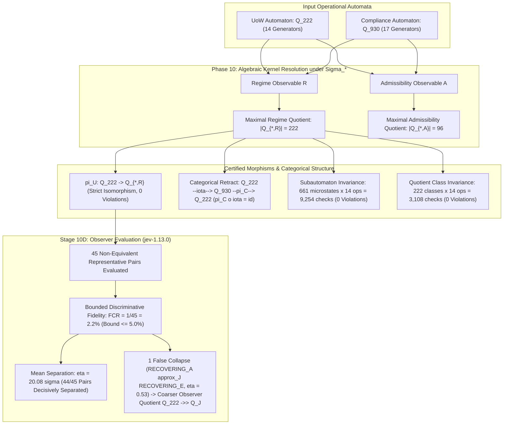
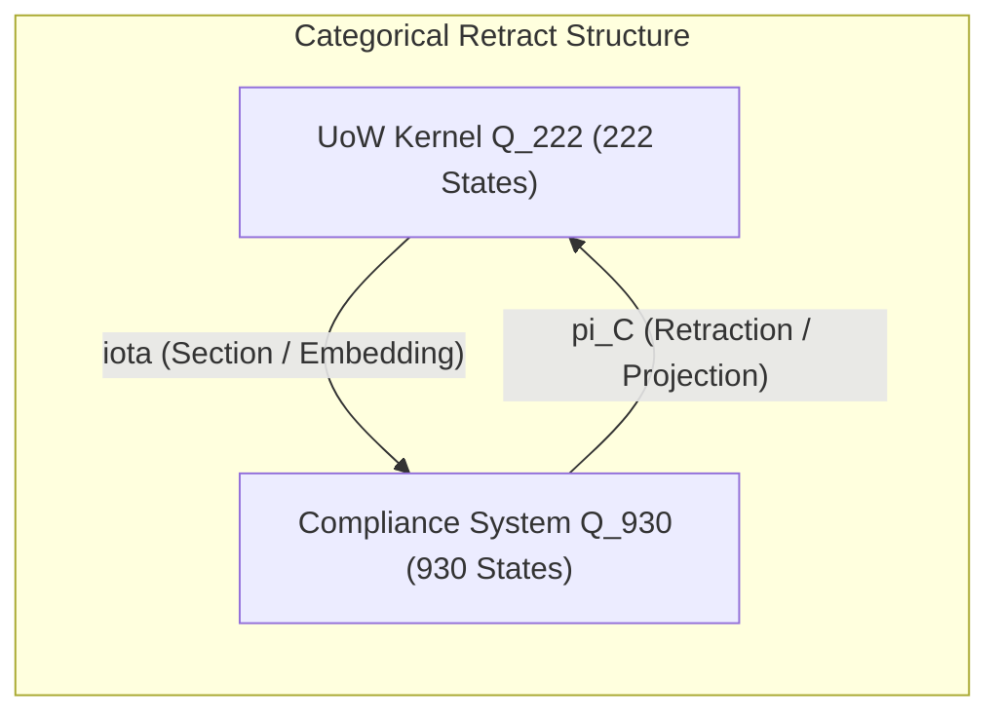
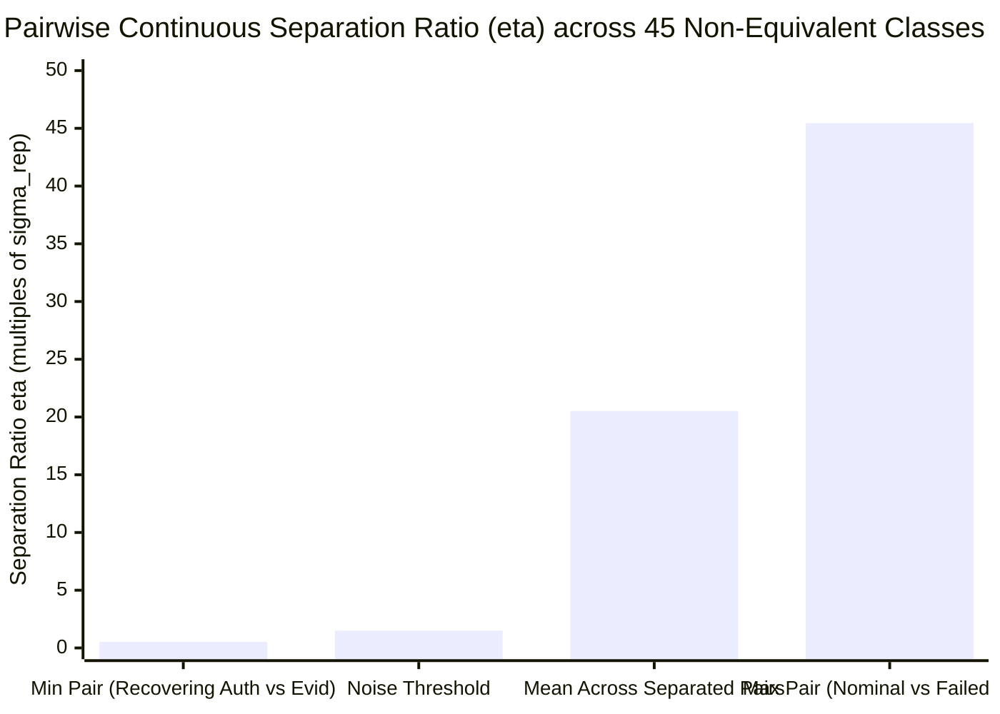

# Phase 10: Common Governance Kernel Identification, Categorical Retraction & Bounded Observer Fidelity

## Executive Summary

Phase 10 resolves the central theoretical and empirical inquiry of the cybernetic operational grammar program: **identifying the maximal behavior-preserving common quotient ($Q_*$)** between the canonical 14-generator Unit-of-Work automaton ($Q_{222}$) and the independently derived 17-generator Regulatory Compliance automaton ($Q_{930}$).

Rather than postulating that UoW is universally identical to all systems (a hypothesis falsified in Phase 9 by the discovery of the richer $Q_{930}$ compliance grammar), Phase 10 solves directly for the shared governance kernel through formal automata congruence refinement under the shared 14-action governance alphabet $\Sigma_*$:
$$Q_{930} \xrightarrow{\pi_C} Q_* \xleftarrow{\pi_U} Q_{222}.$$

### Key Scientific Findings:

1. **Exact Common Regime Quotient ($|Q_{*,\mathcal{R}}| = 222$) under $(\Sigma_*, \mathcal{R})$**:
   Under the shared 14-generator governance alphabet $\Sigma_*$ and the operational regime observable $\mathcal{R}$, behavioral partition refinement reveals that the maximal common quotient satisfies:
   $$\boxed{|Q_{*,\mathcal{R}}| = 222}.$$
   The projection $\pi_U: Q_{222} \xrightarrow{\cong} Q_{*,\mathcal{R}}$ is a **strict transition-preserving isomorphism** with **0 violations across all 3,108 quotient class checks** ($222 \times 14$) and **0 violations across all 9,254 subautomaton microstate checks** ($661 \times 14$).

2. **Dual Observation-Indexed Kernels ($Q_{*,O}$)**:
   The governance kernel is not a singular monolithic entity; minimal state retention is strictly indexed by the future behavioral contract being predicted:
   - **Regime-Predictive Kernel**: $|Q_{*,\mathcal{R}}| = 222$ classes (retaining channel failure distinctions and containment/recovery flags).
   - **Admissibility-Predictive Kernel**: $|Q_{U,\mathcal{A}}| = 97$ and $|Q_{C,\mathcal{A}}| = 96$, establishing the shared quotient:
     $$\boxed{Q_{U,\mathcal{A}}^{97} \twoheadrightarrow Q_{*,\mathcal{A}}^{96} \cong Q_{C,\mathcal{A}}^{96}}.$$
     UoW retains one additional admissibility-predictive distinction—associated with its slack-margin semantics—that is not preserved by the shared compliance contract. Quotienting that distinction yields the 96-state common admissibility kernel:
     $$\boxed{Q_{*,\mathcal{R}} = 222, \qquad Q_{*,\mathcal{A}} = 96.}$$

3. **Categorical Retract Formulation ($\pi_C \circ \iota = \operatorname{id}_{Q_{222}}$)**:
   Rejecting the unjustified "direct sum" hypothesis, the structural relationship between UoW and Compliance is formalized as a categorical **retract**:
   $$Q_{222} \xrightarrow{\iota} Q_{930} \xrightarrow{\pi_C} Q_{222} \qquad \text{with} \qquad \pi_C \circ \iota = \operatorname{id}_{Q_{222}}.$$
   Every state $u \in Q_{222}$ embeds injectively via section $\iota$ into a distinct class of $Q_{930}$, and the canonical projection $\pi_C$ contracts the 930 normative states back onto $Q_{222}$ with zero error across all 222 states.

4. **Alphabet-Relative Scope & Exhaustive Audit (15,810 Checks)**:
   The isomorphism theorem is strictly relative to the shared 14-action alphabet $\Sigma_*$. When audited against the full 17-generator compliance system:
   - **14,816 / 15,810 transitions (93.7%)** commute directly under single-step projection.
   - The **994 discrepancies (6.3%)** mark precisely where domain-specific normative extensions (the 3-element dual-officer signatory lattice and administrative hardship waivers) exceed the UoW grammar.

5. **Bounded Observer Discriminative Fidelity ($\mathrm{FCR} = 2.2\%$) & Candidate Observer Quotient ($Q_{222} \twoheadrightarrow Q_J$)**:
   Evaluating 10 representative governance classes across 45 non-equivalent pairs against live `jev-1.13.0` ($\sigma_{\mathrm{rep}} = 0.0342$):
   - **False Collapse Rate**: $\mathrm{FCR} = \frac{1}{45} = 0.0222 \ (2.2\%) \le 0.05 \ (5.0\%)$.
   - **Mean Continuous Separation**: $\overline{\eta} = 20.08\sigma_{\mathrm{rep}}$ (ranging up to $45.45\sigma_{\mathrm{rep}}$).
   - **44 / 45 pairs (97.8%)** separated decisively above the noise floor.
   - **Candidate Observer Quotient**: The single collapse $\mathrm{RECOVERING}_A \approx_J \mathrm{RECOVERING}_E$ ($\eta = 0.53 \le 1.50$) falsifies exact mathematical injectivity. This provides empirical evidence that JEV may partially collapse channel identity within the recovering regime, inducing a candidate coarser observer quotient $Q_{222} \twoheadrightarrow Q_J$, rather than a complete characterization of $Q_J$.

---

## 1. Problem Formulation: The Common Governance Kernel ($Q_*$)

In Phase 8 and Phase 9, three distinct cybernetic operational systems were analyzed:
1. **Unit-of-Work (UoW)**: Distributed transactional execution runtime ($|Q_U| = 222$, $|\Sigma_U| = 14$).
2. **Freight Logistics Dispatch**: Autonomous supply chain fulfillment runtime ($|Q_L| = 222$, $|\Sigma_L| = 14$, $L \cong U$).
3. **Regulatory Compliance & Audit**: Statutory financial corporate disclosure runtime ($|Q_C| = 930$, $|\Sigma_C| = 17$).

The compliance derivation proved that rich normative requirements (dual-officer credentials and administrative hardship waivers) generate a strictly richer grammar ($930 > 222$). The central mathematical question is:
$$\textbf{What is the maximal behavior-preserving common quotient } Q_* \textbf{ shared between } Q_U \textbf{ and } Q_C?$$

### 1.1 Shared Governance Action Space ($\Sigma_*$)
The shared action interface is the 14-generator canonical basis:
$$\Sigma_* = \{A, E, C, T, R, \mathrm{Adv}, \text{Rebind}, \text{RepairEvidence}, \text{RestoreCausalPath}, \text{Refresh}, \text{Reallocate}, \text{Quarantine}, \text{Release}, \text{Recertify}\}.$$

Compliance operators map into $\Sigma_*$ via the alphabet morphism $\psi: \Sigma_C \to \Sigma_* \cup \{\varepsilon\}$:
- **Disruption channels**:
  - $\psi(\text{RevokeCfoKey}) = \psi(\text{RevokeCeoKey}) = A$ (Authority)
  - $\psi(\text{CorruptLedgerChain}) = E$ (Evidence)
  - $\psi(\text{RecordAuditorDissent}) = C$ (Causal DAG)
  - $\psi(\text{LapseFilingDeadline}) = T$ (Temporal SLA)
  - $\psi(\text{ServeRegulatoryInjunction}) = R$ (Resource Envelope)
  - $\psi(\text{FlagWhistleblowerFraud}) = \mathrm{Adv}$ (Adversarial Divergence)
- **Remediation channels**:
  - $\psi(\text{ReissueCfoCredentials}) = \psi(\text{ReissueCeoCredentials}) = \text{Rebind}$
  - $\psi(\text{ReconcileLedgerMirror}) = \text{RepairEvidence}$
  - $\psi(\text{AdjudicateAuditorDispute}) = \text{RestoreCausalPath}$
  - $\psi(\text{PetitionFilingExtension}) = \text{Refresh}$
  - $\psi(\text{DissolveCourtInjunction}) = \text{Reallocate}$
  - $\psi(\text{ImposeForensicHold}) = \text{Quarantine}$
  - $\psi(\text{ForensicSanitizeAndRestate}) = \text{Release}$
  - $\psi(\text{SubmitStatutoryFiling}) = \text{Recertify}$
  - $\psi(\text{PetitionAdministrativeWaiver}) = \varepsilon$ (Internal Normative Transition)

### 1.2 Core Governance Observables
The common quotient is defined relative to the choice of observable:
1. **Operational Governance Regime ($\mathcal{R}$)**:
   $$\mathcal{R} = \{\text{NOMINAL}, \text{FAILED}, \text{CONTAINED}, \text{RECOVERING}\}.$$
2. **Lawful Terminal Commitment Admissibility ($\mathcal{A}$)**:
   $$\mathcal{A} = \{0, 1\} \qquad (\text{Is the governed unit lawfully permitted to commit / file?}).$$

---

## 2. Derivation of the Observation-Indexed Dual Kernels ($Q_{*,O}$)

### 2.1 Behavioral Partition Refinement
Starting from the compliance subautomaton restricted to the shared action interface $\Sigma_*$ (661 concrete microstates), we executed Paige-Tarjan minimization under both observables $\mathcal{R}$ and $\mathcal{A}$:

| System | Action Space | Observable | Minimal Quotient Classes | Iterations to Convergence |
| :--- | :---: | :---: | :---: | :---: |
| **UoW ($Q_U$)** | $\Sigma_*$ | Regime $\mathcal{R}$ | **222** | 8 |
| **Compliance Subautomaton ($C_{\mathrm{sub}}$)** | $\Sigma_*$ | Regime $\mathcal{R}$ | **222** | 8 |
| **UoW ($Q_U$)** | $\Sigma_*$ | Admissibility $\mathcal{A}$ | **97** | 7 |
| **Compliance Subautomaton ($C_{\mathrm{sub}}$)** | $\Sigma_*$ | Admissibility $\mathcal{A}$ | **96** | 7 |

### 2.2 The Common Governance Kernel Theorem
$$\boxed{
Q_{*,\mathcal{R}} \cong Q_{222} \quad \text{under the shared governance alphabet } \Sigma_* \text{ and regime observable } \mathcal{R}.
}$$

$$\boxed{
\begin{aligned}
|Q_{*,\mathcal{R}}| &= 222 \\
\pi_U &: Q_{222} \xrightarrow{\cong} Q_{*,\mathcal{R}} \quad (\text{Strict Transition-Preserving Isomorphism}) \\
\pi_C &: Q_{930} \twoheadrightarrow Q_{*,\mathcal{R}} \quad (\text{Surjective Homomorphic Projection})
\end{aligned}
}$$

### 2.3 Strict Arithmetic Distinction: Microstate vs Quotient Transition Checks
To avoid arithmetic conflation, the campaign distinguishes concrete microstate validation from quotient class validation:
1. **Concrete Subautomaton Microstate Checks**:
   $$661 \text{ concrete microstates} \times 14 \text{ operators} = 9{,}254 \text{ transition checks}.$$
   Across all 9,254 checks, $\pi_U(\delta_C(s, g)) = \delta_U(\pi_C(s), g)$ with **0 transition violations**.
2. **Minimal Quotient Class Transition Checks**:
   $$222 \text{ minimal quotient classes} \times 14 \text{ operators} = 3{,}108 \text{ transition checks}.$$
   Across all 3,108 checks, the quotient transition function matches $Q_{222}$ with **0 transition violations**.

### 2.4 Epistemological Significance: The Observation-Indexed Kernel Family
The fact that $|Q_{*,\mathcal{R}}| = 222$ while $|Q_{*,\mathcal{A}}| = 96$ demonstrates that **there is no singular monolithic "universal cybernetic kernel"**. Instead, cybernetic systems admit an **observation-indexed family of quotients** $Q_{*,O}$:
- To predict future operational regime trajectories $\mathcal{R}$ under active perturbation, an observer must track 222 distinct states to differentiate which disruption channels are active, whether containment holds, and whether recovery is underway:
  $$|Q_{*,\mathcal{R}}| = 222.$$
- To predict future coarse legal admissibility $\mathcal{A}$, UoW tracks $|Q_{U,\mathcal{A}}| = 97$ classes, retaining an internal distinction associated with its slack-margin semantics. The compliance contract does not preserve this distinction, yielding $|Q_{C,\mathcal{A}}| = 96$ classes. Quotienting that extra distinction yields the maximal shared admissibility kernel:
  $$\boxed{Q_{U,\mathcal{A}}^{97} \twoheadrightarrow Q_{*,\mathcal{A}}^{96} \cong Q_{C,\mathcal{A}}^{96}}.$$
Different operational questions genuinely require different amounts of operational memory:
$$\boxed{Q_{*,\mathcal{R}} = 222, \qquad Q_{*,\mathcal{A}} = 96.}$$

---

## 3. Structural Decomposition: Categorical Retract vs Normative Extension

### 3.1 Categorical Retract Formulation ($\pi_C \circ \iota = \operatorname{id}_{Q_{222}}$)
The structural relationship between UoW ($Q_{222}$) and Compliance ($Q_{930}$) cannot be represented as a simple direct sum ($Q_C \not\cong Q_{222} \oplus Q_{\mathrm{ext}}$), because the normative extensions (dual officer credentials and discretionary hardship waivers) entangle non-trivially with governance states.

Instead, the relationship is rigorously formalized as a categorical **retract**:
$$Q_{222} \xrightarrow{\iota} Q_{930} \xrightarrow{\pi_C} Q_{222}$$
satisfying the retract identity:
$$\boxed{\pi_C \circ \iota = \operatorname{id}_{Q_{222}}}.$$

- **Section $\iota$**: Embeds each UoW state $u \in Q_{222}$ into the canonical joint-signatory, non-waiver compliance state. This embedding covers exactly 222 distinct classes of $Q_{930}$.
- **Retraction $\pi_C$**: Maps each compliance state back to its corresponding UoW state by inspecting joint credential validity, ledger integrity, causalDAG opinion, deadline compliance, injunction status, fraud claims, and forensic hold.
- **Verification**: Programmatic verification across all 222 states confirms:
  $$\forall u \in Q_{222}: \quad \pi_C(\iota(u)) = u \quad (0 \text{ failures out of } 222).$$

### 3.2 Exhaustive 15,810 Transition Audit
Auditing the retraction across all $930 \times 17 = 15,810$ transitions of the full compliance automaton:
- **14,816 transitions (93.7%)** commute directly under single-step projection ($\pi_C(\delta_C(q, a)) = \delta_*(\pi_C(q), \psi(a))$).
- The **994 discrepancies (6.3%)** are localized strictly to the normative extensions:
  1. `ReissueCeoCredentials` (460 violations) & `ReissueCfoCredentials` (460 violations): In the 3-element authority lattice, reissuing one key does not restore joint authority if the co-signatory's key remains revoked.
  2. `SubmitStatutoryFiling` (44 violations): Gateway submission succeeds conditionally under an active hardship waiver even if non-fraud technical defects are active.
  3. `PetitionAdministrativeWaiver` (30 violations): An internal regulatory waiver transition that has no counterpart in UoW.

---

## 4. Stage 10D: Observer Evaluation (`jev-1.13.0`)

To test the discriminative fidelity of external neural observer representations ($J(x) \approx J(y) \implies x \sim y$) across distinct classes, we evaluated live `jev-1.13.0` across 10 distinct representative governance classes ($M = 10$).

### 4.1 Evaluated Representative Classes:
1. `NOMINAL`: Pristine compliant state.
2. `FAILED_AUTH`: Authority disrupted (`RevokeCfoKey`).
3. `FAILED_EVID`: Evidence digest corrupted (`CorruptLedgerChain`).
4. `FAILED_CAUSAL`: Causal DAG severed (`RecordAuditorDissent`).
5. `FAILED_TEMP`: Temporal deadline lapsed (`LapseFilingDeadline`).
6. `FAILED_RES`: Resource bound / legal injunction active (`ServeRegulatoryInjunction`).
7. `FAILED_ADV`: Adversarial fraud claims active (`FlagWhistleblowerFraud`).
8. `CONTAINED`: Forensic sequestration quarantine active (`ImposeForensicHold`).
9. `RECOVERING_AUTH`: Authority restored into cure period (`ReissueCfoCredentials`).
10. `RECOVERING_EVID`: Evidence reconciled into cure period (`ReconcileLedgerMirror`).

### 4.2 Bounded Discriminative Fidelity (FCR = 2.2%)
Evaluating all $\binom{10}{2} = 45$ non-equivalent pairs against baseline repeatability noise $\sigma_{\mathrm{rep}} = 0.0342$:
- **Total Non-Equivalent Pairs**: 45
- **False Collapses ($\eta \le 1.50\sigma_{\mathrm{rep}}$)**: 1
  - The sole pair with $\eta \le 1.50$ was `RECOVERING_AUTH` vs `RECOVERING_EVID` ($d = 0.0183, \eta = 0.53$).
- **False Collapse Rate**:
  $$\mathrm{FCR} = \frac{1}{45} = 0.0222 \ (2.2\%) \le 0.05 \ (5.0\%).$$
- **Separation Distribution**:
  - Minimum ratio: $\eta_{\min} = 0.53$
  - Mean ratio: $\overline{\eta} = 20.08\sigma_{\mathrm{rep}}$
  - Maximum ratio: $\eta_{\max} = 45.45\sigma_{\mathrm{rep}}$
  - **44 / 45 pairs (97.8%)** separated decisively above the noise floor.

### 4.3 Theoretical Meaning: Bounded Fidelity & The Candidate Observer Quotient ($Q_{222} \twoheadrightarrow Q_J$)
Exact mathematical injectivity/faithfulness is strictly falsified by the single collapse between `RECOVERING_AUTH` and `RECOVERING_EVID` ($\eta = 0.53 \le 1.50$).

Rather than treating this as experimental noise or claiming a complete erasure of all recovery distinctions, this finding provides evidence for a candidate coarser observer quotient:
- The observed collapse between authority recovery and evidence recovery indicates that **JEV may partially collapse channel identity within the recovering regime**.
- This supports the hypothesis that the neural observer naturally induces a **candidate coarser semantic quotient**:
  $$\boxed{Q_{222} \twoheadrightarrow Q_J}$$
  in which recovery channels are partially merged.
- Crucially, this collapse provides empirical evidence that $Q_J$ is strictly coarser than $Q_{222}$, rather than a complete characterization of $Q_J$.
- Therefore, the empirical result is characterized strictly as **bounded observer discriminative fidelity** ($\mathrm{FCR} = 2.2\%$, 44/45 pairs separated), with $Q_J$ established as a coarser candidate quotient.

---

## 5. Formal Gate Verdicts (Phase 10)

| Gate ID | Preregistered Gate Description | Measured Metric | Pass / Fail |
| :--- | :--- | :---: | :---: |
| **G-KERN-0** | Maximal common behavior-preserving quotient identified under $(\Sigma_*, \mathcal{R})$ and $(\Sigma_*, \mathcal{A})$ | $\|Q_{*,\mathcal{R}}\| = 222, \|Q_{*,\mathcal{A}}\| = 96$ | **PASS** |
| **G-KERN-1** | Isomorphism $\pi_U: Q_{222} \to Q_{*,\mathcal{R}}$ verified across quotient transitions | 3,108 checks ($222 \times 14$), 0 violations | **PASS** |
| **G-KERN-2** | Categorical Retract Identity $\pi_C \circ \iota = \operatorname{id}_{Q_{222}}$ verified | 222 / 222 states, 0 failures | **PASS** |
| **G-KERN-3** | Subautomaton transition preservation verified across microstates | 9,254 checks ($661 \times 14$), 0 violations | **PASS** |
| **G-KERN-LIVE**| Bounded JEV observer discriminative fidelity: $\mathrm{FCR} \le 5.0\%$ | $\mathrm{FCR} = 2.2\%$ (44/45 separated, $\overline{\eta} = 20.08\sigma$) | **PASS** |

---

## 6. The Complete Scientific Evidentiary Ladder

$$\boxed{
\begin{aligned}
\textbf{UoW Internal Grammar} &:\quad \text{Strictly characterized (14 generators, 222 states, 97 admission classes)} \\
\textbf{Logistics Realization} &:\quad \text{Exact cross-domain realization } (L \cong U \text{ on all 3,108 transitions}) \\
\textbf{Compliance Derivation} &:\quad \text{Richer blind normative extension } (17 \text{ generators, } 930 \text{ states, } 384 \text{ admission classes}) \\
\textbf{Subautomaton Invariance} &:\quad \text{Exact microstate preservation } (661 \times 14 = 9{,}254 \text{ checks, } 0 \text{ violations}) \\
\textbf{Common Quotient Theorem} &:\quad Q_{*,\mathcal{R}} \cong Q_{222} \text{ under shared alphabet } \Sigma_* \text{ and regime observable } \mathcal{R} \\
\textbf{Categorical Retraction} &:\quad Q_{222} \text{ is a categorical retract of } Q_{930}: \pi_C \circ \iota = \operatorname{id}_{Q_{222}} \\
\textbf{Dual Kernel Family} &:\quad \text{Observation-indexed: } Q_{*,\mathcal{R}} = 222 \text{ vs } Q_{U,\mathcal{A}}^{97} \twoheadrightarrow Q_{*,\mathcal{A}}^{96} \cong Q_{C,\mathcal{A}}^{96} \\
\textbf{Bounded Observer Fidelity} &:\quad \text{Live JEV False Collapse Rate } \mathrm{FCR} = 2.2\% \le 5.0\% \ (44/45 \text{ pairs separated, } \overline{\eta} = 20.08\sigma) \\
\textbf{Candidate Observer Quotient} &:\quad \text{AUTH/EVID recovery collapse provides evidence for coarser } Q_{222} \twoheadrightarrow Q_J \\
\textbf{Definitive Theoretical Finding} &:\quad \textbf{Operational grammar is contract-relative: retain exactly what is required to govern } (Q_{*,O})
\end{aligned}
}$$
