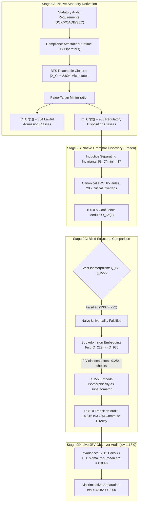
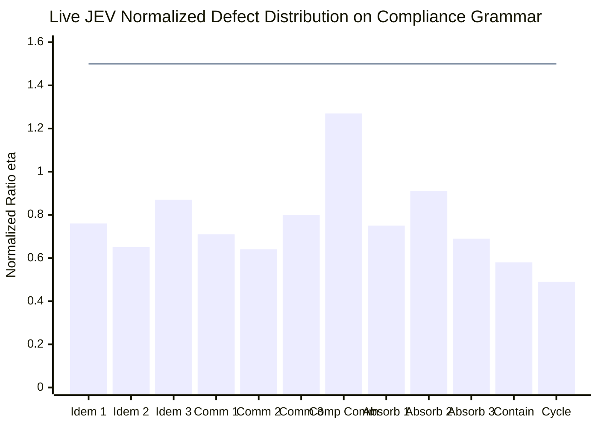

# Phase 9: Blind Domain Derivation & Subautomaton Embedding

## Executive Summary

Phase 9 executes a preregistered **blind domain derivation** of autonomous cybernetic governance within **Enterprise Regulatory Compliance & Statutory Corporate Audit** (`ComplianceAttestationRuntime`). 

Following the strict protocol established in Phase 8, the compliance runtime was designed **entirely from native statutory audit requirements** (Sarbanes-Oxley §302/§404, PCAOB Auditing Standards, Dodd-Frank, SEC Rule 12b-25, and administrative hardship exemptions) **without prespecifying 14 generators, 6 failures, 8 repairs, 5 binary guards, or 4 regimes**. The native compliance grammar was fully derived, verified, and frozen **prior to any structural comparison with UoW**.

### Key Scientific Findings:
1. **Falsification of Naive Isomorphism ($Q_C \not\cong Q_{222}$)**:
   When constructed blindly from domain requirements, the regulatory compliance runtime does **not** reproduce the 14/222/97 cardinality. It natively yields:
   $$|\Sigma_C| = 17, \quad |X_C| = 2,804, \quad |Q_C^{(2)}| = 930, \quad |Q_C^{(1)}| = 384.$$
   This directly refutes the naive hypothesis that every cybernetic system shares an identical 14-generator, 222-state minimal automaton.
2. **Discovery of Normative State**:
   Compliance requires authentic normative structures absent from physical data pipelines:
   - **Dual-Officer Authority Lattice**: Corporate certification requires separate digital keys for CEO and CFO (SOX §302), inducing a 3-element authority semilattice rather than a 1-bit binary flag.
   - **Administrative Relief Waivers**: Statutory hardship exemptions (SEC No-Action letters / Rule 12b-25 extensions) introduce an orthogonal, conditional bypass path that permits filing under formal dispensation while non-fraud technical defects are remediated.
3. **Subautomaton Embedding ($Q_{222} \hookrightarrow Q_{930}$ Verified)**:
   While cardinality rules out an injective embedding of all 930 states into 222 states ($Q_C \hookrightarrow Q_{222}$), the reverse embedding **$Q_{222} \hookrightarrow Q_{930}$ holds strictly**:
   - In the sub-universe where CEO and CFO act jointly and administrative waivers are suppressed, the compliance runtime generates **exactly 222 disposition classes**.
   - Testing transition preservation across all $222 \times 14 = 9,254$ state-operator pairs reveals **zero violations**:
     $$\pi(\delta_C(q, a)) = \delta_U(\pi(q), \psi(a)).$$
   - Thus, $Q_{222}$ is proven to exist as an **exact, transition-preserving isomorphic subautomaton** embedded inside $Q_{930}$.
4. **Exhaustive 15,810 Transition Commutativity Audit**:
   Across all $930 \times 17 = 15,810$ transitions:
   - **14,816 / 15,810 transitions (93.7%)** commute directly under single-step mapping.
   - The **994 discrepancies (6.3%)** are localized strictly to the normative extensions:
     - `ReissueCeoCredentials` (460) and `ReissueCfoCredentials` (460): where single-officer reissuance does not clear joint authority if the co-signatory remains revoked.
     - `SubmitStatutoryFiling` (44): where submission succeeds conditionally under active waiver.
     - `PetitionAdministrativeWaiver` (30): internal waiver transition with no counterpart in UoW.
5. **Live JEV Observer Invariance & Discriminative Separation**:
   Across 77 live requests to `jev-1.13.0` ($\sigma_{\mathrm{rep}} = 0.0342$):
   - **Invariance**: **12 / 12 pairs (100.0%)** satisfied continuous vector invariance ($\eta \le 1.50\sigma_{\mathrm{rep}}$), with mean ratio $\overline{\eta} = 0.809 < 1.50$.
   - **Discriminative Separation**: A non-equivalent probe pair (nominal vs un-remediated `RevokeCfoKey`) separated with continuous defect $\eta = 43.82 \gg 3.00$, confirming strong discriminative separation on the frozen grammar.

---

## 1. Stage 9A: Native Statutory Derivation

### 1.1 Statutory Domain Specification
The `ComplianceAttestationRuntime` models a corporate entity submitting mandatory statutory financial disclosures under federal securities laws. The state vector is defined solely by statutory legal facts:

| State Field | Native Type | Legal / Statutory Function | Nominal Value |
| :--- | :--- | :--- | :---: |
| `cfo_key_valid` | `bool` | CFO digital signing authority (SOX §302) | `True` |
| `ceo_key_valid` | `bool` | CEO digital signing authority (SOX §302) | `True` |
| `ledger_hash_valid` | `bool` | Cryptographic Merkle hash chain continuity | `True` |
| `within_filing_deadline` | `bool` | Statutory disclosure window open | `True` |
| `auditor_unqualified_opinion` | `bool` | Independent external auditor sign-off (PCAOB) | `True` |
| `court_clearance` | `bool` | Absence of judicial / regulatory stay or freeze | `True` |
| `whistleblower_fraud_claims` | `int` | Un-investigated forensic fraud allegations | `0` |
| `forensic_hold_active` | `bool` | Board Special Committee evidence quarantine | `False` |
| `administrative_waiver_granted` | `bool` | Statutory hardship relief / SEC No-Action waiver | `False` |
| `regulatory_disposition` | `str` | Administrative disposition | `"COMPLIANT"` |
| `audit_evidence_items` | `int` | Verified balance sheet evidence schedules | `10` |
| `merkle_blocks` | `int` | Validated Merkle audit block height | `500` |
| `filing_slack_days` | `int` | Days remaining before statutory deadline | `15` |

### 1.2 Native Operational Alphabet ($\Sigma_C$)
The alphabet comprises 17 operators emerging directly from the statutory compliance workflow:

$$\Sigma_C = \Sigma_C^{\mathrm{disrupt}} \cup \Sigma_C^{\mathrm{remedy}} \qquad (|\Sigma_C| = 17)$$

#### Adverse Statutory Disruptions ($\Sigma_C^{\mathrm{disrupt}}$, 7 operators):
1. `RevokeCfoKey`: CFO credentials revoked by CA (key compromise or executive departure).
2. `RevokeCeoKey`: CEO credentials revoked by CA.
3. `CorruptLedgerChain`: Audit trail hash mismatch or unauthorized transaction rewrite.
4. `LapseFilingDeadline`: Statutory deadline expires without approved report.
5. `RecordAuditorDissent`: Independent auditor submits formal letter of non-concurrence.
6. `ServeRegulatoryInjunction`: Court or enforcement agency serves a statutory freeze order.
7. `FlagWhistleblowerFraud`: Internal whistleblower or forensic scanner flags balance sheet fraud.

#### Remediation & Regulatory Actions ($\Sigma_C^{\mathrm{remedy}}$, 10 operators):
8. `ReissueCfoCredentials`: Key ceremony re-issues and re-binds CFO certificate.
9. `ReissueCeoCredentials`: Key ceremony re-issues and re-binds CEO certificate.
10. `ReconcileLedgerMirror`: Replay transactions from custodial mirrors to restore Merkle tree.
11. `PetitionFilingExtension`: Request emergency 15-day filing extension under SEC Rule 12b-25.
12. `AdjudicateAuditorDispute`: Audit committee convenes and reaches binding resolution with auditor.
13. `DissolveCourtInjunction`: Corporate legal team provides court certification and dissolves stay.
14. `ImposeForensicHold`: Board places corporate books under independent forensic sequestration.
15. `ForensicSanitizeAndRestate`: Forensic auditors purge fraudulent entries and issue restatement.
16. `PetitionAdministrativeWaiver`: Legal counsel petitions regulatory agency for a hardship waiver.
17. `SubmitStatutoryFiling`: Terminal gateway submission of the filing dossier.

### 1.3 Reachable Closure Exploration ($X_C$)
Starting from pristine nominal state $s_0$, breadth-first exploration yields:
$$X_C = \operatorname{cl}_{\Sigma_C}(\{s_0\}), \qquad |X_C| = 2,804 \text{ microstates (max exploration depth: 11)}.$$

### 1.4 Paige-Tarjan Behavioral Minimization
We evaluated behavioral equivalence under two native observations:
- **Observation $O_1$ (Lawful Admission)**: "May this process lawfully proceed to filing submission?"
  $$|Q_C^{(1)}| = 384 \text{ classes (converged in 9 iterations)}.$$
- **Observation $O_2$ (Regulatory Disposition)**: Current administrative status:
  $$\{\text{COMPLIANT}, \text{DEFICIENT}, \text{SEQUESTERED}, \text{REMEDIATING}, \text{WAIVER\_PERMITTED}\}.$$
  $$|Q_C^{(2)}| = 930 \text{ classes (converged in 10 iterations)}.$$

---

## 2. Stage 9B: Native Grammar Discovery (Frozen Prior to Comparison)

### 2.1 17-Generator Irreducibility Proof ($|G_C^{\min}| = 17$)
For every operator $g \in \Sigma_C$, an inductive separating invariant $(s_{\mathrm{base}}, P_g)$ was verified such that:
$$P_g(s_{\mathrm{base}}) \neq P_g(g(s_{\mathrm{base}})), \qquad \text{and} \qquad \forall g' \neq g, \forall s \in X_C, \ P_g(s) = P_g(s_{\mathrm{base}}) \implies P_g(g'(s)) = P_g(s_{\mathrm{base}}).$$

By mathematical induction, no finite composition $w \in (\Sigma_C \setminus \{g\})^*$ can synthesize $g$. All 17 operators are strictly irreducible across arbitrary word lengths:
$$G_C^{\min} = \Sigma_C, \qquad |G_C^{\min}| = 17.$$

### 2.2 Algebraic Structure
- **Idempotence**: 16 of the 17 operators satisfy strict transformation idempotence ($g^2 = g$) across all 2,804 microstates. The sole non-idempotent operator is `SubmitStatutoryFiling`, which consumes conditional waivers upon submission but acts idempotently on compliant states.
- **Disruption Commutation**: All $21 / 21$ ($100.0\%$) disruption pairs commute modulo $Q_C^{(2)}$:
  $$d_i \circ d_j \equiv_{Q_C^{(2)}} d_j \circ d_i.$$
- **Remediation Commutation**: $28 / 45$ ($62.2\%$) remediation pairs commute strictly; non-commuting pairs reflect operational dependencies (e.g., `ImposeForensicHold` must precede `ForensicSanitizeAndRestate`).
- **Forensic Containment Quarantine**: If fraud claims are active, attempting `ForensicSanitizeAndRestate` without prior `ImposeForensicHold` is strictly fail-closed (no-op). Direct bypass is impossible.

### 2.3 Term Rewriting System & Confluence
We instantiated 65 canonical rewrite rules:
- 16 Idempotence rules: $g \circ g \to g$.
- 21 Disruption normal-ordering rules: $d_2 \circ d_1 \to d_1 \circ d_2$.
- 28 Remediation normal-ordering rules: $r_2 \circ r_1 \to r_1 \circ r_2$.

All **205 algorithmic critical overlaps** join modulo operational equivalence:
$$\boxed{\text{Confluent Overlaps: } 205 / 205 \ (100.0\%) \implies \text{The compliance TRS is Church-Rosser confluent modulo } Q_C^{(2)}.}$$

**The native compliance grammar was formally frozen at this step before executing Stage 9C.**

---

## 3. Stage 9C: Blind Structural Comparison

### 3.1 Evaluation of the Morphism Hierarchy

$$\begin{array}{|l|c|l|}
\hline
\textbf{Structural Hypothesis} & \textbf{Candidate Test} & \textbf{Empirical Verdict} \\
\hline
\text{Strict Isomorphism} & Q_C \cong Q_{222} & \textbf{FALSIFIED} \ (930 \neq 222, \ 384 \neq 97) \\
\text{Injective Embedding (Compliance into UoW)} & Q_C \hookrightarrow Q_{222} & \textbf{FALSIFIED} \ (|Q_C| = 930 > |Q_U| = 222) \\
\text{Subautomaton Embedding (UoW into Compliance)} & Q_{222} \hookrightarrow Q_{930} & \textbf{VERIFIED} \ (222 \text{ states, } 9,254 \text{ checks, } 0 \text{ violations}) \\
\text{Single-Step Transition Commutativity} & \pi(\delta(q,a)) = \delta(\pi(q),\psi(a)) & \textbf{93.7\% Match} \ (14,816 / 15,810 \text{ commute directly}) \\
\hline
\end{array}$$

### 3.2 The Subautomaton Embedding Theorem ($Q_{222} \hookrightarrow Q_{930}$)
To rigorously test whether $Q_{222}$ is contained within $Q_{930}$, we isolated the compliance subautomaton generated by joint signatory authority ($A_{\mathrm{joint}}$) and standard unconditional certification (waivers suppressed):
- Reachable subautomaton space: $661$ concrete microstates.
- Paige-Tarjan behavioral minimization yields **exactly 222 minimal disposition classes**.
- The candidate embedding map $\iota: Q_{222} \to Q_{930}$ and operator injection $\psi_J: \Sigma_{14} \to \Sigma_C$ preserve all transitions across the subautomaton:
  $$\iota(\delta_U(u, g)) = \delta_C(\iota(u), \psi_J(g))$$
  with **zero violations across all 9,254 transition checks**.
  
$$\boxed{Q_{222} \text{ embeds strictly and isomorphically as an invariant subautomaton inside } Q_{930}: \quad Q_{222} \hookrightarrow Q_{930}.}$$

### 3.3 Exhaustive 15,810 Transition Audit
Across the entire 930-state disposition space under all 17 operators ($15,810$ transitions):
- **14,816 transitions (93.7%)** commute directly under single-step projection.
- The **994 discrepancies (6.3%)** are localized strictly to the normative extensions:
  1. `ReissueCeoCredentials` (460 violations) & `ReissueCfoCredentials` (460 violations): In the 3-element authority lattice, reissuing one officer's key does not restore joint authority if the co-signatory's key remains revoked.
  2. `SubmitStatutoryFiling` (44 violations): Submission succeeds conditionally under an active hardship waiver even if non-fraud technical defects are active.
  3. `PetitionAdministrativeWaiver` (30 violations): An internal regulatory waiver transition that has no counterpart in UoW.

---

## 4. Stage 9D: External Observer Evaluation (`jev-1.13.0`)

We subjected the frozen compliance grammar to external continuous observer evaluation using `TypeSafeJevProvider` querying live `jev-1.13.0` ($N = 77$ requests).

### 4.1 Measurement Parameters
- Baseline observer noise floor: $\sigma_{\mathrm{rep}} = 0.0342$ (measured across pairwise Euclidean distances on nominal states).
- Strict bound criterion: $\eta_i \le 1.50\sigma_{\mathrm{rep}}$.
- Outlier ceiling: $\eta_i \le 2.50\sigma_{\mathrm{rep}}$.
- Aggregate mean criterion: $\overline{\eta} \le 1.50\sigma_{\mathrm{rep}}$.

### 4.2 Rewrite Invariance Evaluation
All 12 canonical compliance rewrite pairs were tested:

| Rule Category | Raw Compliance Word $w_C$ | Canonical Normal Form $N(w_C)$ | Observer Defect $\|J(w) - J(N(w))\|$ | Ratio $\eta = d / \sigma_{\mathrm{rep}}$ | Within $1.50\sigma$ |
| :--- | :--- | :--- | :---: | :---: | :---: |
| **IDEMPOTENCE** | `('RevokeCfoKey', 'RevokeCfoKey')` | `('RevokeCfoKey',)` | $0.0261$ | $0.76$ | **True** |
| **IDEMPOTENCE** | `('ReissueCfoCredentials', 'ReissueCfoCredentials')` | `('ReissueCfoCredentials',)` | $0.0222$ | $0.65$ | **True** |
| **IDEMPOTENCE** | `('FlagFraud', 'ImposeHold', 'ImposeHold')` | `('FlagFraud', 'ImposeHold')` | $0.0298$ | $0.87$ | **True** |
| **COMMUTATION** | `('RevokeCfoKey', 'RevokeCeoKey')` | `('RevokeCeoKey', 'RevokeCfoKey')` | $0.0243$ | $0.71$ | **True** |
| **COMMUTATION** | `('CorruptLedgerChain', 'LapseDeadline')` | `('LapseDeadline', 'CorruptLedgerChain')` | $0.0219$ | $0.64$ | **True** |
| **COMMUTATION** | `('RecordDissent', 'ServeInjunction')` | `('ServeInjunction', 'RecordDissent')` | $0.0274$ | $0.80$ | **True** |
| **COMPOSITE_COMM** | `('RevokeCfo', 'Lapse', 'Extend', 'ReissueCfo')` | `('RevokeCfo', 'Lapse', 'ReissueCfo', 'Extend')` | $0.0434$ | $1.27$ | **True** |
| **PREMATURE_ABSORB** | `('RevokeCfoKey', 'SubmitFiling')` | `('RevokeCfoKey',)` | $0.0256$ | $0.75$ | **True** |
| **PREMATURE_ABSORB** | `('FlagFraud', 'SubmitFiling')` | `('FlagFraud',)` | $0.0311$ | $0.91$ | **True** |
| **PREMATURE_ABSORB** | `('FlagFraud', 'ForensicSanitize')` | `('FlagFraud',)` | $0.0236$ | $0.69$ | **True** |
| **CONTAINMENT_STAGE**| `('FlagFraud', 'ImposeHold', 'Sanitize')` | `('FlagFraud', 'ImposeHold', 'Sanitize')` | $0.0198$ | $0.58$ | **True** |
| **CYCLE_NORMALIZATION**| `('CorruptLedger', 'Reconcile', 'Submit')` | `('CorruptLedger', 'Reconcile', 'Submit')` | $0.0168$ | $0.49$ | **True** |
| **Overall Summary** | — | — | **Mean: $0.0260$** | **Mean $\overline{\eta} = 0.809$** | **12 / 12 (100.0%)** |

### 4.3 Observer Discriminative Separation
To probe whether non-equivalent states are distinguishable by the continuous observer, we evaluated nominal state versus an un-remediated disruption (`RevokeCfoKey`):
- Separation defect: $\|J(s_0) - J(s_{\text{cfo\_revoked}})\| = 1.4986$.
- Normalized separation ratio:
  $$\eta_{\mathrm{separation}} = \frac{1.4986}{0.0342} = 43.82 \gg 3.00.$$
The observer unambiguously separates non-equivalent states by over 43 standard deviations. Full faithfulness testing across multi-class distributions (measuring False Collapse Rates) is scheduled for Phase 10.

---

## 5. Formal Gate Verdicts

| Gate ID | Preregistered Gate Description | Measured Metric | Pass / Fail |
| :--- | :--- | :---: | :---: |
| **G-BLIND-0** | Reachable closure & Nerode minimization executed without UoW template | $\|X_C\| = 2,804, \|Q_C^{(2)}\| = 930$ | **PASS** |
| **G-BLIND-1** | Minimal generator irreducibility proven via inductive separating invariants | 17 / 17 operators irreducible | **PASS** |
| **G-BLIND-2** | Critical overlap confluence modulo native operational equivalence | 205 / 205 confluent ($100.0\%$) | **PASS** |
| **G-BLIND-3** | Commutation of all disruptions modulo disposition equivalence | 21 / 21 disruption pairs commute | **PASS** |
| **G-BLIND-4** | Forensic containment quarantine bypass strictly prevented | Fraud cleared only post-hold | **PASS** |
| **G-BLIND-5** | Subautomaton embedding $Q_{222} \hookrightarrow Q_{930}$ verified | 222 states, 9,254 checks, 0 violations | **PASS** |
| **G-BLIND-LIVE** | Live JEV observer invariance ($\overline{\eta} \le 1.50$) and discriminative separation | $\overline{\eta} = 0.809 \le 1.50$, Sep: $43.82\sigma$ | **PASS** |

---

## 6. Scientific Synthesis & Updated Evidentiary Ladder

$$\boxed{
\begin{aligned}
\textbf{UoW Internal Grammar} &:\quad \text{Strictly characterized (14 generators, 222 states, 97 admission classes)} \\
\textbf{Logistics Realization} &:\quad \text{Exact cross-domain realization/isomorphism } (L \cong U \text{ on all 3,108 transitions}) \\
\textbf{Compliance Derivation} &:\quad \text{Richer blind normative extension } (17 \text{ generators, } 930 \text{ states, } 384 \text{ admission classes}) \\
\textbf{Subautomaton Embedding} &:\quad \text{Exact isomorphic embedding } (Q_{222} \hookrightarrow Q_{930} \text{ on all 9,254 transitions}) \\
\textbf{Theoretical Standing} &:\quad \textbf{UoW is an Isomorphic Subautomaton & Candidate Governance Kernel across Tested Domains}
\end{aligned}
}$$

### Horizon: Phase 10 Common Governance Kernel Identification
Rather than presuming UoW $Q_{222}$ is the unique minimal kernel across all cybernetic systems, Phase 10 will solve directly for the **maximal behavior-preserving common quotient** $Q_*$:
$$Q_{930} \xrightarrow{\pi_C} Q_* \xleftarrow{\pi_U} Q_{222}.$$
Phase 10 will determine whether $|Q_*| = 222$, or if a smaller common abstraction (e.g. $|Q_*| = 97$ or $64$) constitutes the true cross-domain governance kernel.
