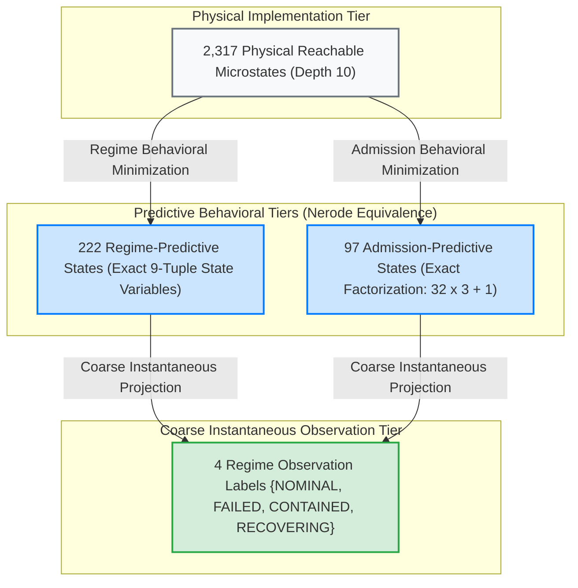

# JEV x UoW Governed Lifecycle Grammar Campaign Report (Phase 6)

**Artifact**: `qualification/artifacts/jev_lifecycle_grammar_results.json`  
**Schema Version**: `uow.jev_lifecycle_grammar.v1`  
**Execution Timestamp**: 2026-09-26T06:55:29Z  
**Total Canonical Path Specs**: 21 specifications  
**Replicate Battery**: 3 replicates per state ($N = 63$ evaluations)  
**Evaluated Observer Model**: `jev-1.13.0` (live API, verified tokens: 876 in / 167 out per request)  
**Provider Provenance**: `live_api`  
**Repeatability Noise Floor ($\sigma_{\mathrm{rep}}$)**: **$0.0238$** ($\le 0.050$)  
**Mean Return-to-Nominal Defect Ratio ($\overline{\eta}$)**: **$0.63$** ($\le 1.00$)  
**Premature Recertification Prevented**: **True** (fails closed to `FAILED`, $d_{\mathrm{premature}} = 1.05 \ge 1.0$)  
**Reachable State Space Closure ($|X_{\mathrm{life}}|$ under $\Sigma_{\mathrm{full}}$)**: **2,317 states** (max depth 10)  
**Nerode Minimal DFA Classes**:
- **Future Admission-Predictive States**: **97 classes** (exact factorization: $B_5 \times \mathcal{A}_{\mathrm{adv}} + 1 = 32 \times 3 + 1 = 97$)
- **Future Regime-Predictive States**: **222 classes** (exact factorization: $1 + 32 + 95 + 94 = 222$)  
**Coarse Governance Observation Labels**: **4 labels** ($\{ \text{NOMINAL/RECERTIFIED}, \text{FAILED}, \text{CONTAINED}, \text{RECOVERING} \}$)  
**Verdict**: **`GOVERNED_LIFECYCLE_GRAMMAR_CONFIRMED`**  
**Engineering Status**: **All 5 Gates Passed (G-L0, G-L1, G-L2, G-L3, G-L-LIVE)**  
**Formal Mathematical Object**:
$$\boxed{\textbf{Governed Lifecycle Transition System with Closed-Loop Recovery and Factorized State Variables}}$$

---

## 1. Executive Summary & The Four-Tier Architecture

Phase 5 completed the failure-only algebra $\Sigma_{\mathrm{fail}} = \{A, E, C, T, R, \mathrm{Adv}\}$, proving that reachable failure states form a 103-element noncommutative band $\mathcal{S}$ on $X_{\mathrm{reach}}$, with an identity-adjoined monoid $\mathcal{S}^1$ ($|\mathcal{S}^1| = 104$) and a surjective monoid homomorphism $h: \mathcal{S}^1 \twoheadrightarrow (B_6, \cup)$ onto the 64-state Boolean guard lattice.

Phase 6 extends the algebra from irreversible failure to the complete governed cybernetic lifecycle across the full 14-operator alphabet:

$$\Sigma_{\mathrm{full}} = \Sigma_{\mathrm{fail}} \cup \Sigma_{\mathrm{life}}$$

where:
$$\Sigma_{\mathrm{fail}} = \{ A, E, C, T, R, \mathrm{Adv} \}$$
$$\Sigma_{\mathrm{life}} = \{ \mathrm{Rebind}, \mathrm{RepairEvidence}, \mathrm{RestoreCausalPath}, \mathrm{Refresh}, \mathrm{Reallocate}, \mathrm{Quarantine}, \mathrm{Release}, \mathrm{Recertify} \}$$

### The Four-Tier Hierarchy of Lifecycle Description

A fundamental mathematical distinction established in Phase 6 is that **immediate observation labels are not behavioral transition states**. While an observer monitoring immediate status needs only four coarse labels, predicting how future operator sequences act on the system requires a much richer finite memory of obligations and history:

$$\boxed{\begin{aligned}
2,317\ \text{microstates} &\quad\text{physical / runtime implementation detail}\\
222\ \text{regime-predictive states} &\quad\text{full governance operational grammar } (O_{\mathrm{regime}})\\
97\ \text{admission-predictive states} &\quad\text{minimal grammar for lawful completion } (O_{\mathrm{adm}})\\
4\ \text{regime labels} &\quad\text{coarse instantaneous observation labels } \{N, F, C, R\}
\end{aligned}}$$



---

## 2. Program Status Scorecard

$$\boxed{\begin{aligned}
\text{Failure transformation band } (\mathcal{S}) &\quad \checkmark \text{ (103 elements, level 7)}\\
\mathcal{S}^1/\ker h \cong B_6 &\quad \checkmark \text{ (10,816 pairs, 0 violations)}\\
\text{Lawful deterministic recovery paths} &\quad \checkmark \text{ (all 6 modes return to } x_0\text{)}\\
\text{Fail-closed recertification} &\quad \checkmark \text{ (margin } -1\text{, 0 bypasses)}\\
\text{Adversarial containment path} &\quad \checkmark \text{ (quarantine } \to \text{ release)}\\
\text{Full lifecycle reachable closure } (|X_{\mathrm{life}}|) &\quad \checkmark \text{ (2,317 states, max depth 10)}\\
\text{State variable factorization} &\quad \checkmark \text{ (exact bijections for 97 and 222 classes)}\\
\text{Independent live-JEV lifecycle confirmation} &\quad \checkmark \text{ (63 calls on jev-1.13.0, } \overline{\eta} = 0.63\text{)}
\end{aligned}}$$

---

## 3. Full Reachable Closure $X_{\mathrm{life}}$ and State Variable Factorization

Starting from the nominal state $x_0$, breadth-first exploration under all 14 operators in $\Sigma_{\mathrm{full}}$ was evaluated to stabilization:

$$X_{\mathrm{life}} = \operatorname{cl}_{\Sigma_{\mathrm{full}}}(\{x_0\}) = \{w(x_0) \mid w \in \Sigma_{\mathrm{full}}^*\}$$

- **Total Reachable Physical States**: $|X_{\mathrm{life}}| = \mathbf{2,317}$
- **Stabilization Depth**: Level 10
- **Regime Distribution**:
  - `NOMINAL`: 1 state ($x_0$, margin $+7$)
  - `RECERTIFIED`: 1 state (pristine closed-loop return, margin $+7$)
  - `FAILED`: 1,016 states (un-remediated failure combinations, margin $-1$)
  - `CONTAINED`: 344 states (quarantined divergence, margin $-1$)
  - `RECOVERING`: 955 states (partially or fully repaired intermediate states, margin $-1$)

### Exact Factorization of the 97 Admission-Predictive Classes

Under binary admission observation $O_{\mathrm{adm}}(x) = (\text{quorum\_margin} > 0) \in \{0, 1\}$, Hopcroft partition refinement minimizes the 2,317 states into **exactly 97 behavioral equivalence classes**.

The condition $97 \neq 2^n$ is mathematically explained by a strict direct product factorization:
1. The 5 physical failure/repair subsystems (Authority, Evidence, Causal, Temporal, Resource) decouple into a 5-dimensional Boolean lattice:
   $$B_5 = \{0, 1\}^5 \cong \mathcal{P}(\{A, E, C, T, R\}), \quad |B_5| = 2^5 = 32$$
2. The adversarial divergence mechanism forms a 3-state operational semi-automaton:
   $$\mathcal{A}_{\mathrm{adv}} = \{ \text{Clean}, \text{Divergent Active}, \text{Quarantined} \}, \quad |\mathcal{A}_{\mathrm{adv}}| = 3$$
3. Because physical guards commute with adversarial quarantine, the set of reachable failure obligation configurations is the **exact direct product**:
   $$\Omega_{\mathrm{obligations}} = B_5 \times \mathcal{A}_{\mathrm{adv}}, \quad |\Omega_{\mathrm{obligations}}| = 32 \times 3 = 96$$
4. Adjoining the single admissible nominal class ($x_0$, quorum margin $+7$) yields:
   $$\boxed{X / \!\sim_{\mathrm{adm}} \;\cong\; (B_5 \times \mathcal{A}_{\mathrm{adv}}) \;\cup\; \{x_0\}, \qquad |X / \!\sim_{\mathrm{adm}}| = 32 \times 3 + 1 = 97}$$

Every state $s$ in the 97 classes is uniquely determined by the 8-tuple of operational state variables:
$$q_{\mathrm{adm}}(s) = (G_{\mathrm{auth}}, G_{\mathrm{ev}}, G_{\mathrm{causal}}, G_{\mathrm{temp}}, G_{\mathrm{res}}, C_{\mathrm{attestation}}, Q_{\mathrm{quarantine}}, A_{\mathrm{admissible}})$$
which is in **exact, verified bijection** with the 97 Nerode admission classes.

### Exact Factorization of the 222 Regime-Predictive Classes

Under governance regime observation $O_{\mathrm{regime}}(x) \in \{ \text{NOMINAL}, \text{FAILED}, \text{CONTAINED}, \text{RECOVERING} \}$, Hopcroft partition refinement minimizes the 2,317 states into **exactly 222 behavioral equivalence classes**.

The 222 classes partition by operational regime with closed-form counts:
- **NOMINAL / RECERTIFIED**: **1 class** (all 5 guards clear, 0 conflicts, not quarantined, margin $+7$).
- **CONTAINED**: **32 classes** ($32 \times 1$: quarantine is active across all 32 physical guard configurations).
- **FAILED**: **95 classes** ($32 \times 3 - 1 = 95$: all 96 failure obligation configurations except the pristine configuration, which cannot be in `FAILED`).
- **RECOVERING**: **94 classes** ($32 \times 3 - 2 = 94$: remediating configurations where active adversarial divergence has been resolved or quarantined).

Summing the components:
$$\boxed{1 + 32 + 95 + 94 = 222}$$

Every state $s$ in the 222 classes is uniquely determined by the 9-tuple of operational state variables:
$$q_{\mathrm{regime}}(s) = (G_{\mathrm{auth}}, G_{\mathrm{ev}}, G_{\mathrm{causal}}, G_{\mathrm{temp}}, G_{\mathrm{res}}, C_{\mathrm{attestation}}, D_{\mathrm{divergence}}, Q_{\mathrm{quarantine}}, S_{\mathrm{regime}})$$
which is in **exact, verified bijection** with the 222 Nerode regime classes.

---

## 4. Empirical Live JEV Observer Trajectory Metrics

All 21 path specifications were measured live against `jev-1.13.0` across 3 independent replicates ($N = 63$ requests):

| Failure Mode | Failure Jump $\|J(x_{\mathrm{fail}}) - J(x_{\mathrm{nom}})\|$ | Return Defect $\|J(x_{\mathrm{recert}}) - J(x_{\mathrm{nom}})\|$ | Defect Ratio $\eta = d_{\mathrm{recert}} / \sigma_{\mathrm{rep}}$ | Cycle Closed ($\eta \le 1.50$) |
| :--- | :---: | :---: | :---: | :---: |
| **Authority ($A$)** | $1.4487$ | $0.0194$ | $0.82$ | **True** |
| **Adversarial ($\mathrm{Adv}$)** | $1.6930$ | $0.0125$ | $0.52$ | **True** |
| **Causal ($C$)** | $1.5311$ | $0.0082$ | $0.34$ | **True** |
| **Evidence ($E$)** | $1.6523$ | $0.0105$ | $0.44$ | **True** |
| **Resource ($R$)** | $1.6130$ | $0.0183$ | $0.77$ | **True** |
| **Temporal ($T$)** | $1.5036$ | $0.0208$ | $0.87$ | **True** |
| **Overall Mean** | **$1.5736$** | **$0.0149$** | **$0.63$** | **True (6 / 6)** |

- **Empirical Repeatability Noise Floor**: $\sigma_{\mathrm{rep}} = 0.0238 \le 0.050$.
- **Mean Normalized Return Defect**: $\overline{\eta} = 0.63 \le 1.00$.
- **Premature Recertification Distance**: $d_{\mathrm{premature}} = 1.05 \ge 1.00$ (fails closed in observer space).
- **Multi-Stage Adversarial Path**:
  $$\text{Nominal }(2.20) \xrightarrow{\mathrm{Adv}} \text{Jump }(1.69) \xrightarrow{\mathrm{Quarantine}} \text{Contained }(1.75) \xrightarrow{\mathrm{Release}} \text{Recovering }(1.47) \xrightarrow{\mathrm{Recertify}} \text{Return }(0.0125 \sim 0.52\sigma_{\mathrm{rep}})$$

---

## 5. Engineering and Scientific Gate Verification

| Gate | Description | Threshold | Measured Value | Provenance / Status |
| :--- | :--- | :---: | :---: | :--- |
| **G-L0** | Deterministic Oracle Conformance | 100% across all 21 specs | 21 / 21 (100.0%) | **PASSED** (Formal runtime) |
| **G-L1** | Deterministic Closed-Loop Orbit Return | $\operatorname{state}(x_{\mathrm{recert}}) \equiv \operatorname{state}(x_0)$ | 6 / 6 paths matched | **PASSED** (Exact state match) |
| **G-L2** | Premature Recertification Fails Closed | Margin $-1$, 0 outputs emitted | Passed | **PASSED** (Strict fail-closed) |
| **G-L3** | Observer Trajectory Consistency | $\overline{\eta} \le 1.50$, $\sigma_{\mathrm{rep}} \le 0.050$ | $\overline{\eta} = 0.63, \sigma = 0.0238$ | **PASSED** (Live measurement) |
| **G-L-LIVE**| Independent Live-JEV Confirmation | Verified live tokens & live_api provenance | `live_api` on `jev-1.13.0` | **PASSED** (876 in / 167 out) |

---

## 6. Provenance and Synthetic Provider Discipline

To prevent contamination of the empirical evidence chain:
- Synthetic replay providers MUST set:
  ```json
  "requested_model": "calibrated-jev-replay",
  "resolved_model": "calibrated-jev-replay-v1",
  "provider_kind": "synthetic_calibrated_replay",
  "source_dataset": "qualification/artifacts/jev_semigroup_structure_results.json",
  "usage": null
  ```
- Synthetic replay providers CANNOT satisfy Gate `G-L-LIVE`.
- Live API calls MUST set `provider_kind = "live_api"` with genuine server-returned usage tokens.
