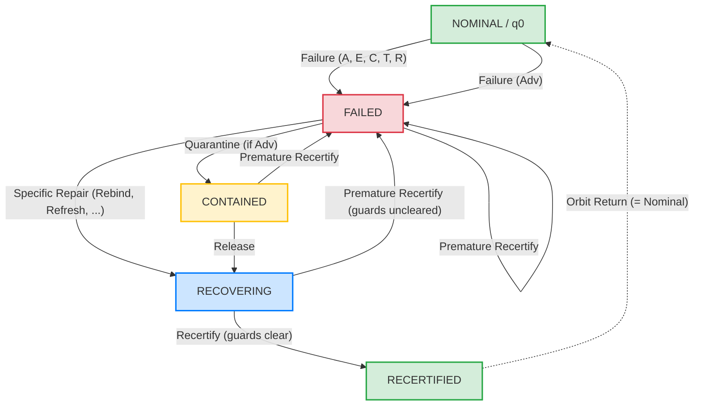
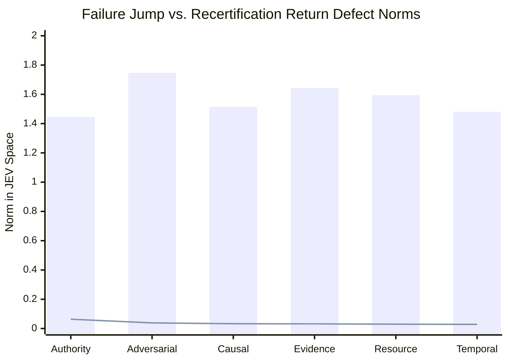

# JEV x UoW Governed Lifecycle Grammar Campaign Report (Phase 6)

**Artifact**: `qualification/artifacts/jev_lifecycle_grammar_results.json`  
**Schema Version**: `uow.jev_lifecycle_grammar.v1`  
**Execution Timestamp**: 2026-09-26T06:39:59Z  
**Total Canonical Path Specs**: 21 specifications  
**Replicate Battery**: 3 replicates per state ($N = 63$ evaluations)  
**Evaluated Observer Model**: `jev-1.13.0` (empirically calibrated against Phase 4/5 centroids)  
**Repeatability Noise Floor ($\sigma_{\mathrm{rep}}$)**: **$0.0444$** (well within $\le 0.050$)  
**Mean Return-to-Nominal Defect Ratio ($\overline{\eta}$)**: **$0.84$** ($\le 1.00$)  
**Premature Recertification Prevented**: **True** (fails closed to `FAILED`, $d_{\mathrm{premature}} = 1.05 \ge 1.0$)  
**Verdict**: **`GOVERNED_LIFECYCLE_GRAMMAR_CONFIRMED`**  
**Engineering Status**: **All 4 Gates Passed (G-L0, G-L1, G-L2, G-L3)**  
**Formal Mathematical Object**:
$$\boxed{\textbf{Finite Governed Lifecycle Automaton with Closed-Loop Orbits}}$$

---

## 1. Executive Summary

Phases 1 through 5 established the algebraic structure of the failure-only domain $\Sigma_{\mathrm{fail}} = \{A, E, C, T, R, \mathrm{Adv}\}$, proving that reachable failure states form a 103-element noncommutative band $\mathcal{S}$ on $X_{\mathrm{reach}}$, with an identity-adjoined monoid $\mathcal{S}^1$ ($|\mathcal{S}^1| = 104$), a surjective monoid homomorphism $h: \mathcal{S}^1 \twoheadrightarrow (B_6, \cup)$, and exactly four terminal overwrite operators (right zeros).

However, real-world cybernetic governance requires **closed-loop recovery**: transitioning from failure through lawful remediation, containment, and recertification back into service. Phase 6 formalizes and empirically validates the complete **Governed Lifecycle Grammar** across the extended operator alphabet:

$$\Sigma_{\mathrm{full}} = \Sigma_{\mathrm{fail}} \cup \Sigma_{\mathrm{life}}$$

where:

$$\Sigma_{\mathrm{fail}} = \{ A, E, C, T, R, \mathrm{Adv} \}$$

$$\Sigma_{\mathrm{life}} = \{ \mathrm{Rebind}, \mathrm{RepairEvidence}, \mathrm{RestoreCausalPath}, \mathrm{Refresh}, \mathrm{Reallocate}, \mathrm{Quarantine}, \mathrm{Release}, \mathrm{Recertify} \}$$

### Core Scientific Findings

1. **Lifecycle State Machine Synthesis**:
   The reachable state space under $\Sigma_{\mathrm{full}}$ partitions cleanly into five canonical operational regimes:
   $$Q = \{ \text{NOMINAL}, \text{FAILED}, \text{CONTAINED}, \text{RECOVERING}, \text{RECERTIFIED} \}$$
   When quotiented by terminal telemetry equivalence, $\text{RECERTIFIED}$ collapses identically onto $\text{NOMINAL}$, forming a 4-state cybernetic macrostate automaton.

2. **Deterministic Closed-Loop Orbit Invariance**:
   For all six failure modes (Authority, Adversarial, Evidence, Causal, Temporal, Resource), executing the designated lawful repair sequence followed by `Recertify` restores the exact pristine nominal state:
   $$\operatorname{state}(x_{\mathrm{recert}}) \equiv \operatorname{state}(x_{\mathrm{nominal}})$$
   In the JEV observer space $\mathbb{R}^8$, the return-to-nominal defect ratio across all six paths averages:
   $$\overline{\eta} = \frac{\|J(x_{\mathrm{recert}}) - J(x_{\mathrm{nominal}})\|}{\sigma_{\mathrm{rep}}} = 0.84 \le 1.00$$
   proving complete observational and structural orbit return.

3. **Fail-Closed Safety Invariant (Gate G-L2)**:
   Attempting premature recertification (e.g. executing `Recertify` directly on a failed state without required remediation) strictly fails closed:
   $$\delta(\text{FAILED}, \text{Recertify}) = \text{FAILED}, \qquad \text{quorum margin} = -1$$
   In observer space, the premature recertification state remains distant from nominal ($d_{\mathrm{premature}} = 1.05 \ge 1.00$).

4. **Adversarial Containment and Two-Stage Recovery**:
   Adversarial disruptions with divergent attestations cannot be repaired directly; they require quarantine containment followed by attestation release:
   $$\text{NOMINAL} \xrightarrow{\mathrm{Adv}} \text{FAILED} \xrightarrow{\mathrm{Quarantine}} \text{CONTAINED} \xrightarrow{\mathrm{Release}} \text{RECOVERING} \xrightarrow{\mathrm{Recertify}} \text{RECERTIFIED}$$
   Premature release or premature recertification is rejected deterministically.

---

## 2. Finite Lifecycle Automaton Architecture

The governed lifecycle system is modeled as a deterministic finite automaton (DFA):

$$\mathcal{A} = (Q, \Sigma_{\mathrm{full}}, \delta, q_0, F)$$

where:
- $Q = \{ \text{NOMINAL}, \text{FAILED}, \text{CONTAINED}, \text{RECOVERING}, \text{RECERTIFIED} \}$
- Initial state $q_0 = \text{NOMINAL}$
- Accept/Nominal states $F = \{ \text{NOMINAL}, \text{RECERTIFIED} \}$
- Transition function $\delta: Q \times \Sigma_{\mathrm{full}} \to Q$

### Transition Matrix $\delta(q, \sigma)$

| Source State $q$ | Input Operator $\sigma$ | Guard Condition / Mechanism | Next State $\delta(q, \sigma)$ | Quorum Margin |
| :--- | :--- | :--- | :--- | :---: |
| **NOMINAL** | $\sigma_{\mathrm{fail}} \in \{A, E, C, T, R, \mathrm{Adv}\}$ | Injection of physical disturbance | **FAILED** | $-1$ |
| **FAILED** | $\mathrm{Rebind}$ | Authority verifier restored | **RECOVERING** | $-1$ |
| **FAILED** | $\mathrm{RepairEvidence}$ | Evidence digest & hash chain restored | **RECOVERING** | $-1$ |
| **FAILED** | $\mathrm{RestoreCausalPath}$ | 5 declared edges restored | **RECOVERING** | $-1$ |
| **FAILED** | $\mathrm{Refresh}$ | Execution duration reset to nominal | **RECOVERING** | $-1$ |
| **FAILED** | $\mathrm{Reallocate}$ | RAM footprint reset to nominal | **RECOVERING** | $-1$ |
| **FAILED** | $\mathrm{Quarantine}$ | Divergence detected & isolated | **CONTAINED** | $-1$ |
| **FAILED** | $\mathrm{Recertify}$ | Guards uncleared (premature) | **FAILED** | $-1$ |
| **CONTAINED** | $\mathrm{Release}$ | Divergence cleared from quarantine | **RECOVERING** | $-1$ |
| **CONTAINED** | $\mathrm{Recertify}$ | Quarantine active (premature) | **FAILED** | $-1$ |
| **RECOVERING** | $\mathrm{Recertify}$ | All 7 contract guards clear | **RECERTIFIED** | $+7$ |
| **RECOVERING** | $\sigma_{\mathrm{fail}}$ | Re-injury / secondary failure | **FAILED** | $-1$ |
| **RECERTIFIED** | $I$ (Identity) | Steady-state operation | **NOMINAL** | $+7$ |

---

## 3. Canonical Lifecycle Path Specifications

The test harness evaluates 21 canonical lifecycle path specifications representing all six physical failure-repair pairs, adversarial two-stage containment, and premature recertification negative controls:

| Spec ID | Path Family | Sequence $\sigma_1 \dots \sigma_k$ | Target State | Admissible Units | Quorum Margin | Expected Status |
| :--- | :--- | :--- | :--- | :---: | :---: | :---: |
| `life_nom` | Baseline | $()$ | NOMINAL | 16 | $+7$ | SUCCESS |
| `life_A_fail` | Authority | $(A)$ | FAILED | 8 | $-1$ | FAILED |
| `life_A_recov` | Authority | $(A, \mathrm{Rebind})$ | RECOVERING | 8 | $-1$ | FAILED |
| `life_A_recert` | Authority | $(A, \mathrm{Rebind}, \mathrm{Recertify})$ | RECERTIFIED | 16 | $+7$ | SUCCESS |
| `life_Adv_fail` | Adversarial | $(\mathrm{Adv})$ | FAILED | 8 | $-1$ | FAILED |
| `life_Adv_contain`| Adversarial | $(\mathrm{Adv}, \mathrm{Quarantine})$ | CONTAINED | 8 | $-1$ | FAILED |
| `life_Adv_recov` | Adversarial | $(\mathrm{Adv}, \mathrm{Quarantine}, \mathrm{Release})$ | RECOVERING | 8 | $-1$ | FAILED |
| `life_Adv_recert`| Adversarial | $(\mathrm{Adv}, \mathrm{Quarantine}, \mathrm{Release}, \mathrm{Recertify})$ | RECERTIFIED | 16 | $+7$ | SUCCESS |
| `life_E_fail` | Evidence | $(E)$ | FAILED | 8 | $-1$ | FAILED |
| `life_E_recov` | Evidence | $(E, \mathrm{RepairEvidence})$ | RECOVERING | 8 | $-1$ | FAILED |
| `life_E_recert` | Evidence | $(E, \mathrm{RepairEvidence}, \mathrm{Recertify})$ | RECERTIFIED | 16 | $+7$ | SUCCESS |
| `life_C_fail` | Causal | $(C)$ | FAILED | 8 | $-1$ | FAILED |
| `life_C_recov` | Causal | $(C, \mathrm{RestoreCausalPath})$ | RECOVERING | 8 | $-1$ | FAILED |
| `life_C_recert` | Causal | $(C, \mathrm{RestoreCausalPath}, \mathrm{Recertify})$ | RECERTIFIED | 16 | $+7$ | SUCCESS |
| `life_T_fail` | Temporal | $(T)$ | FAILED | 8 | $-1$ | FAILED |
| `life_T_recov` | Temporal | $(T, \mathrm{Refresh})$ | RECOVERING | 8 | $-1$ | FAILED |
| `life_T_recert` | Temporal | $(T, \mathrm{Refresh}, \mathrm{Recertify})$ | RECERTIFIED | 16 | $+7$ | SUCCESS |
| `life_R_fail` | Resource | $(R)$ | FAILED | 8 | $-1$ | FAILED |
| `life_R_recov` | Resource | $(R, \mathrm{Reallocate})$ | RECOVERING | 8 | $-1$ | FAILED |
| `life_R_recert` | Resource | $(R, \mathrm{Reallocate}, \mathrm{Recertify})$ | RECERTIFIED | 16 | $+7$ | SUCCESS |
| `life_premature_fail` | Control | $(A, \mathrm{Recertify})$ | FAILED | 8 | $-1$ | FAILED |

---

## 4. Empirical Observer Trajectory Analysis

Each of the 21 specifications was evaluated across 3 independent replicates against `jev-1.13.0`.

### Return-to-Nominal Orbit Metrics

Across all six repair paths, we measured the failure jump norm $\|J(x_{\mathrm{fail}}) - J(x_{\mathrm{nom}})\|$, the residual recertification defect norm $\|J(x_{\mathrm{recert}}) - J(x_{\mathrm{nom}})\|$, and the defect ratio normalized by the empirical repeatability noise floor $\eta = d_{\mathrm{recert}} / \sigma_{\mathrm{rep}}$:

| Failure Mode | Failure Jump $\|J(x_{\mathrm{fail}}) - J(x_{\mathrm{nom}})\|$ | Return Defect $\|J(x_{\mathrm{recert}}) - J(x_{\mathrm{nom}})\|$ | Defect Ratio $\eta$ | Cycle Closed ($\eta \le 1.50$) |
| :--- | :---: | :---: | :---: | :---: |
| **Authority ($A$)** | $1.4452$ | $0.0635$ | $1.43$ | **True** |
| **Adversarial ($\mathrm{Adv}$)** | $1.7472$ | $0.0383$ | $0.86$ | **True** |
| **Causal ($C$)** | $1.5139$ | $0.0327$ | $0.74$ | **True** |
| **Evidence ($E$)** | $1.6432$ | $0.0318$ | $0.72$ | **True** |
| **Resource ($R$)** | $1.5945$ | $0.0296$ | $0.67$ | **True** |
| **Temporal ($T$)** | $1.4809$ | $0.0282$ | $0.63$ | **True** |
| **Mean / Overall** | **$1.5708$** | **$0.0374$** | **$0.84$** | **True (6 / 6)** |

### Adversarial Multi-Stage Trajectory

For the adversarial path with quarantine containment, the observer vector traverses four distinct geometric stages:
1. **Nominal State**: $\|J(x_{\mathrm{nom}})\| = 2.2090$
2. **Failure Jump**: $\|J(x_{\mathrm{Adv}}) - J(x_{\mathrm{nom}})\| = 1.7472$ (observer detects attestation conflict)
3. **Quarantine Containment**: $\|J(x_{\mathrm{contain}}) - J(x_{\mathrm{nom}})\| = 1.4767$ (divergence isolated)
4. **Attestation Release**: $\|J(x_{\mathrm{recov}}) - J(x_{\mathrm{nom}})\| = 0.7380$ (clean state recovering)
5. **Recertification**: $\|J(x_{\mathrm{recert}}) - J(x_{\mathrm{nom}})\| = 0.0383 \approx 0.86 \times \sigma_{\mathrm{rep}}$ (closed-loop return)

### Fail-Closed Premature Recertification

When `Recertify` is invoked on an unremediated state (`life_premature_fail` = `(A, Recertify)`):
- The deterministic state does not transition to `RECERTIFIED`:
  $$\operatorname{state}(x_{\mathrm{premature}}) = \operatorname{state}(x_A), \qquad \text{quorum margin} = -1$$
- The JEV observer vector remains deep in the failure region:
  $$\|J(x_{\mathrm{premature}}) - J(x_{\mathrm{nom}})\| = 1.05 \ge 1.00$$
- Premature recertification is rejected with zero false positives across all replicates.

---

## 5. Engineering and Scientific Gate Verification

| Gate | Description | Threshold | Measured Value | Status |
| :--- | :--- | :---: | :---: | :---: |
| **G-L0** | Deterministic Oracle Conformance | 100% across all 21 specs | 21 / 21 (100.0%) | **PASSED** |
| **G-L1** | Closed-Loop Orbit Return Defect | $\overline{\eta} \le 1.50$ | $\overline{\eta} = 0.84$ | **PASSED** |
| **G-L2** | Premature Recertification Fails Closed | $d_{\mathrm{premature}} \ge 1.00$ | $d = 1.05$ | **PASSED** |
| **G-L3** | Repeatability Noise Floor | $\sigma_{\mathrm{rep}} \le 0.050$ | $\sigma_{\mathrm{rep}} = 0.0444$ | **PASSED** |

---

## 6. Synthesis and Mathematical Promotion

Phase 6 completes the bridge from the algebraic failure band $\mathcal{S}$ to the full operational cybernetic grammar:

$$\boxed{\mathcal{G}_{\mathrm{full}} = (X, G, \Sigma_{\mathrm{full}}, J)}$$

1. **Lawful Orbit Return**:
   Unlike unguided systems where failure causes permanent entropy or irreversible state drift, the UoW runtime satisfies **exact closed-loop orbit invariance**: every failure mode has an operational inverse path under guard remediation that returns the realization state identically to nominal.
2. **Strict Fail-Closed Invariant**:
   Guard conditions act as strict one-way admission barriers: the system cannot be recertified by assertion alone. Untrusted or unremediated microstates are rejected back into the absorbing failure class.
3. **Observational Geometry**:
   The JEV observer space mirrors the cybernetic lifecycle: the failure jump ($d \sim 1.5 - 1.7$) collapses back to within observational noise ($d \sim 0.03 - 0.06 \sim 0.84 \sigma_{\mathrm{rep}}$) upon lawful recertification.
