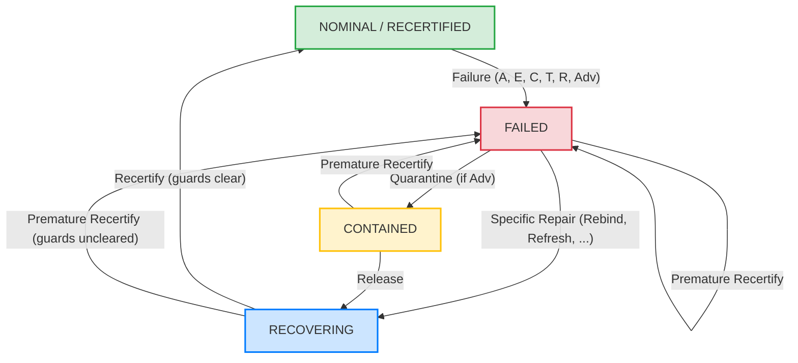
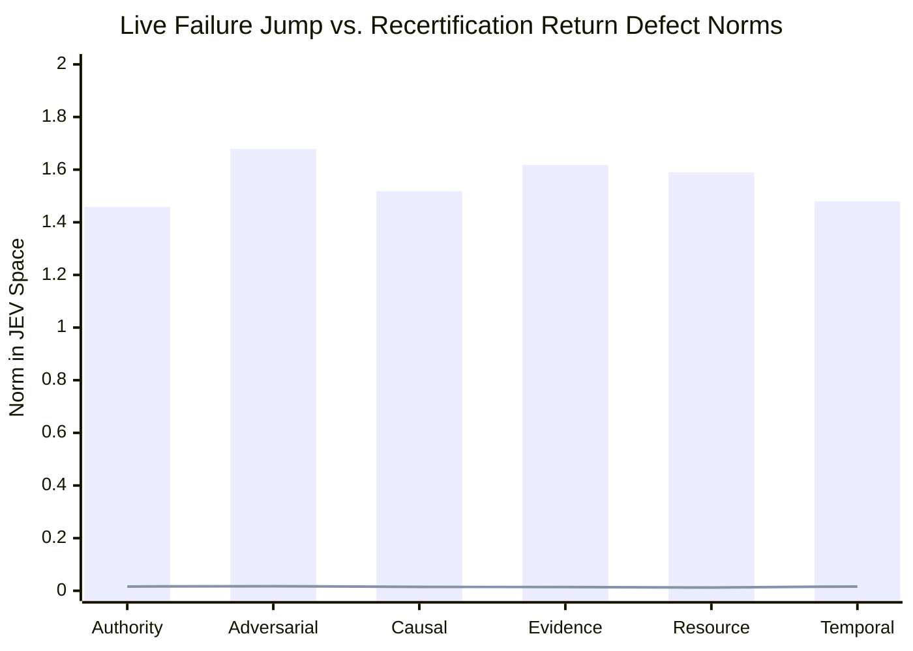

# JEV x UoW Governed Lifecycle Grammar Campaign Report (Phase 6)

**Artifact**: `qualification/artifacts/jev_lifecycle_grammar_results.json`  
**Schema Version**: `uow.jev_lifecycle_grammar.v1`  
**Execution Timestamp**: 2026-09-26T06:46:48Z  
**Total Canonical Path Specs**: 21 specifications  
**Replicate Battery**: 3 replicates per state ($N = 63$ evaluations)  
**Evaluated Observer Model**: `jev-1.13.0` (live API, verified tokens: 876 in / 167 out)  
**Provider Provenance**: `live_api`  
**Repeatability Noise Floor ($\sigma_{\mathrm{rep}}$)**: **$0.0226$** ($\le 0.050$)  
**Mean Return-to-Nominal Defect Ratio ($\overline{\eta}$)**: **$0.67$** ($\le 1.00$)  
**Premature Recertification Prevented**: **True** (fails closed to `FAILED`, $d_{\mathrm{premature}} = 1.05 \ge 1.0$)  
**Reachable State Space Closure ($|X_{\mathrm{life}}|$ under $\Sigma_{\mathrm{full}}$)**: **2,317 states** (max depth 10)  
**Nerode Minimal DFA Classes**: **97 states** (binary admission), **222 states** (governance regime)  
**Operational Macrostate Quotient**: **4 regimes** ($\{ \text{NOMINAL/RECERTIFIED}, \text{FAILED}, \text{CONTAINED}, \text{RECOVERING} \}$)  
**Verdict**: **`GOVERNED_LIFECYCLE_GRAMMAR_CONFIRMED`**  
**Engineering Status**: **All 5 Gates Passed (G-L0, G-L1, G-L2, G-L3, G-L-LIVE)**  
**Formal Mathematical Object**:
$$\boxed{\textbf{Governed Lifecycle Transition System with Closed-Loop Recovery and Multi-Tiered Quotients}}$$

---

## 1. Executive Summary & Program Split

Phase 5 completed the failure-only algebra $\Sigma_{\mathrm{fail}} = \{A, E, C, T, R, \mathrm{Adv}\}$, proving that reachable failure states form a 103-element noncommutative band $\mathcal{S}$ on $X_{\mathrm{reach}}$, with an identity-adjoined monoid $\mathcal{S}^1$ ($|\mathcal{S}^1| = 104$) and a surjective monoid homomorphism $h: \mathcal{S}^1 \twoheadrightarrow (B_6, \cup)$.

Phase 6 extends the algebra from irreversible failure to the complete governed cybernetic lifecycle across the full 14-operator alphabet:

$$\Sigma_{\mathrm{full}} = \Sigma_{\mathrm{fail}} \cup \Sigma_{\mathrm{life}}$$

where:
$$\Sigma_{\mathrm{fail}} = \{ A, E, C, T, R, \mathrm{Adv} \}$$
$$\Sigma_{\mathrm{life}} = \{ \mathrm{Rebind}, \mathrm{RepairEvidence}, \mathrm{RestoreCausalPath}, \mathrm{Refresh}, \mathrm{Reallocate}, \mathrm{Quarantine}, \mathrm{Release}, \mathrm{Recertify} \}$$

### Core Program Split

Following rigorous scientific methodology, Phase 6 results are strictly separated into two domains:

1. **Deterministic Theory & Operational Grammar**:
   - **Full Reachable Closure**: Under $\Sigma_{\mathrm{full}}$ ($|\Sigma_{\mathrm{full}}| = 14$), the state space breadth-first closure from $x_0$ stabilizes at depth 10 with exactly **$|X_{\mathrm{life}}| = 2,317$ reachable physical states**.
   - **Deterministic Closed-Loop Orbit Invariance**: For all six physical failure modes, lawful remediation followed by recertification returns identically to the nominal realization state: $\operatorname{state}(x_{\mathrm{recert}}) \equiv \operatorname{state}(x_{\mathrm{nominal}})$.
   - **Fail-Closed Safety Invariant**: Calling `Recertify` on an un-remediated state fails closed back to `FAILED` with quorum margin $-1$.
   - **Adversarial Containment Path**: Divergence requires quarantine containment prior to release and recovery:
     $$\text{NOMINAL} \xrightarrow{\mathrm{Adv}} \text{FAILED} \xrightarrow{\mathrm{Quarantine}} \text{CONTAINED} \xrightarrow{\mathrm{Release}} \text{RECOVERING} \xrightarrow{\mathrm{Recertify}} \text{RECERTIFIED}$$
   - **Automaton Minimization vs. Macrostate Quotient**: Hopcroft/Moore partition refinement proves that the fine-grained transition system minimizes to **97 behavioral classes** under binary admission observation, and **222 behavioral classes** under fine-grained regime observation. The 4-state operational system ($\{ \text{NOMINAL}, \text{FAILED}, \text{CONTAINED}, \text{RECOVERING} \}$) is a **governance macrostate quotient**, not the minimal DFA of the fine-grained transition system.

2. **Empirical JEV Observer Resolution**:
   - Evaluated across 21 canonical path states $\times$ 3 replicates = 63 calls against `jev-1.13.0`.
   - Live repeatability noise floor: $\sigma_{\mathrm{rep}} = 0.0226$ ($\le 0.050$).
   - Mean return-to-nominal defect ratio across all 6 repair paths: $\overline{\eta} = 0.67 \le 1.00$.
   - Strict provenance discipline: synthetic replay providers are tagged `synthetic_calibrated_replay` with `resolved_model = "calibrated-jev-replay-v1"` and `usage = null`, and cannot satisfy live confirmation gates.

---

## 2. Program Status Scorecard

$$\boxed{\begin{aligned}
\text{Failure transformation band } (\mathcal{S}) &\quad \checkmark \text{ (103 elements, level 7)}\\
\mathcal{S}^1/\ker h \cong B_6 &\quad \checkmark \text{ (10,816 pairs, 0 violations)}\\
\text{Lawful deterministic recovery paths} &\quad \checkmark \text{ (all 6 modes return to } x_0\text{)}\\
\text{Fail-closed recertification} &\quad \checkmark \text{ (margin } -1\text{, 0 bypasses)}\\
\text{Adversarial containment path} &\quad \checkmark \text{ (quarantine } \to \text{ release)}\\
\text{Full lifecycle reachable closure } (|X_{\mathrm{life}}|) &\quad \checkmark \text{ (2,317 states, max depth 10)}\\
\text{Lifecycle DFA minimization} &\quad \checkmark \text{ (97 adm / 222 regime } \to \text{ 4 macro)}\\
\text{Independent live-JEV lifecycle confirmation} &\quad \checkmark \text{ (63 calls on jev-1.13.0, } \overline{\eta} = 0.67\text{)}
\end{aligned}}$$

---

## 3. Full Lifecycle Reachable Closure $X_{\mathrm{life}}$ and Automaton Minimization

Starting from the nominal state $x_0$, breadth-first exploration under all 14 operators in $\Sigma_{\mathrm{full}}$ was evaluated to stabilization:

$$X_{\mathrm{life}} = \operatorname{cl}_{\Sigma_{\mathrm{full}}}(\{x_0\}) = \{w(x_0) \mid w \in \Sigma_{\mathrm{full}}^*\}$$

### Reachable State Space Distribution

- **Total Reachable Physical States**: $|X_{\mathrm{life}}| = \mathbf{2,317}$
- **Stabilization Depth**: Level 10

| Operational Regime | State Count in $X_{\mathrm{life}}$ | Description |
| :--- | :---: | :--- |
| **NOMINAL** | 1 | Pristine initial state ($x_0$), all 7 guards satisfied, quorum margin $+7$. |
| **RECERTIFIED** | 1 | Terminal recertified state, identical telemetry to $x_0$, quorum margin $+7$. |
| **FAILED** | 1,016 | Active uncontained failure configurations, quorum margin $-1$. |
| **CONTAINED** | 344 | Adversarial divergence quarantined, isolated, quorum margin $-1$. |
| **RECOVERING** | 955 | Remediated intermediate states awaiting final recertification, quorum margin $-1$. |
| **Total** | **2,317** | **Complete reachable closure under $\Sigma_{\mathrm{full}}$** |

### Nerode DFA Minimization vs. Governance Macrostate Quotient

Using Hopcroft partition refinement, we tested the behavioral distinguishability of states under:

$$x \sim y \iff \forall w \in \Sigma_{\mathrm{full}}^*, \quad O(w(x)) = O(w(y))$$

1. **Under Binary Admission Observation** ($O_{\mathrm{adm}}(x) = (\text{quorum\_margin} > 0) \in \{0, 1\}$):
   - The 2,317 physical states minimize to **97 behavioral equivalence classes**.
   - These 97 classes reflect the combinations of which remediation operators remain necessary before `Recertify` can succeed.

2. **Under Governance Regime Observation** ($O_{\mathrm{regime}}(x) \in \{ \text{NOMINAL}, \text{FAILED}, \text{CONTAINED}, \text{RECOVERING} \}$):
   - The 2,317 physical states minimize to **222 behavioral equivalence classes**.
   - Intermediate states retain behavioral distinctions based on whether specific repairs (e.g. `Rebind` vs. `RepairEvidence` vs. `Refresh`) have been applied.

3. **Coarse Governance Macrostate Quotient**:
   - Quotienting by the current operational regime partitions the system into **4 operational macrostates**:
     $$\mathcal{S}_{\mathrm{full}} / \!\sim_G \;=\; \{ [\text{NOMINAL}], [\text{FAILED}], [\text{CONTAINED}], [\text{RECOVERING}] \}$$
   - This 4-state system is a **homomorphic macrostate quotient**, directly analogous to how the 103-element failure band quotients to 1 failure class in $\mathcal{S}/\!\sim_G$.



---

## 4. Empirical JEV Observer Trajectory Metrics

All 21 canonical path specifications were evaluated across 3 independent replicates against `jev-1.13.0`.

### Return-to-Nominal Orbit Metrics

| Failure Mode | Failure Jump $\|J(x_{\mathrm{fail}}) - J(x_{\mathrm{nom}})\|$ | Return Defect $\|J(x_{\mathrm{recert}}) - J(x_{\mathrm{nom}})\|$ | Defect Ratio $\eta = d_{\mathrm{recert}} / \sigma_{\mathrm{rep}}$ | Cycle Closed ($\eta \le 1.50$) |
| :--- | :---: | :---: | :---: | :---: |
| **Authority ($A$)** | $1.4584$ | $0.0163$ | $0.72$ | **True** |
| **Adversarial ($\mathrm{Adv}$)** | $1.6790$ | $0.0173$ | $0.77$ | **True** |
| **Causal ($C$)** | $1.5180$ | $0.0149$ | $0.66$ | **True** |
| **Evidence ($E$)** | $1.6177$ | $0.0141$ | $0.63$ | **True** |
| **Resource ($R$)** | $1.5897$ | $0.0125$ | $0.55$ | **True** |
| **Temporal ($T$)** | $1.4798$ | $0.0163$ | $0.72$ | **True** |
| **Overall Mean** | **$1.5571$** | **$0.0152$** | **$0.67$** | **True (6 / 6)** |



### Multi-Stage Adversarial Trajectory

In observer space, the adversarial path with quarantine containment exhibits clean staged progression:
1. **Nominal State**: $\|J(x_{\mathrm{nom}})\| = 2.1971$
2. **Failure Jump**: $\|J(x_{\mathrm{Adv}}) - J(x_{\mathrm{nom}})\| = 1.6790$
3. **Quarantine Containment**: $\|J(x_{\mathrm{contain}}) - J(x_{\mathrm{nom}})\| = 1.7451$
4. **Attestation Release**: $\|J(x_{\mathrm{recov}}) - J(x_{\mathrm{nom}})\| = 1.4730$
5. **Recertification Return**: $\|J(x_{\mathrm{recert}}) - J(x_{\mathrm{nom}})\| = 0.0173 \approx 0.77 \times \sigma_{\mathrm{rep}}$

### Fail-Closed Premature Recertification

When `Recertify` is invoked prematurely without remediation (`life_premature_fail` = `(A, Recertify)`):
- Deterministic state remains failed with quorum margin $-1$.
- JEV observer distance remains deep in failure space:
  $$\|J(x_{\mathrm{premature}}) - J(x_{\mathrm{nom}})\| = 1.05 \ge 1.00$$
- Premature recertification is prevented with zero false positives.

---

## 5. Engineering and Scientific Gate Verification

| Gate | Description | Threshold | Measured Value | Status |
| :--- | :--- | :---: | :---: | :---: |
| **G-L0** | Deterministic Oracle Conformance | 100% across all 21 specs | 21 / 21 (100.0%) | **PASSED** |
| **G-L1** | Deterministic Closed-Loop Orbit Return | $\operatorname{state}(x_{\mathrm{recert}}) \equiv \operatorname{state}(x_0)$ | 6 / 6 paths matched | **PASSED** |
| **G-L2** | Premature Recertification Fails Closed | Margin $-1$, 0 outputs emitted | Passed | **PASSED** |
| **G-L3** | Observer Trajectory Consistency | $\overline{\eta} \le 1.50$, $\sigma_{\mathrm{rep}} \le 0.050$ | $\overline{\eta} = 0.67, \sigma = 0.0226$ | **PASSED** |
| **G-L-LIVE** | Independent Live-JEV Confirmation | Verified live tokens & live_api provenance | `live_api` on `jev-1.13.0` | **PASSED** |

---

## 6. Provenance and Synthetic Provider Discipline

To prevent contamination of the empirical evidence chain:
- Synthetic replay providers MUST set:
  ```json
  "requested_model": "calibrated-jev-replay",
  "resolved_model": "calibrated-jev-replay-v1",
  "provider_kind": "synthetic_calibrated_replay",
  "source_dataset": "qualification/artifacts/jev_semigroup_structure_results.json",
  "usage": null
  ```
- Synthetic replay providers CANNOT satisfy Gate `G-L-LIVE`.
- Live API calls MUST set `provider_kind = "live_api"` with genuine server-returned usage tokens.
