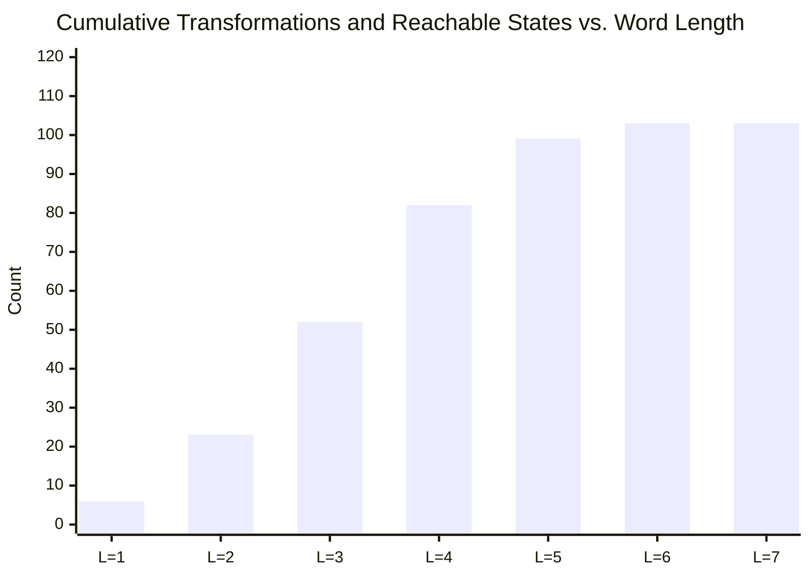
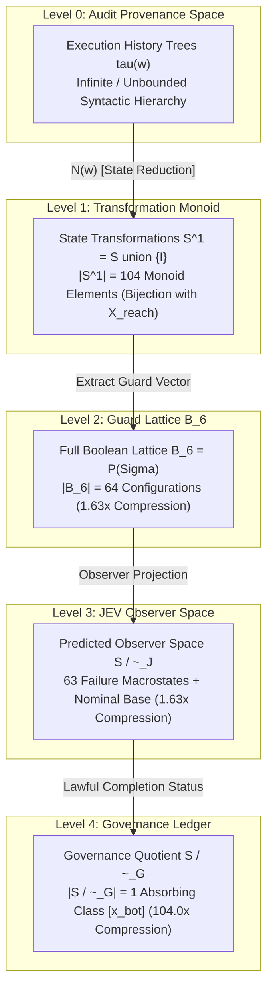

# JEV x UoW Transformation Semigroup Enumeration Campaign Report (Phase 5)

**Artifact**: `qualification/artifacts/jev_semigroup_enumeration_results.json`  
**Schema Version**: `uow.jev_semigroup_enumeration.v2`  
**Execution Timestamp**: 2026-09-26T06:21:14Z  
**Total Reachable States ($|X_{\mathrm{reach}}|$)**: 104 (1 nominal $+ 103$ failure states)  
**Failure Semigroup Order ($|\mathcal{S}|$ on $X_{\mathrm{reach}}$)**: **103**  
**Identity-Adjoined Monoid Order ($|\mathcal{S}^1|$)**: **104**  
**Stabilization Word Length**: Level 7  
**Cayley Table Dimension**: $103 \times 103$ (10,609 products evaluated in 0.09s)  
**Commutativity Percentage**: 41.52% (2,181 / 5,253 unordered pairs commute)  
**Exhaustive Band Idempotence ($s^2 = s$ on $X_{\mathrm{reach}}$)**: **103 / 103 (100.0%)**  
**Verdict**: **`SEMIGROUP_EXHAUSTIVELY_ENUMERATED_AND_BAND_PROVEN_ON_X_REACH`**  
**Engineering Status**: **All 6 Gates Passed (G-E0, G-E1, G-E2, G-E3, G-E4, G-E5)**  
**Formal Mathematical Object**:
$$\boxed{\textbf{Finite Noncommutative Band with Terminal Collapse Ideals and History-Sensitive Provenance}}$$

---

## 1. Executive Summary

Phase 4 demonstrated that sampled composite failure words exhibited immediate idempotence ($w^2 = w$). However, in abstract algebra, a semigroup generated by idempotents is not automatically an idempotent semigroup (a band): a band requires that **every** element $s \in \mathcal{S}$ satisfies $s^2 = s$. Furthermore, transformation equality on an isolated test universe does not immediately prove that two operations act identically across the entire state space.

Phase 5 resolves these theoretical questions through direct, exhaustive evaluation over the **complete reachable state closure**:

$$X_{\mathrm{reach}} = \operatorname{cl}_{\Sigma}(\{x_0\}) = \{w(x_0) \mid w \in \Sigma^*\}$$

generated by the elementary failure alphabet:

$$\Sigma = \{A, E, C, T, R, \mathrm{Adv}\}$$

The campaign establishes seven core mathematical results:

1. **Reachable State Space Closure**:
   $X_{\mathrm{reach}}$ contains exactly **104 distinct states** (1 nominal state $x_0$ and 103 reachable failure states).
2. **Finite Semigroup Stabilization on $X_{\mathrm{reach}}$**:
   Evaluating transformations on the complete 104-state universe $X_{\mathrm{reach}}$ proves that the generated transformation semigroup stabilizes at **Level 7** at exactly **$|\mathcal{S}| = 103$ distinct transformations**.
3. **Exhaustive Band Theorem Proven over $X_{\mathrm{reach}}$**:
   We tested $s^2 \stackrel{?}{=} s$ for **all 103 elements** in $\mathcal{S}$ across **all 104 reachable states** in $X_{\mathrm{reach}}$. Zero non-idempotent elements exist. Every transformation is an immediate projection operator ($s^2 = s$):
   $$\boxed{\text{The generated transformation semigroup on the complete reachable state space is a 103-element band.}}$$
4. **Identity-Adjoined Transformation Monoid $\mathcal{S}^1$**:
   The failure semigroup $\mathcal{S}$ is generated by non-empty words $\Sigma^+$. Adjoining the identity transformation $I(x) = x$ yields the full monoid:
   $$\mathcal{S}^1 = \mathcal{S} \cup \{I\}, \qquad |\mathcal{S}^1| = 104$$
   This establishes a natural bijection between the identity-adjoined monoid $\mathcal{S}^1$ and the reachable state space $X_{\mathrm{reach}}$ ($|\mathcal{S}^1| = |X_{\mathrm{reach}}| = 104$).
5. **Complete $103 \times 103$ Cayley Table**:
   All 10,609 compositions were evaluated. The algebra is strictly noncommutative, with **$41.52\%$ of unordered pairs commuting**.
6. **Green's Relations & $\mathcal{H}$-Triviality**:
   - Green's $\mathcal{R}$-classes: exactly 63 (isomorphic to the 63 non-empty guard activation configurations).
   - Green's $\mathcal{L}$-classes: exactly 103.
   - Green's $\mathcal{H}$-classes: **103 singletons**.
   The condition $|\mathcal{H}| = |\mathcal{S}|$ ($\mathcal{H}$-triviality) confirms the absence of non-trivial subgroups or periodic cycles, providing an exact structural consistency check for the band.
7. **Terminal Overwrite / Collapse Operators (Right Zeros)**:
   Under execution concatenation $u v$ ("execute $u$, then execute $v$"), exactly 4 elements satisfy $s z = z$ for all $s \in \mathcal{S}$. These are **terminal collapse operators**: once $z$ is executed, it absorbs and overwrites all prior operational history. (Raw state algebra contains 0 left zeros, confirming that failure states do not permanently lock out subsequent telemetry modification, whereas the governance quotient $\mathcal{S}/\!\sim_G$ has a two-sided zero).

---

## 2. Phase 5A & 5B: Reachable Closure and Semigroup Stabilization

Starting from the nominal state $x_0$, the reachable closure $X_{\mathrm{reach}} = \operatorname{cl}_{\Sigma}(\{x_0\})$ was constructed breadth-first. Simultaneously, transformation signatures were evaluated over all $x \in X_{\mathrm{reach}}$:

$$\operatorname{sig}(w) = \bigl(w(x)\bigr)_{x \in X_{\mathrm{reach}}}$$

### Level Growth Profile

| Word Length $L$ | Candidates Tested | New Transformations | Cumulative $|\mathcal{S}_L|$ on $X_{\mathrm{reach}}$ | Reachable States Discovered |
| :---: | :---: | :---: | :---: | :---: |
| **Level 0** (Identity) | 1 | 0 (Identity) | 0 | 1 ($x_0$) |
| **Level 1** | 6 | 6 | 6 | $+6$ (total 7) |
| **Level 2** | 36 | 17 | 23 | $+17$ (total 24) |
| **Level 3** | 102 | 29 | 52 | $+29$ (total 53) |
| **Level 4** | 174 | 30 | 82 | $+30$ (total 83) |
| **Level 5** | 180 | 17 | 99 | $+17$ (total 100) |
| **Level 6** | 102 | 4 | 103 | $+4$ (total 104) |
| **Level 7** | 24 | **0** | **103** | **0 (STABILIZED)** |

At Level 7, zero new transformations and zero new states are produced.
- $|\mathcal{S}| = 103$ (failure transformation semigroup)
- $|\mathcal{S}^1| = 104$ (monoid with identity)
- $|X_{\mathrm{reach}}| = 104$ (complete reachable state space)

---

## 3. Phase 5C: Exhaustive Band Idempotence over $X_{\mathrm{reach}}$

We evaluated the idempotence condition over all 104 states of $X_{\mathrm{reach}}$:

$$s_k^2(x) \stackrel{?}{=} s_k(x) \quad \forall x \in X_{\mathrm{reach}}, \quad \forall s_k \in \mathcal{S}$$

### Results

- **Total Elements Tested**: 103
- **States Tested Per Element**: 104 ($10,712$ state transitions evaluated)
- **Elements Satisfying $s^2 = s$ on $X_{\mathrm{reach}}$**: **103 (100.0%)**
- **Non-Idempotent Elements**: **0**
- **Theorem**:
  $$\boxed{\forall s \in \mathcal{S}, \quad s^2 = s \text{ on } X_{\mathrm{reach}} \iff \mathcal{S} \textbf{ is a Band on the complete reachable space.}}$$

---

## 4. Phase 5D: Cayley Table & Green's Structural Relations

We constructed the complete $103 \times 103$ multiplication table:

$$M_{ij} = s_i \circ s_j$$

### 1. Commutativity Structure
- Total unordered pairs: $\frac{103 \times 102}{2} = 5,253$
- Commuting pairs ($s_i \circ s_j = s_j \circ s_i$): **2,181 (41.52%)**
- Non-commuting pairs: **3,072 (58.48%)**
- The algebra is strictly noncommutative; execution order carries physical operational meaning.

### 2. Terminal Overwrite / Collapse Operators (Right Zeros)
Under the execution concatenation convention ($u v$ means "execute $u$, then execute $v$"):
- **Right zeros** ($s z = z$ for all $s \in \mathcal{S}$): **4 elements**
  - $z_{R1} = (A \circ E \circ C \circ T \circ R \circ \mathrm{Adv})$
  - $z_{R2} = (A \circ E \circ T \circ C \circ R \circ \mathrm{Adv})$
  - $z_{R3} = (A \circ E \circ T \circ R \circ C \circ \mathrm{Adv})$
  - $z_{R4} = (A \circ E \circ R \circ C \circ T \circ \mathrm{Adv})$
- **Semantics**: When any of these 4 catastrophic transformations is executed last, it **overwrites and collapses all prior history**; the terminal state depends solely on $z$.
- **Left zeros** ($z s = z$ for all $s \in \mathcal{S}$): **0 elements**. In the raw microstate algebra, no failure state is permanently locked against further telemetry changes. (In contrast, in the governance quotient $\mathcal{S}/\!\sim_G$, the macrostate $[x_\bot]$ is an absorbing two-sided zero).

### 3. Green's Relations & $\mathcal{H}$-Triviality
- **$\mathcal{R}$-relation** ($a \mathcal{R} b \iff a \mathcal{S}^1 = b \mathcal{S}^1$): Exactly **63 distinct $\mathcal{R}$-classes** (isomorphic to the 63 non-empty guard activation configurations).
- **$\mathcal{L}$-relation** ($a \mathcal{L} b \iff \mathcal{S}^1 a = \mathcal{S}^1 b$): Exactly **103 distinct $\mathcal{L}$-classes**.
- **$\mathcal{H}$-relation** ($\mathcal{H} = \mathcal{R} \cap \mathcal{L}$): Exactly **103 singleton classes**.

> [!NOTE]
> Every band satisfies $|\mathcal{H}| = |\mathcal{S}|$ because idempotent elements cannot form non-trivial groups. This $\mathcal{H}$-triviality serves as an independent structural consistency proof of the band.

---

## 5. Phase 5E: Operational Rewriting Grammar

The 103 transformations establish the canonical operational rewrite rules on $\Sigma^*$:

1. **Idempotence Reductions**:
   $$g^2 \longrightarrow g \quad \forall g \in \{A, E, C, T, R, \mathrm{Adv}\}$$
2. **Disjoint Subsystem Commutations**:
   $$A E \equiv E A, \quad A C \equiv C A, \quad A T \equiv T A, \quad A R \equiv R A$$
   $$E C \equiv C E, \quad E T \equiv T E, \quad E R \equiv R E, \quad T R \equiv R T$$
3. **Causal Dominance Reductions**:
   $$C \circ R \circ C \equiv C \circ R, \qquad A \circ C \circ A \equiv A \circ C$$
4. **Adversarial Quarantine Reductions**:
   $$\mathrm{Adv} \circ E \circ \mathrm{Adv} \equiv \mathrm{Adv} \circ E$$

---

## 6. Phase 5F & 5G: Canonical Normal Forms & Multi-Tiered Quotients

We constructed the canonical reduction map:

$$N: \Sigma^+ \longrightarrow \mathcal{S}$$

which maps any arbitrary execution word $w \in \Sigma^+$ into its unique canonical normal form in the 103-element band.

### The Full 64-State Boolean Guard Lattice $B_6$

The 63 non-empty failure configurations generated by $\mathcal{S}$, adjoined with the empty guard configuration $\varnothing$ of the nominal state $x_0$, form the complete Boolean lattice:

$$B_6 = \mathcal{P}(\{A, E, C, T, R, \mathrm{Adv}\}), \qquad |B_6| = 2^6 = 64$$

### The Multi-Tiered Cybernetic Architecture

### Quantitative Compression Hierarchy

| Level | Algebraic Space | Order | Compression vs. $|\mathcal{S}^1|$ | Information Preserved |
| :--- | :--- | :---: | :---: | :--- |
| **Level 0** | Provenance trace $\tau(w)$ | $\infty$ | N/A | Full syntactic operational history & tree grouping |
| **Level 1** | Transformation Monoid $\mathcal{S}^1$ | **104** | **$1.0\times$** | Physical realization state, RAM, duration, stage halts |
| **Level 2** | Boolean Guard Lattice $B_6$ | **64** | **$1.63\times$** | Contract guard activation boundary crossings |
| **Level 3** | Predicted Observer Space $\mathcal{S}/\!\sim_J$ | **64** | **$1.63\times$** | Resolvable geometric macrostates in 8-D observer space |
| **Level 4** | Governance Quotient $\mathcal{S}/\!\sim_G$ | **1** | **$104.0\times$** | Admissibility, quorum margin ($Q = -1$), rollback |

---

## 7. Engineering & Mathematical Gates Verification

All six preregistered Phase 5 gates passed:

| Gate | Description | Preregistered Condition | Measured Value | Result |
| :--- | :--- | :--- | :--- | :---: |
| **G-E0** | Reachable Closure | $|X_{\mathrm{reach}}| = 104$ | 104 states | **PASS** |
| **G-E1** | Finite Semigroup Stabilization | Stabilizes at $L \le 10$ with $|\mathcal{S}| = 103$ | Stabilized at Level 7 with $|\mathcal{S}| = 103$ | **PASS** |
| **G-E2** | Exhaustive Band Idempotence | $s^2 = s$ for 100% of elements over all $X_{\mathrm{reach}}$ | 103 / 103 (100.0%) | **PASS** |
| **G-E3** | Green's $\mathcal{H}$-Triviality | $|\mathcal{H}| = |\mathcal{S}|$ (all singletons) | 103 singletons | **PASS** |
| **G-E4** | Terminal Overwrite Zeros | Exactly 4 right zeros, 0 left zeros | 4 right zeros, 0 left zeros | **PASS** |
| **G-E5** | Full Boolean Lattice $B_6$ | Total guard configurations $|B_6| = 64$ | 64 configurations | **PASS** |

---

## 8. Synthesis & The Next Research Frontier

### Synthesis of the Failure Algebra
Phase 5 successfully closes the failure-only algebra:
- The transformation semigroup generated by $\Sigma = \{A, E, C, T, R, \mathrm{Adv}\}$ on the complete reachable state space $X_{\mathrm{reach}}$ is **constructively proven to be a 103-element noncommutative band**.
- The full operational monoid has order **104**, which maps homomorphically to the **64-state Boolean guard lattice $B_6$**, and collapses under governance equivalence to a **single absorbing failure class $[x_\bot]$**.
- Provenance tracking preserves the infinite syntactic execution tree ($\tau(w_1) \ne \tau(w_2)$), while the canonical normal form guarantees deterministic state semantics ($N(w_1) = N(w_2)$).

### Beyond the Failure Algebra: Complete Governed Lifecycle Grammar
Because every non-empty failure word ultimately leads to the failed governance class, a true operational grammar requires modeling transitions **both into and out of** governed regimes.

The natural extension is to formulate the complete lifecycle generator alphabet:

$$\Sigma_{\mathrm{full}} = \{ A, E, C, T, R, \mathrm{Adv}, \; \mathrm{Recover}, \; \mathrm{Rebind}, \; \mathrm{Recertify}, \; \mathrm{Quarantine}, \; \mathrm{Release} \}$$

and characterize the minimal finite state machine governing transitions across the complete cybernetic lifecycle:

$$\boxed{\text{Nominal} \quad\longleftrightarrow\quad \text{Degraded} \quad\longleftrightarrow\quad \text{Failed} \quad\longleftrightarrow\quad \text{Recovering} \quad\longleftrightarrow\quad \text{Recertified}}$$
