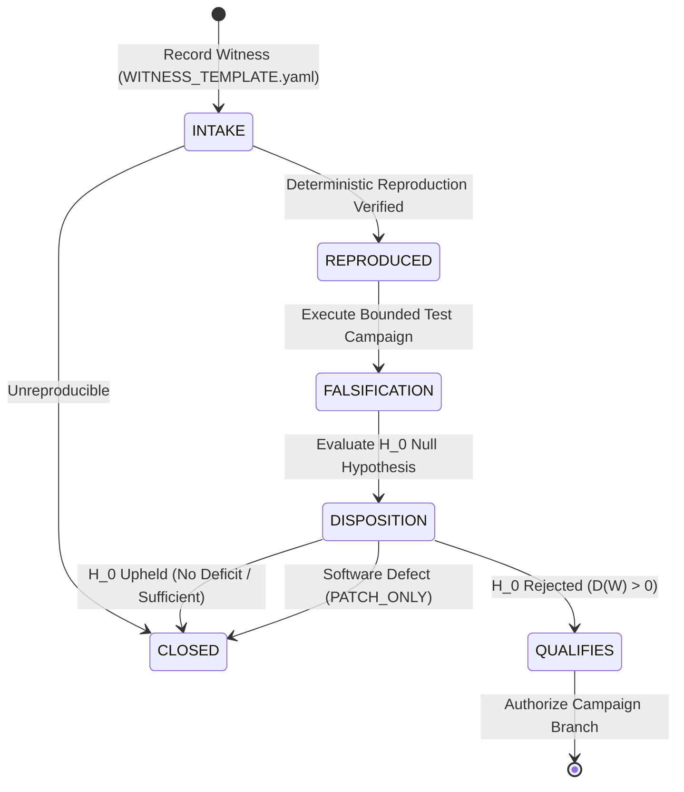

# UoW v3.2 Deficit-Driven Development Governance & Intake Policy

This document formalizes the operational and architectural governance rules for the **Unit-of-Work (UoW) v3.2** lifecycle.

Unlike earlier releases that pursued protocol consolidation (v3.0) or planned qualification milestones (v3.1 M1–M5), **v3.2 has no predetermined roadmap, capability milestone schedule, or speculative feature backlog**.

Development in v3.2 is strictly governed by demonstrated deficits.

---

## 1. The Governing Invariants

\[
\boxed{
\Delta \text{Architecture} = 0
\quad\text{unless}\quad
D(W) > 0
}
\]

where \(D(W)\) is an observed, reproduced semantic, operational, or substrate deficit witnessed against the qualified v3.1 baseline.

\[
D(W) = 0 \implies \text{no architecture change}
\]

And the intake prerequisite:

\[
\boxed{
\text{No Witness}
\implies
\text{No Campaign}
\implies
\text{No New Architecture}
}
\]

---

## 2. Sufficiency as the Null Hypothesis

All candidate work in v3.2 begins from the formal null hypothesis:

\[
H_0: \quad \text{The existing qualified UoW architecture is sufficient to express, certify, and enforce the requirement.}
\]

A new architectural feature, primitive, or protocol modification is warranted **only if a bounded, reproducible campaign decisively rejects \(H_0\)**.

This inverts the traditional software expansion incentive:
> **We are not trying to prove that a new feature is useful.**  
> **We are trying to prove that the existing architecture is insufficient.**

---

## 3. The Three Permitted Deficit Categories

Every witness record must classify its candidate deficit into **exactly one** of the following three mutually exclusive categories:

### 3.1 `MISSING_ARCHITECTURAL_PRIMITIVE`
- **Definition**: An operational or semantic requirement that cannot be structurally represented, certified, or committed using the canonical 11 protocol objects and operators.
- **Sufficiency Test**: *Can the requirement be represented and certified using the existing canonical protocol objects and operators?*
  - If **YES**: \(H_0\) is confirmed; no primitive deficit exists.
  - If **NO**: The witness establishes a demonstrated structural gap in the protocol tuple.

### 3.2 `BOUNDARY_FAILURE_NEW_CONDITION`
- **Definition**: A previously qualified protocol or runtime invariant that fails under a newly demonstrated, reproducible stress, scale, partition, latency, or environmental condition.
- **Sufficiency Test**: *Does a previously qualified invariant actually fail under the reproduced new condition?*
  - If **NO** (invariant holds): \(H_0\) is confirmed; close the witness.
  - If **YES** (invariant violated): A bounded hardening or authority fencing campaign is authorized.

### 3.3 `SUBSTRATE_REALIZATION_INCOMPATIBILITY`
- **Definition**: The protocol semantics are fully expressible in abstract form, but cannot be correctly enforced on a specific target silicon, security domain, or hardware authority using existing realization mechanisms.
- **Sufficiency Test**: *Is the existing protocol expressible, but impossible to enforce correctly on the target substrate using current realization mechanisms?*
  - If **NO**: An adaptation configuration problem exists, not an architectural deficit.
  - If **YES**: A specialized native authority realization is warranted.

---

## 4. Intake State Machine

Every candidate deficit traverses a four-stage state machine recorded in `governance/v32/witnesses/`:



### Terminal Dispositions
1. **`NO_DEFICIT`** \(\longrightarrow\) **`CLOSED`**: The observed behavior is within specification or invalid.
2. **`EXISTING_ARCHITECTURE_SUFFICIENT`** \(\longrightarrow\) **`CLOSED`**: The requirement is cleanly solvable with existing primitives; documentation/example added if appropriate.
3. **`PATCH_ONLY`** \(\longrightarrow\) **`CLOSED`**: An implementation defect or bug exists, but does not represent a missing protocol concept or architecture limitation. Routed to standard patch repair.
4. **`QUALIFIES`**: Concrete witness demonstrated, reproduced, and \(H_0\) falsified. **Only this disposition authorizes setting `architectural_change_allowed: true`**.

---

## 5. Strict Branching Transition

To enforce separation between hypothesis falsification and implementation, branches must follow a two-tier lineage:

```text
v3.2/development
       │
       ▼
v3.2/witness-<id>
       │
       │ reproduce + test H_0
       ▼
     decision
       │
       ├── NO_DEFICIT / SUFFICIENT ─► Close witness, delete/archive branch
       │
       ├── PATCH_ONLY ─────────────► v3.2/patch-<id>
       │
       └── QUALIFIES
                │
                ▼
       v3.2/<scoped-campaign>
```

- **Witness Branch (`v3.2/witness-<id>`)**: Answers **only**: *Is there actually an architectural deficit?* It must NOT implement solutions.
- **Campaign Branch (`v3.2/<scoped-campaign>`)**: Answers: *What is the minimal change that closes the verified deficit?*

---

## 6. Machine-Enforced Validation

All witness files are validated locally and in GitHub Actions CI using [`qualification/v32_intake.py`](../qualification/v32_intake.py):

```powershell
python -m qualification.v32_intake --validate-all
```

The validator strictly enforces:
- Proper schema version (`uow.v32.witness.v1`).
- Exact baseline commit SHA from a released/development lineage.
- Required sections: witness metadata, baseline, classification, requirement, observation, reproduction, falsification, disposition, and change authorization.
- Invariant: `architectural_change_allowed: true` is rejected unless status is `QUALIFIES` and result is one of the three permitted deficit categories.
