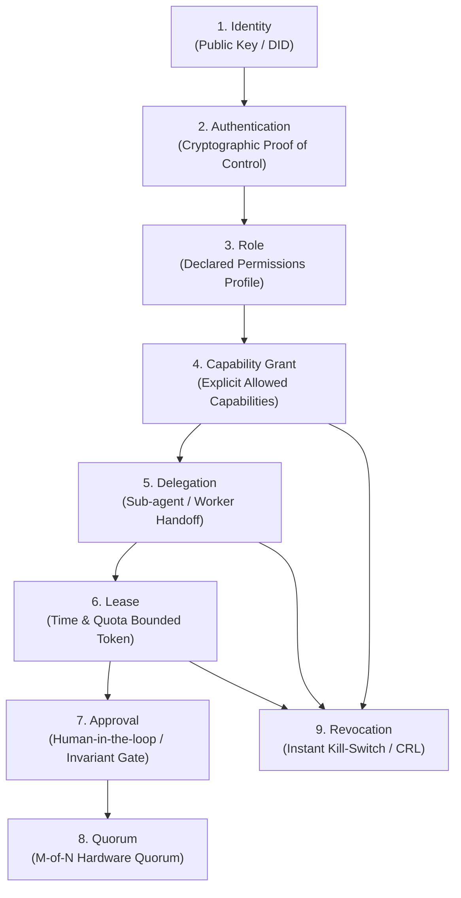

# Substrate Specification: Identity, Authority, Delegation, and Revocation

## 1. Executive Trust Architecture

Autonomous agents, distributed services, and human operators operate under a **formal trust model** that strictly separates identity from authority, and statically grants from temporary leases:

$$\boxed{\text{Identity} \to \text{Authentication} \to \text{Role} \to \text{Grant} \to \text{Delegation} \to \text{Lease} \to \text{Approval} \to \text{Quorum} \to \text{Revocation}}$$

---

## 2. The Nine Stages of the Trust Lifecycle

1. **Identity**: Unique canonical principal identifier (e.g., `did:uow:agent-planner-01`, `ed25519:7f83...`).
2. **Authentication**: Cryptographic challenge-response verifying control of the identity key.
3. **Role**: Semantic grouping of permissions (e.g., `ROLE_INVENTORY_MANAGER`, `ROLE_SAFETY_SUPERVISOR`).
4. **Capability Grant**: Formal authorization binding an identity or role to specific capabilities (`[inventory.reserve, inventory.query]`).
5. **Delegation**: Cryptographically signed transfer of scoped authority from a parent agent/user to a child subagent with strict attenuation (child permissions $\subseteq$ parent permissions).
6. **Lease**: Temporal and quota envelope governing when and how much work can be executed (e.g., max 100 calls within 10 minutes).
7. **Approval**: Dynamic gating requiring explicit cryptographic signoff for high-impact (`IRREVERSIBLE`, `PHYSICAL`) actions.
8. **Quorum**: Multi-party agreement rule requiring $M$-of-$N$ distinct authority witnesses for root or safety-critical mutations.
9. **Revocation**: Universal kill-switch allowing immediate, non-repudiable cancellation of grants, leases, or delegations.

---

## 3. Multi-Point Authority Binding

A critical vulnerability in distributed workflow systems is **Time-of-Check to Time-of-Use (TOCTOU)**: authority is verified when a task is submitted, but by the time the task reaches execution 20 minutes later, the agent's credentials have been compromised or revoked.

UoW v2.0 enforces **Multi-Point Authority Binding** across four discrete lifecycle points:

$$\begin{array}{|l|l|l|}
\hline
\textbf{Lifecycle Point} & \textbf{Authority Check Performed} & \textbf{Rejection Code on Failure} \\
\hline
\textbf{1. Proposal Time} & \text{Valid signature, authenticated actor, valid schema} & \text{ERR\_UNAUTHENTICATED} \\
\textbf{2. Certification Time} & \text{Role authorization, active delegation, lease not expired} & \text{ERR\_AUTHORITY\_DENIED} \\
\textbf{3. Commit Time} & \text{Pre-state hash freshness, OCC sequence monotonicity} & \text{ERR\_STALE\_PRE\_STATE} \\
\textbf{4. Effect Time} & \textbf{Real-time Revocation Check before firing actuator} & \textbf{ERR\_AUTHORITY\_REVOKED} \\
\hline
\end{array}$$

---

## 4. Mid-Flight Authority Revocation Semantics

> **What happens when authority disappears after work has already been proposed?**

1. **Proposal In-Flight (Queue)**:
   - When authority is revoked, a revocation certificate $\text{Revoke}(\text{principal\_id}, t)$ is appended to the `RevocationRegistry` in the Authority Plane.
   - When the kernel pops candidate proposal $\pi_t$ from the queue, it consults the registry.
   - If the proposing agent's identity or delegation lease is revoked, certification is refused immediately:
     $$\text{CERTIFY}(\pi_t, S_t) \longrightarrow \text{REJECT}(\text{ERR\_AUTHORITY\_REVOKED})$$

2. **Certified But Unexecuted (Effector Queue)**:
   - If an operation was certified into `CertificateResult`, but the physical actuator has not yet fired:
   - The Effector Harness performs a **mandatory just-in-time check** against the `RevocationRegistry`.
   - If revoked, execution is aborted, and a compensating reconciliation UoW is scheduled to unwind the certified state.

3. **In-Flight Saga Execution**:
   - If a multi-step composition $U_1 \circ U_2 \circ U_3$ is partially executed when authority is revoked, downstream steps fail immediately.
   - The engine automatically executes compensation transactions for already-committed steps ($U_2^{-1}, U_1^{-1}$).
