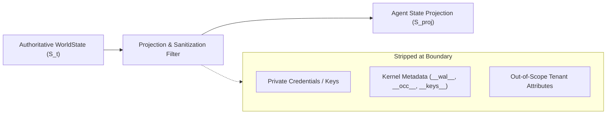

# Architectural Specification: Boundary Audit Between Substrate, Policy, and Proposal

## 1. Executive Problem Statement: Authority Leakage Prevention

Before autonomous planning agents, generative reasoning models, or semantic mediation layers are deployed in UoW v2.0, the architecture must establish an airtight **boundary audit** between the three fundamental cognitive tiers:

$$\boxed{
\begin{array}{rcl}
\text{Runtime Substrate} &\longleftrightarrow& \text{"What the machine knows and executes"}\\
\Updownarrow & & \text{Substrate } \longleftrightarrow \text{ Policy Boundary}\\
\text{Policy / Design Plane} &\longleftrightarrow& \text{"What governance permits and defines as success"}\\
\Updownarrow & & \text{Policy } \longleftrightarrow \text{ Proposal Boundary}\\
\text{Proposal / Agent Plane} &\longleftrightarrow& \text{"What an agent is allowed to suggest"}
\end{array}
}$$

Without mathematically explicit and type-enforced boundaries between these tiers, catastrophic failure modes emerge:
1. **Confused Deputy / Privilege Escalation**: An agent embeds instructions in a payload that mutate its own roles or capability grants.
2. **State Pollution / Hallucination Spill**: An agent's speculative chain-of-thought is committed directly to authoritative state.
3. **Telemetry Gaming / Invariant Evasion**: An agent observes internal trigger thresholds or sensor weights and fabricates inputs to prevent emergency down-scaling.
4. **Credential Exfiltration**: Kernel private keys, quorum witness secrets, or unredacted multi-tenant attributes leak into agent context windows.

---

## 2. Three-Tier Boundary Matrix

```mermaid
graph TD
    subgraph SubstrateTier["1. Runtime Substrate ('What the machine knows')"]
        AuthS["Authoritative State (S_t)"]
        Ledger["Evidence Ledger & WAL"]
        Keys["Root Keyring & Quorum Seeds"]
        Res["Universal Resource Pool"]
        Eff["Effector Drivers & Hardware Actuators"]
        Sensors["Sensor Telemetry Buffers (O_t)"]
    end

    subgraph Boundary1["Substrate <--> Policy Boundary"]
        ProjFact["State Projections g(S_t)"]
        Events["Derived Events (E_t)"]
        TransCert["Policy Transition Certificates"]
        ModeNotice["Active Operating Mode (M_t)"]
    end

    subgraph PolicyTier["2. Policy / Design Plane ('What governance permits')"]
        Profile["SystemDesignProfile (P)"]
        Invariants["Hard Invariants (Omega)"]
        Goals["Active Goals G_t = f(S_t, P)"]
        ActionSpace["Authorized Action Space A(M_t)"]
        Triggers["Escalation Triggers"]
    end

    subgraph Boundary2["Policy <--> Proposal Boundary"]
        SanitizedProj["Sanitized State Projection (S_proj)"]
        GoalFeed["Goal Feed (Metrics & Precedence)"]
        AllowedCaps["Allowed Capability Manifest A(M_t)"]
        CandidateProp["Candidate Proposal (pi_t)"]
    end

    subgraph ProposalTier["3. Proposal / Agent Plane ('What an agent may suggest')"]
        AgentContext["Agent Context / Scratchpad (K_t)"]
        Planner["Planning Engine / LLM Policy"]
        PropQueue["Candidate Proposals (Zero Authority)"]
    end

    SubstrateTier <--> Boundary1
    Boundary1 <--> PolicyTier
    PolicyTier <--> Boundary2
    Boundary2 <--> ProposalTier
```

---

## 3. Boundary 1: Substrate $\longleftrightarrow$ Policy Boundary

The boundary between the physical/runtime substrate and the policy plane governs how the governance kernel observes machine state and enforces constraints.

### 3.1 What Substrate Objects are Visible to Policy?
1. **Committed State Projections ($D_t = g(S_t)$)**: Deterministic factual views over verified state attributes required to evaluate invariant boundaries and goal metrics.
2. **Semantic Events ($E_t$)**: Derived boundary crossings and threshold events produced by the event pipeline from witnessed observations.
3. **Resource Utilization Metrics ($R_{\text{util}}$)**: Aggregated capacity allocations (CPU, RAM, GPU slots) and consumed budgets (energy, currency, quotas).
4. **Causal Epoch & Sequence Number ($t_{\text{epoch}}, t_{\text{seq}}$)**: Monotonic OCC sequence counters.

### 3.2 What Substrate Objects are STRICTLY HIDDEN from Policy?
1. **Private Cryptographic Seeds**: Hardware security module (HSM) private keys, quorum witness secrets, and actor signature private keys.
2. **Raw Hardware Device Pointers**: Physical memory addresses, OS thread descriptors, and raw network sockets.
3. **Ephemeral Cache Buffers**: Ephemeral intermediate scratchpads that have not been committed to the Evidence Ledger.

### 3.3 What Policy Outputs are Communicated to the Substrate?
1. **Active Operating Mode ($M_t$)**: Determines which action spaces and resource limits the runtime certifier enforces.
2. **Invariant Predicate Set ($\Omega$)**: The non-negotiable boundary expressions that the kernel evaluates before committing any transaction.
3. **Escalation Triggers ($O_t \to E_t \to C_t \to M_{t+1}$)**: Certified trigger conditions evaluated by the kernel over incoming events.
4. **Policy Transition Certificates (`PolicyTransitionRecord`)**: Cryptographically certified records committed to the Evidence Ledger upon mode shifts.

### 3.4 Invariants Governing Boundary 1:
* $\text{Policy cannot bypass OCC}$: No policy directive can alter state without atomically incrementing the sequence number and emitting an `EvidenceRecord`.
* $\text{Policy cannot alter past evidence}$: The Evidence Ledger remains strictly append-only; historical records are immutable even to root policy.

---

## 4. Boundary 2: Policy $\longleftrightarrow$ Proposal (Agent) Boundary

The boundary between the policy plane and autonomous agents governs what an agent may observe, plan against, and propose.

### 4.1 What Policy Outputs are Visible to Agents?
1. **Active Goals ($G_t$)**:
   - `goal_id`, human-readable `name`, and operational description.
   - `priority_rank`: Lexicographic rank ($1 = \text{highest}$).
   - `direction`: `MAXIMIZE`, `MINIMIZE`, `SATISFY_THRESHOLD`, `MAINTAIN_RANGE`.
   - `target_predicate`: Boolean expression describing success.
   - `utility_metric`: Name of quantitative metric to optimize.
2. **Authorized Action Space ($A(M_t)$)**:
   - Complete list of capability IDs white-listed for the active operating mode.
   - Input and output schemas for each white-listed capability.
   - Stated side-effect classes (`PURE_READ`, `REVERSIBLE`, `COMPENSATABLE`, `IRREVERSIBLE`, `EXTERNAL_UNCERTAIN`, `PHYSICAL`).
   - Declared read and write scopes for each capability.
3. **Invariant Boundary Constraints ($C_t = \Omega$)**:
   - Formal boolean expressions defining the feasible state boundary $\Omega$.
   - **Rationale**: Agents must be informed of the constraints so their internal search trees or neural policies prune infeasible branches prior to proposal generation.
4. **Active Operating Mode Label ($M_t$)**:
   - Current posture: `NORMAL`, `DEGRADED`, `EMERGENCY`, or `RECOVERY`.
5. **Remaining Resource Budgets ($R_{\text{avail}}$)**:
   - Remaining consumable budget (e.g. execution time budget ms, API call allowance).

### 4.2 What Policy Internals are STRICTLY HIDDEN from Agents?
1. **Root Governance Keys & Signatures**: Root public keys, activation tokens, and governance signoff credentials.
2. **Identity & Delegation Credentials of Other Principals**: Token signatures, secret tokens, or private claims of other agents/users.
3. **Internal Escalation Trigger Thresholds**: Detailed internal trigger equations that could be exploited to intentionally trigger or avoid emergency down-scaling.
4. **Decommission Sunset Keys**: Cryptographic tokens that irreversibly terminate system operations.

---

## 5. Boundary 3: State Projections Consumed by Agents ($S_t \longrightarrow S_t^{\text{proj}}$)

An autonomous agent **must never be handed the raw, monolithic `WorldState` object**.

Instead, the runtime substrate generates a **Sanitized State Projection** ($S_t^{\text{proj}}$) conforming to [`agent_state_projection.json`](file:///spec/schemas/agent_state_projection.json):

### 5.1 Positive Authorization & Key Canonicalization Rules:
1. **Key Path Canonicalization**: Prior to evaluation, all key paths undergo strict canonicalization:
   - URL percent-decoding (`%2e%2e` $\to$ `..`, `%2f` $\to$ `.`).
   - Normalizing directory separators (`/`, `\\` $\to$ `.`).
   - Rejecting path traversal attempts (`..`) with fail-closed `ERR_AUTHORITY_DENIED`.
   - Collapsing duplicate dots and normalizing ASCII casing.
2. **Strict Positive Authorization**:
   $$\boxed{
   \text{Access}(k) \iff \text{canonical}(k) \in \text{declared capability read\_scope}
   }$$
   State attributes are admitted if and only if they match an explicit allowlist pattern.
3. **Inviolable Defense-in-Depth**: As a secondary check, any attribute matching reserved kernel namespaces (`__*`, `kernel.*`, `auth.keys.*`, `sec.*`, `wal.*`, `hsm.*`) is unconditionally dropped.
4. **Pre-State Hash Binding**: The projection binds $H_{\text{pre}} = H(S_t)$ directly from the authoritative state at projection time.
5. **Read-Only Immutability**: Projections are wrapped in read-only mapping proxies; in-memory mutation attempts raise runtime exceptions.

---

## 6. Prohibited Crossings: Fields That Must NEVER Cross

To prevent accidental authority leakage, the following categories of fields are strictly prohibited from crossing the proposal boundary:

$$\begin{array}{|l|l|l|}
\hline
\textbf{Forbidden Crossing Category} & \textbf{Hazard Prevented} & \textbf{Rejection Mechanism} \\
\hline
\textbf{1. Direct State Mutations} & \text{Agent dictating arbitrary state transitions } \vec{\Delta} & \text{Payloads with } \text{writes/mutations} \to \text{ERR\_AUTHORITY\_DENIED} \\
\textbf{2. Signing Keys / Commit Tokens} & \text{Agent self-certifying proposals} & \text{Kernel checks certifier signature against root ring} \\
\textbf{3. Direct Operating Mode Mutation} & \text{Agent escaping DEGRADED / EMERGENCY mode} & \text{Payloads targeting } \text{operating\_mode} \to \text{ERR\_AUTHORITY\_DENIED} \\
\textbf{4. Self-Privilege Escalation} & \text{Agent granting itself roles or capabilities} & \text{Payloads targeting } \text{auth.roles} \to \text{ERR\_AUTHORITY\_DENIED} \\
\textbf{5. Direct Effector Hardware Invocations} & \text{Agent firing actuators without certification} & \text{Effectors reject requests lacking CertificateResult} \\
\textbf{6. Constraint Bypass / Override Flags} & \text{Agent injecting "force=True" or "skip_invariants"} & \text{Unknown / bypass parameters fail JSON Schema check} \\
\textbf{7. Out-of-Scope State Keys} & \text{Cross-tenant or unpermitted data access} & \text{Positive authorization filter drops out-of-scope keys} \\
\hline
\end{array}$$

---

## 7. Mathematical Summary: Capability-Oriented Proposals

The proposal tier does not emit state transitions $\vec{\Delta}$. Instead, it emits a tuple of target capability identifier $C$, typed invocation arguments $\theta$, and pre-state hash $H_{\text{pre}}$:

$$\boxed{
\pi_t = (C, \; \theta, \; H_{\text{pre}}) \quad \text{where } \text{Authority}(\pi_t) = 0
}$$

The governance kernel and runtime substrate independently verify admissibility and derive the authoritative state transition:

$$\boxed{
\Delta_{\text{authoritative}} = C.\text{apply}(\theta, \; S_t)
}$$

subject to:
$$H(S_t) = H_{\text{pre}} \quad \wedge \quad C \in A(M_t) \quad \wedge \quad \text{WriteScope}(C.\text{apply}) \subseteq \text{DeclaredWriteScope}(C)$$

Any agent-supplied `predicted_outcome` is recorded purely for diagnostic calibration and is **never** applied as authoritative state.

