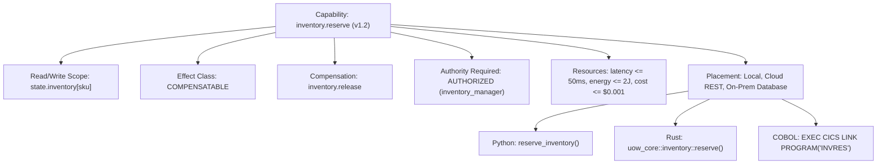

# Substrate Specification: Capability Ontology

## 1. Executive Axiom

$$\boxed{\text{Function} \neq \text{Capability}}$$

A **function** is an implementation artifact—a subroutine, an HTTP endpoint, an RPC method, or a compiled routine in C, Python, or Rust.

A **capability** is a formal, system-wide declaration of *what the system knows how to accomplish*. It abstracts away the runtime language and execution mechanism while explicitly declaring its side-effects, authority bounds, resource costs, reversibility, and compensation paths.

Agents, humans, policy engines, and orchestrators reason exclusively over **capabilities**, never raw functions.



---

## 2. Canonical Capability Descriptor

A compliant Capability Descriptor adheres to [`capability_descriptor.json`](file:///spec/schemas/capability_descriptor.json) and comprises 12 formal facets:

```json
{
  "capability_id": "inventory.reserve",
  "version": "1.2.0",
  "description": "Atomically decrements available on-hand stock and grants an inventory allocation lease.",
  "contracts": {
    "input_schema": "https://uow.network/spec/schemas/inventory_reserve_req.json",
    "output_schema": "https://uow.network/spec/schemas/inventory_reserve_resp.json"
  },
  "effect_semantics": {
    "side_effect_class": "COMPENSATABLE",
    "read_scope": ["inventory.*.available", "customer.*.status"],
    "write_scope": ["inventory.*.reserved", "inventory.*.available"],
    "is_idempotent": true,
    "idempotency_key_pattern": "idemp:{uow_id}:{customer_id}:{sku}:{epoch}",
    "compensation": {
      "compensating_capability_id": "inventory.release",
      "strategy": "FORWARD_COMPENSATING_UOW",
      "max_compensation_window_seconds": 86400
    }
  },
  "authority_requirements": {
    "min_claim_type": "AUTHORIZED",
    "required_roles": ["ROLE_COMMERCE_OPERATOR", "ROLE_INVENTORY_SYSTEM"],
    "quorum_required": false
  },
  "preconditions": [
    "state.inventory[request.sku].available >= request.quantity",
    "state.customer[request.customer_id].credit_hold == False"
  ],
  "resource_profile": {
    "execution_budget_ms": 75.0,
    "financial_cost_microusds": 150,
    "cpu_cores": 1,
    "ram_units": 2,
    "bandwidth_bytes": 1024,
    "rate_limit_per_minute": 1000
  },
  "evidence_produced": {
    "generates_receipt": true,
    "receipt_type": "INVENTORY_ALLOCATION_RECEIPT",
    "hash_chain_bound": true
  },
  "observations_consumed": [
    {
      "namespace": "obs.warehouse.lock_status",
      "max_staleness_ms": 5000,
      "min_confidence": 0.95
    }
  ],
  "supported_transports": ["IN_PROCESS", "HTTP_REST", "MESSAGE_QUEUE"],
  "supported_locations": ["EDGE_NODE", "CLOUD_CLUSTER", "MAINFRAME_CONNECTOR"]
}
```

---

## 3. Formal Facets

### 3.1 Side-Effect Classification
Every capability explicitly declares its physical and logical side-effect class:
1. `PURE_READ`: Guarantees zero state mutation and zero side-effects. Safe for speculative prefetching and arbitrary retries.
2. `REVERSIBLE`: State mutation is confined to internal transactional boundaries that can be rolled back bit-for-bit upon abortion.
3. `COMPENSATABLE`: External side-effects cannot be physically rolled back, but a formal semantic inverse exists (e.g. `reserve` $\to$ `release`, `charge` $\to$ `refund`).
4. `IRREVERSIBLE`: Effects cannot be undone or compensated (e.g. SMS dispatched, payload detonated, physical material discarded). Requires elevated authority and human or multi-party quorum approval.
5. `EXTERNAL_UNCERTAIN`: Dispatches to external systems with non-deterministic or timeout-susceptible outcome semantics.
6. `PHYSICAL`: Controls real-world actuators, motors, heating elements, or robotic apparatus.

### 3.2 Read/Write Scope Isolation
Capabilities declare explicit namespace boundaries:
* Read Scope: Sets of attributes read by the capability logic.
* Write Scope: Strict whitelist of attributes the capability is legally authorized to mutate. Any attempt to write outside this scope is aborted with `ERR_SCOPE_VIOLATION`.

### 3.3 Compensation Binding
If a capability is `COMPENSATABLE`, it must bind to a compensating capability ID:
$$\text{Compensate}(U(\text{args})) \longrightarrow U_{\text{comp}}(\text{invert}(\text{args}))$$
If no compensating capability exists, the capability must be classified as `IRREVERSIBLE`.
