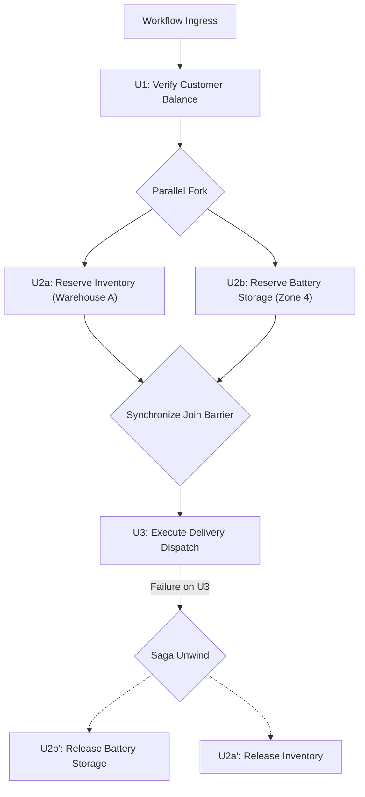

# Substrate Specification: Composition Semantics

## 1. Executive Composition Model

Before generative planning agents construct multi-step workflows, the runtime substrate must formalize what it means to **compose Units of Work**:

$$\boxed{U_{\text{composed}} = U_1 \circ U_2 \circ \dots \circ U_n}$$

A plan generated by an AI agent is not a bag of disconnected calls; it is a **directed dependency graph of capabilities** with formal input/output dataflow, concurrency barriers, state preconditions, and failure compensation paths.

---

## 2. Seven Composition Invariants

### 2.1 1. Output-to-Input Binding
* Outputs of predecessor Unit of Work $U_a$ may be piped into the inputs of successor $U_b$ via explicit JSONPointer mappings:
  $$\text{args}(U_b) = \mathcal{M}(\text{output}(U_a), S_t)$$
* Type safety: Input/output schemas must be verified at graph validation time before any node is executed.

### 2.2 2. State Dependency & OCC Chains
* Sequential compositions form a cryptographic state hash chain:
  $$H(S_0) \xrightarrow{U_1} H(S_1) \xrightarrow{U_2} H(S_2)$$
* If an external concurrent transaction advances the sequence while $U_2$ is computing, OCC fails closed with `ERR_STALE_PRE_STATE`.

### 2.3 3. Parallel Execution & Concurrency Bounds
* Units of Work $U_a$ and $U_b$ may execute in parallel **if and only if their declared write scopes are disjoint**:
  $$\text{WriteScope}(U_a) \cap \text{WriteScope}(U_b) = \emptyset$$
* If write scopes overlap, the composition engine forces sequential ordering to prevent race hazards.

### 2.4 4. Atomicity Boundaries vs Sagas
* **Local Transactions (ACID)**: Confined to internal software state mutations where all steps succeed or roll back atomically.
* **Distributed Sagas**: When composition involves external, physical, or multi-party effectors, atomicity is impossible. The composition is executed as a **Saga** with explicit forward compensation.

### 2.5 5. Cascade Compensation Paths
* When step $U_k$ fails in a saga of $n$ steps:
  1. Forward execution is halted immediately.
  2. The compensation stack is unwound in **strict reverse topological order**:
     $$U_{k-1}^{-1} \longrightarrow U_{k-2}^{-1} \longrightarrow \dots \longrightarrow U_1^{-1}$$
  3. If a compensating step itself fails, the system transitions to `RECOVERY` operating mode and logs a high-priority incident in the Evidence Ledger.

### 2.6 6. Conditional Branches & Barrier Synchronization
* Branching: Evaluated via deterministic route guards over intermediate world state.
* Join Barriers: Wait for all inbound branches to complete. Supported policies:
  - `ALL_SUCCESS`: All parent nodes must succeed.
  - `QUORUM_SUCCESS`: At least $M$-of-$N$ parents succeed.
  - `FIRST_COMPLETED`: Speculative race; first result wins, remaining branches cancelled.

### 2.7 7. Partial Certification
* A complex graph may be certified in discrete stages:
  - Sub-graphs containing only `PURE_READ` operations can be certified and executed speculatively.
  - Sub-graphs containing `IRREVERSIBLE` or `PHYSICAL` effects require full upfront certification of all preconditions before any effect fires.
