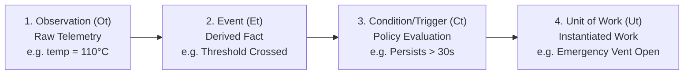

# Substrate Specification: Event and Trigger Semantics

## 1. Executive Pipeline Architecture

Distributed, event-driven, and autonomous systems require an explicit, formal answer to:
> **What happened that caused work to become relevant?**

Conflating raw measurements directly with work dispatch produces catastrophic flapping, sensor-spoofing vulnerabilities, and uncontrolled cascade executions. UoW v2.0 establishes a strict four-stage causal pipeline:

$$\boxed{O_t \longrightarrow E_t \longrightarrow C_t \longrightarrow U_t}$$



---

## 2. Stage Breakdown

### 2.1 Stage 1: Observation ($O_t$) — Raw Stimulus
* **Definition**: A witnessed reading or telemetry sample from an Observation Plane sensor.
* **Primitive**: `SensorObservation`
  $$O_t = (\text{sensor\_id}, \text{timestamp}, \text{modality}, \text{reading}, \text{confidence}, \text{witness\_sig})$$
* **Example**:
  ```json
  {
    "sensor_id": "thermocouple-04",
    "timestamp": "2026-09-24T22:40:00.120Z",
    "reading": { "temp_c": 110.4 },
    "confidence": 0.99
  }
  ```
* **Property**: Does not declare that anything is wrong or that any action should be taken. It is pure factual reporting of what was sensed.

### 2.2 Stage 2: Event ($E_t$) — Derived Fact
* **Definition**: An instantaneous semantic occurrence or boundary crossing derived by comparing observations against baseline state or historical sequences.
* **Calculation**: Pure deterministic projection over $O_t$ and $S_t$:
  $$E_t = \text{DetectEvents}(O_t, S_t)$$
* **Example**:
  ```json
  {
    "event_id": "evt-temp-threshold-crossed-001",
    "event_type": "THRESHOLD_EXCEEDANCE",
    "source_observation_id": "obs-9812",
    "metric": "temp_c",
    "threshold": 100.0,
    "actual": 110.4,
    "occurred_at": "2026-09-24T22:40:00.120Z"
  }
  ```
* **Property**: Represents a semantic fact that occurred in time. An event is immutable once detected.

### 2.3 Stage 3: Condition / Trigger ($C_t$) — Policy Rule Evaluation
* **Definition**: A declarative rule defined in the active `SystemDesignProfile` that evaluates temporal persistence, logical conjunctions, or statistical patterns over events.
* **Hysteresis & Debouncing**:
  - Eliminates transient sensor jitter (e.g. requires $\Delta t \ge 30\text{s}$ of continuous exceedance).
  - Evaluates multi-sensor correlation (e.g. at least 2 distinct sensors agree).
* **Example**:
  ```json
  {
    "condition_id": "cond-thermal-runaway",
    "rule_expression": "event.THRESHOLD_EXCEEDANCE.duration_seconds >= 30 AND state.pump_status == 'OFF'",
    "matched_at": "2026-09-24T22:40:30.120Z",
    "trigger_state": "ACTIVE"
  }
  ```

### 2.4 Stage 4: Unit-of-Work ($U_t$) — Instantiated Work Candidate
* **Definition**: Once the trigger condition evaluates to True, a concrete Unit-of-Work candidate is instantiated to address the situation.
* **Properties**:
  - Bound to the relevant capability (e.g. `grid.coolant_valve.open`).
  - Pre-populated with deterministic arguments and evidence links to $O_t$, $E_t$, and $C_t$.
  - Dispatched into the Authority Plane queue for OCC validation and certification.

---

## 3. Invariant Guarantees

1. **No Direct Jump $O_t \to U_t$**: A sensor observation cannot directly invoke a Unit of Work. It must be derived into an event and evaluated through policy triggers.
2. **Deterministic Evidence Traceability**: Every event-triggered UoW must contain the cryptographic hash chain of the triggering condition, event, and underlying sensor observation in its evidence envelope.
