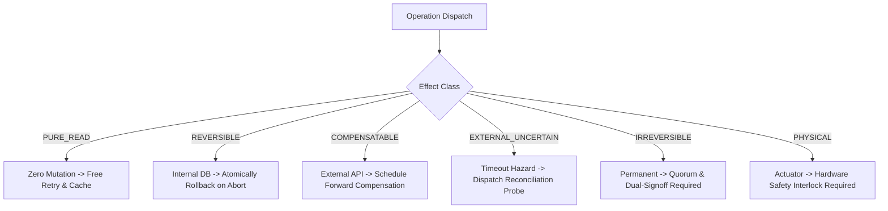

# Substrate Specification: Failure and Effect Semantics

## 1. Executive Axiom

$$\boxed{\text{Failure} \neq \text{Unknown Outcome}}$$

In classical single-node computing, a subroutine either succeeds or fails. In distributed, physical, and agentic systems, a third state exists that is fundamentally different: **Unknown Outcome (Indeterminate)**.

If a payment gateway or robotic controller times out 500ms after receiving an execution packet:
* Did the payment go through?
* Did the robotic arm move?
* Did the network drop the request before arrival, or the acknowledgment on return?

Assuming an unknown outcome is a "failure" and naively retrying causes duplicate billing or physical collisions. Assuming it "succeeded" risks phantom inventory.

Autonomous agents and orchestrators must explicitly distinguish **rejections** from **uncertain outcomes**.

---

## 2. Canonical Failure Taxonomy

$$\begin{array}{|l|l|c|l|}
\hline
\textbf{Category} & \textbf{Error Code} & \textbf{Retryable?} & \textbf{World State Impact} \\
\hline
\textbf{1. Semantic Rejection} & \text{ERR\_GUARD\_UNSATISFIED} & \text{No} & \text{Guaranteed zero effect; preconditions failed} \\
\textbf{2. Validation Failure} & \text{ERR\_SCHEMA\_VIOLATION} & \text{No} & \text{Guaranteed zero effect; malformed input} \\
\textbf{3. Execution Failure} & \text{ERR\_EXECUTION\_CRASH} & \text{No} & \text{Rolled back via transactional boundary} \\
\textbf{4. Transport Failure} & \text{ERR\_TRANSPORT\_DROP} & \text{Yes} & \text{Guaranteed zero effect; packet never delivered} \\
\textbf{5. Timeout} & \text{ERR\_TIMEOUT} & \text{Conditional} & \textbf{POTENTIAL PARTIAL EFFECT} \\
\textbf{6. Partial Effect} & \text{ERR\_PARTIAL\_EFFECT} & \text{No} & \textbf{Compensating saga required} \\
\textbf{7. Stale State} & \text{ERR\_STALE\_PRE\_STATE} & \text{Yes} & \text{Zero effect; sequence hazard detected} \\
\textbf{8. Resource Exhaustion} & \text{ERR\_RESOURCE\_EXHAUSTED} & \text{Yes} & \text{Zero effect; backoff and retry later} \\
\textbf{9. Dependency Failure} & \text{ERR\_DEPENDENCY\_FAILURE} & \text{Conditional} & \text{Downstream service unavailable} \\
\textbf{10. Policy Denial} & \text{ERR\_INVARIANT\_VIOLATION} & \text{No} & \text{Zero effect; violated system invariant} \\
\textbf{11. Authority Denial} & \text{ERR\_AUTHORITY\_DENIED} & \text{No} & \text{Zero effect; actor lacks permissions} \\
\textbf{12. Uncertain Outcome} & \textbf{ERR\_UNCERTAIN\_OUTCOME} & \textbf{NEVER DIRECT} & \textbf{Must dispatch reconciliation probe} \\
\hline
\end{array}$$

---

## 3. Typed Effect Classification

Every Capability and Effector Intent declares an explicit `EffectClass`:

### 3.1 `PURE_READ`
* Zero state mutation, zero external side effects.
* Retries are unconditionally safe.
* Results may be cached according to state hash $H(S_t)$.

### 3.2 `REVERSIBLE`
* Changes internal software state within an atomic transaction.
* If downstream steps fail, state is rolled back bit-for-bit to $S_t$.

### 3.3 `COMPENSATABLE`
* Interacts with external systems (e.g. credit card processor, inventory API).
* Physical rollback is impossible, but a semantic inverse capability exists:
  $$\text{Reserve}(\text{item}) \xrightarrow{\text{compensate}} \text{Release}(\text{item})$$

### 3.4 `EXTERNAL_UNCERTAIN`
* Capability interacts with third-party networks without transactional guarantees.
* Upon timeout or transport disconnect, system enters `PENDING_RECONCILIATION`.
* **Prohibition**: The engine prohibits automated retry until a signed reconciliation probe confirms whether the original intent was executed.

### 3.5 `IRREVERSIBLE`
* Effects that cannot be undone or compensated (e.g. SMS delivery, financial wire settlement, document shredding).
* Requires elevated authority, human-in-the-loop review, or $M$-of-$N$ quorum signatures.

### 3.6 `PHYSICAL`
* Controls physical actuators, valves, robotic arms, or electrical relays.
* Enforces physical rate limits, emergency stop interlocks, and sensor verification of physical restoral.
