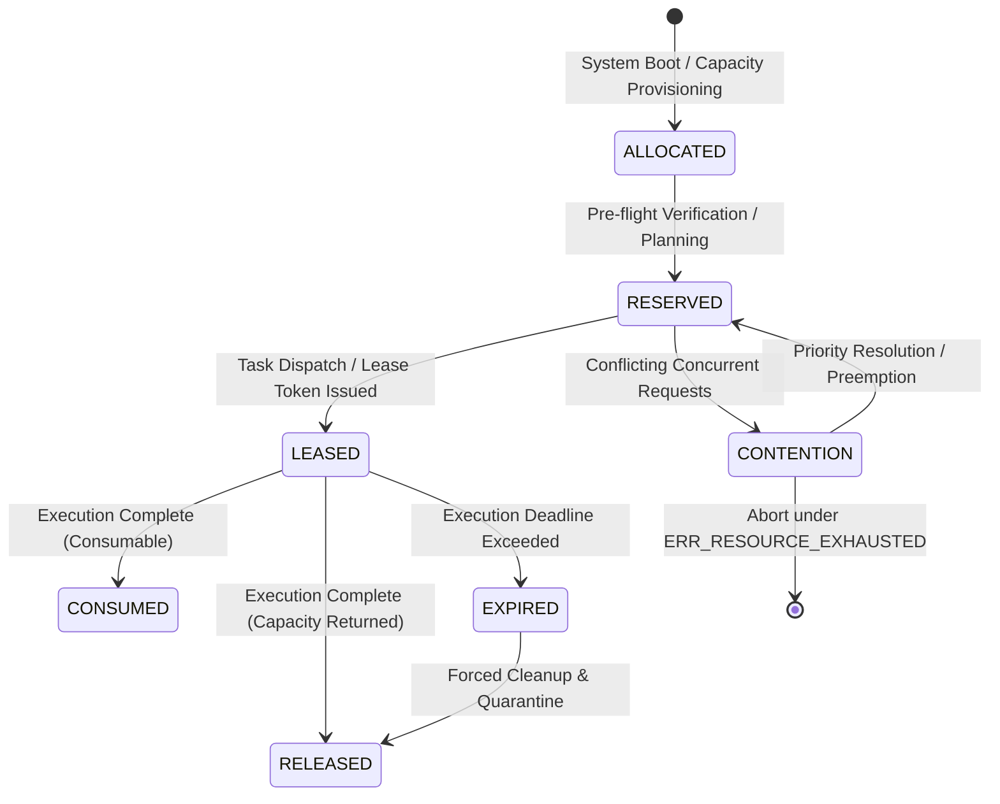

# Substrate Specification: Universal Resource and Lease Model

## 1. Executive Resource Architecture

Every Unit of Work consumes finite real-world resources. Autonomous planning and goal optimization are impossible if resources are modeled as an afterthought or restricted purely to CPU and RAM.

UoW v2.0 establishes a **Universal Resource Model**:

$$\boxed{R = \{r_{\text{compute}}, r_{\text{memory}}, r_{\text{storage}}, r_{\text{energy}}, r_{\text{bandwidth}}, r_{\text{money}}, r_{\text{inventory}}, r_{\text{attention}}, r_{\text{quota}}, r_{\text{capacity}}\}}$$

---

## 2. Resource Classes: Leased vs Consumable

All resources fall into one of two fundamental accounting categories:

$$\begin{array}{|l|l|l|}
\hline
\textbf{Category} & \textbf{Accounting Behavior} & \textbf{Examples} \\
\hline
\textbf{Leased Capacity} & \text{Held temporarily; returned to pool upon UoW completion} & \text{CPU cores, GPU/NPU slots, RAM buffers, DB lock} \\
\textbf{Consumable Budget} & \text{Debited permanently upon execution; cannot be un-spent} & \text{Energy (kWh), Money (USD), API quota, SMS credits} \\
\hline
\end{array}$$

---

## 3. The Resource Lifecycle

1. **ALLOCATED**: Baseline capacity provisioned to the node or execution cluster.
2. **RESERVED**: Soft hold placed during multi-step planning or proposal generation.
3. **LEASED**: Hard cryptographic lease issued with an explicit sequence number and time deadline:
   $$L = (\text{lease\_id}, \text{uow\_id}, \text{allocations}, \text{epoch}, \text{deadline})$$
4. **CONSUMED**: Permanent debit for consumable resources (e.g. $0.05 deducted from account).
5. **RELEASED**: Capacity returned to available pool for other tasks to acquire.
6. **EXPIRED**: If a lease exceeds its deadline, the lease manager forcibly revokes it and reclaims capacity.
7. **CONTENTION**: Simultaneous competing demands exceeding available capacity, resolved by policy priority ranking.

---

## 4. Contention & Priority Preemption

When resources are exhausted ($\sum \text{allocated} > \text{capacity}$):
1. **Priority Dominance**: High-priority tasks (e.g. `EMERGENCY` operating mode or rank-1 safety goals) can preempt low-priority speculative tasks.
2. **Deterministic Backpressure**: Lower-priority proposals fail closed with `ERR_RESOURCE_EXHAUSTED` and an explicit exponential backoff hint (`retry_after_ms`).
