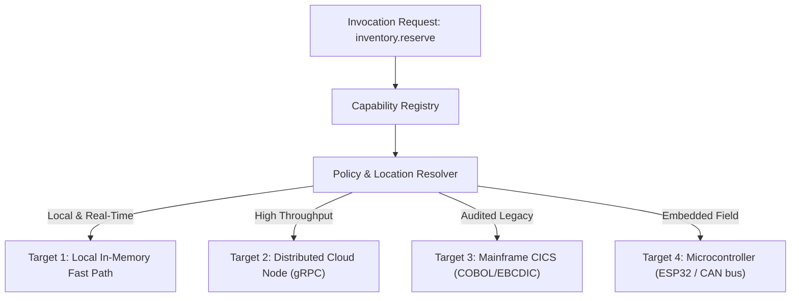

# Substrate Specification: Version Negotiation and Capability Placement

## 1. Executive Placement & Version Principles

$$\boxed{\text{Capability} \neq \text{Location}}$$
$$\boxed{\text{Version Drift Must Fail Closed}}$$

In heterogeneous, polyglot environments, capabilities exist across multiple distributed tiers: microcontrollers, edge nodes, cloud clusters, legacy mainframes, and external SaaS APIs. Furthermore, long-running systems inevitably experience multi-version coexistence where agents, executors, sensors, and policies run on differing versions.

---

## 2. Version Negotiation Matrix

Consider a realistic distributed deployment scenario:
* **Agent**: Understands Capability `v3.0.0`
* **Executor**: Implements Realization `v2.1.0`
* **Policy**: Authored against Contract `v1.0.0`
* **Sensor**: Emits Telemetry Schema `v4.0.0`

### Formal Rules of Version Evolution:
1. **Semantic Versioning Semantics**:
   - **Patch ($x.y.Z$)**: Implementation bug fix; 100% backward & forward compatible.
   - **Minor ($x.Y.z$)**: Additive capability, optional parameters; backward-compatible. Older executors can safely execute newer minor requests by ignoring optional extensions.
   - **Major ($X.y.z$)**: Breaking change (removed parameter, altered semantic invariant). Incompatible across major boundaries.
2. **Negotiation Handshake**:
   - Every candidate proposal carries a version constraint:
     $$\text{version\_constraint} = \text{"^2.0.0"} \quad (\ge 2.0.0, < 3.0.0)$$
   - The Policy Resolver matches the capability against available executors.
   - If no executor satisfies the constraint, the proposal is rejected before execution with `ERR_VERSION_MISMATCH`.
3. **Sensor-to-Policy Schema Adaptation**:
   - Telemetry schemas evolve additively. If a policy requires schema `v1` and sensor emits `v4`, a registered down-projector transforms the observation into the canonical representation expected by the policy certifier.

---

## 3. Capability Placement Decoupling

A capability is a semantic contract, not a fixed IP address, process PID, or hardware core.

### The Three-Stage Placement Architecture:
1. **Capability Registry**: Maintains the canonical catalog of capabilities, their schemas, and required resource profiles.
2. **Placement Resolver**: Inspects current world conditions, network topology, latency budgets, and security classifications to select the optimal execution target.
3. **Execution Adapter**: Translates the canonical `UoWEnvelope` into the wire format required by the target substrate (e.g. JSON over HTTP, Protobuf over gRPC, fixed-width card over SNA/TCP).
