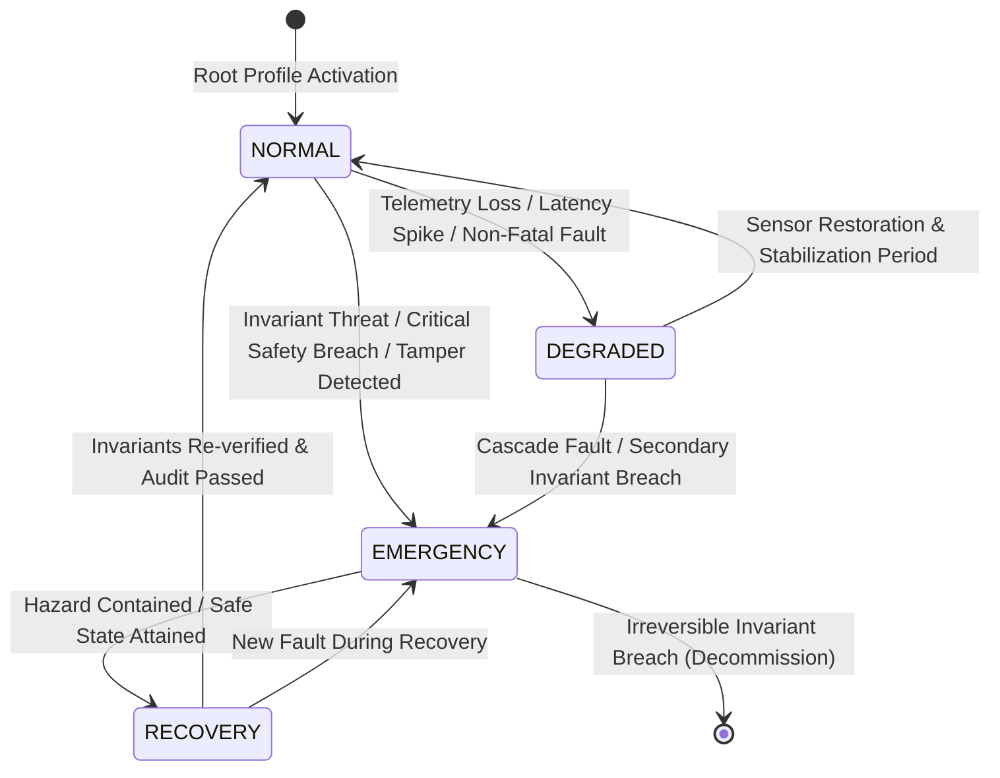

# Architectural Specification: Operating Modes & State Postures

## 1. Executive Definition

In UoW v2.0, an **Operating Mode** defines the operational posture, active goals, permitted action spaces, and safety margins of a running system. Rather than having a static configuration, the system transitions between discrete modes based on environmental telemetry, subsystem availability, and invariant proximity.

$$\boxed{\text{Operating Mode } M \in \{\text{NORMAL}, \text{DEGRADED}, \text{EMERGENCY}, \text{RECOVERY}\}}$$

---

## 2. Canonical Operating Modes

### 2.1 `NORMAL` (Nominal Operations)
* **Posture**: Full operational capability, unconstrained goal pursuit, standard latency/throughput budgets.
* **Active Objectives**: Primary mission objectives (e.g. inventory reservation, high-throughput message processing, utility maximization).
* **Action Space**: Complete catalog of white-listed operations defined in `action_space["NORMAL"]`.
* **Telemetry Requirements**: All declared sensor namespaces must report with confidence $\ge \tau_{\text{min}}$ and staleness $\le T_{\text{max}}$.
* **Fallback Mode**: `DEGRADED`.

### 2.2 `DEGRADED` (Constrained Operations)
* **Posture**: Reduced operational footprint following partial telemetry failure, node partition, or secondary resource exhaustion.
* **Active Objectives**: Core service maintenance, conservative resource utilization, task shedding. Secondary optimization goals (e.g. speculative prefetching, deep reasoning) are suspended.
* **Action Space**: Restricted to read operations, essential mutations, and conservative rate limits.
* **Hysteresis**: Return to `NORMAL` requires continuous nominal telemetry for a minimum stabilization window (e.g. 60 seconds) to prevent flapping.
* **Fallback Mode**: `EMERGENCY`.

### 2.3 `EMERGENCY` (Hazard Containment & Fail-Safe)
* **Posture**: Immediate hazard containment and preservation of physical or financial invariants.
* **Active Objectives**: Bring system to a verified fail-safe state, prevent cascade failures, isolate corrupted namespaces. All standard business objectives are aborted.
* **Action Space**: Exclusively safety interlocks, emergency disconnects, load-shedding, and diagnostic logging. Any standard mutation proposal is rejected with `ERR_OPERATION_PROHIBITED_IN_MODE`.
* **Autonomous Return Prohibited**: The system *cannot* autonomously return from `EMERGENCY` directly to `NORMAL`. It must transition to `RECOVERY`.
* **Fallback Mode**: Halt / Decommission.

### 2.4 `RECOVERY` (Audited Restoral)
* **Posture**: Controlled post-emergency state re-qualification.
* **Active Objectives**: Verify cryptographic evidence continuity, reconcile ledger entries, execute rollback sagas if necessary, confirm physical/data invariants are satisfied.
* **Action Space**: Audit verification, reconciliation UoWs, state re-sync operations.
* **Exit Gate**: Transition from `RECOVERY` to `NORMAL` requires:
  1. Complete invariant re-evaluation over current `WorldState` confirming $\forall i \in \text{Invariants}, i(S_t) = \text{True}$.
  2. Cryptographic attestation signed by designated governance authority or operator token.
  3. Clean execution of all pending compensating sagas.

---

## 3. Action Space Gating by Mode

Every proposed Unit-of-Work operation $O_k$ has an authorized modes set $\mathcal{M}(O_k)$ derived from `SystemDesignProfile.action_space`:

$$\text{Operation Authorized} \iff M_{\text{current}} \in \mathcal{M}(O_k)$$

If an agent proposes an operation valid in `NORMAL` while the system is in `DEGRADED` or `EMERGENCY`, the certifier immediately rejects the proposal:
$$\text{CERTIFY}(\pi, S_t) \longrightarrow \text{REJECT}(\text{ERR\_OPERATION\_PROHIBITED\_IN\_MODE})$$

---

## 4. Hysteresis & Anti-Flapping Mechanics

To prevent rapid oscillation between modes due to noisy sensor readings:
1. **Escalation (Increasing Restriction)**: Occurs **immediately** upon certified trigger evaluation ($\Delta t = 0$).
2. **De-escalation (Decreasing Restriction)**: Requires:
   - All trigger conditions evaluated to False.
   - Telemetry sustained within nominal bounds for duration $T_{\text{stabilization}}$.
   - Monotonic causal sequence advance without warning events.
