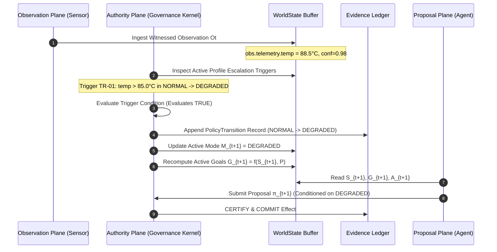

# Architectural Specification: Observation-Triggered Policy Transitions

## 1. Executive Transition Chain

The Policy Transition engine formalizes how environmental observations deterministically drive operational posture shifts:

$$\boxed{O_t \longrightarrow \text{Certified Condition Evaluation} \longrightarrow \text{Mode Transition} \longrightarrow G_{t+1}}$$



---

## 2. Separation of Powers in Transitions

### 2.1 Sensors Cannot Propose or Execute Transitions
* Sensors only report what they observe ($O_t$).
* A sensor packet cannot contain an instruction to "switch to emergency mode".
* Any observation claiming authority or proposing action is classified as `UNVERIFIED_CLAIM` and stripped of control semantics.

### 2.2 Agents Cannot Mutate Policy or Operating Mode
* Autonomous agents propose actions within the authorized action space $A(M_t)$.
* An agent proposal attempting to directly set `WorldState.operating_mode` or modify `SystemDesignProfile` is rejected with `ERR_AUTHORITY_DENIED`.
* Policy transitions are strictly governed by certified triggers or root authority signatures.

### 2.3 Kernel Evaluates Certified Triggers
* The Authority Kernel continuously inspects incoming verified observations against the `escalation_triggers` declared in `SystemDesignProfile`.
* When an escalation condition evaluates to True:
  1. The kernel verifies observation confidence: $\text{conf}(O_t) \ge \tau_{\text{required}}$.
  2. The kernel verifies observation freshness: $\Delta t \le T_{\text{max\_staleness}}$.
  3. The kernel produces a formal `PolicyTransition` structure.
  4. The `PolicyTransition` is committed to the immutable `EvidenceLedger`.
  5. Current operating mode $M$ is advanced atomically.
  6. Active goals $G_{t+1}$ and permitted action space $A_{t+1}$ are re-derived.

---

## 3. Formal Policy Transition Primitive

A certified transition conforms to [`policy_transition.json`](file:///spec/schemas/policy_transition.json):

```json
{
  "transition_id": "pt-20260924-001",
  "profile_id": "uow.grid.energy_balancer",
  "profile_version": "1.2.0",
  "previous_mode": "NORMAL",
  "target_mode": "DEGRADED",
  "trigger_event": {
    "trigger_type": "SENSOR_OBSERVATION",
    "trigger_id": "TR-THERMAL-EXCEEDANCE",
    "condition_matched": "obs.telemetry.temp > 85.0",
    "observed_value": 88.5,
    "confidence": 0.98
  },
  "evaluated_at": "2026-09-24T22:30:00Z",
  "causal_epoch": 1420,
  "certified_by": "kernel.certifier.node-1",
  "witness_hash": "a1b2c3d4e5f60718293a4b5c6d7e8f90a1b2c3d4e5f60718293a4b5c6d7e8f90"
}
```

---

## 4. Reversion & Recovery Transitions

Transitions from high restriction to lower restriction (`EMERGENCY` $\to$ `RECOVERY` $\to$ `NORMAL`) are governed by symmetric rigor:
* **No Automatic Escalation Down From Emergency**: An emergency state requires explicit attestation from root authority or physical reset witnesses.
* **Audit Pre-condition**: Transitioning from `RECOVERY` to `NORMAL` evaluates:
  1. $\forall i \in \text{Invariants}, i(S_t) == \text{True}$.
  2. All open fault receipts in the `EvidenceLedger` are resolved.
  3. Telemetry has remained nominal for the full stabilization window.
