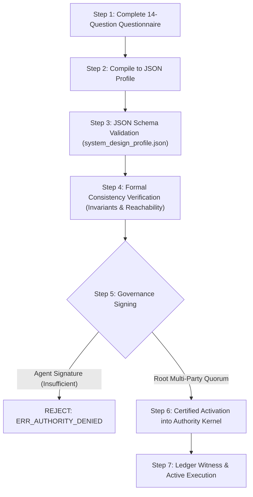

# Authoring Methodology: 14-Question Construction Guide for System Design Profiles

## 1. Executive Authoring Principle

$$\boxed{\text{AI may draft policy} \neq \text{AI may activate policy}}$$

The Design / Policy Plane welcomes autonomous agents, LLMs, and automated synthesis tools to **draft, simulate, and optimize** candidate mission profiles. However, **activation into the Authority Plane** strictly requires root governance credentials (e.g., cryptographic multi-party hardware quorum).

An AI system or agent may generate the profile JSON, but any attempt to self-authorize or activate it without valid root cryptographic signatures fails closed with `ERR_AUTHORITY_DENIED`.

---

## 2. The 14-Question Construction Methodology

Every mission profile must answer these 14 structured questions before compilation into a machine-readable [`SystemDesignProfile`](file:///spec/schemas/system_design_profile.json):

### Section I: Identity, Scope & Authority
1. **System Identity**: What is the canonical name, semantic version, domain, and issuing authority for this profile?
2. **Mission Statement**: What is the explicit operational purpose, scope of action, and rationale for this system?
3. **Domain Classification**: What safety tier applies (`SAFETY_CRITICAL`, `FINANCIAL_AUDITED`, `MISSION_CRITICAL`, `OPERATIONAL_STANDARD`, `RESEARCH_EXPERIMENTAL`)?

### Section II: Boundaries & Constraints ($\text{Constraints} \neq \text{Objectives}$)
4. **Hard Invariants**: What state conditions must NEVER be violated under any circumstances, regardless of potential utility gains or optimization tradeoffs?
   * *Requirement*: Must specify `formal_expression`, `severity: HARD_CONSTRAINT`, and `enforcement: FAIL_CLOSED`.

### Section III: Operational Postures & Dynamics
5. **Operating Modes**: What discrete operational states exist (e.g. `NORMAL`, `DEGRADED`, `EMERGENCY`, `RECOVERY`)?
6. **Mode Entry/Exit Criteria**: What verified state conditions govern entry and exit for each mode?
7. **Objectives by Mode**: What specific goals ($G_t = f(S_t, P)$) are active in each mode?
   * *Requirement*: Every goal must be an objective, never a hard constraint (`is_hard_constraint: false`).
8. **Priority Dominance**: When active goals conflict within a mode, what is the strict lexicographic precedence order?

### Section IV: Interfaces, Actions & Telemetry
9. **Action Space Permissibility**: What Unit-of-Work operations are explicitly authorized in each operating mode, and what minimum authority level is required?
10. **Observation Requirements**: What sensor namespaces, modalities, minimum confidence scores, and freshness windows are mandatory for nominal operation?
11. **Performance Metrics**: What quantitative metrics evaluate operational success, efficiency, and safety margins?

### Section V: Escalation, Authority & Lifecycle
12. **Escalation Triggers**: What certified sensor observations or evidence events force immediate escalation to a restricted mode?
13. **Cryptographic Authority & Activation**: Who holds the root public key or quorum threshold ($M$-of-$N$) required to activate this profile?
14. **Decommission Criteria**: When does this profile sunset, expire, or irreversibly terminate?

---

## 3. Authoring Workflow: From Draft to Certified Execution



### Step 1 & 2: Drafting & JSON Compilation
Architects or AI drafting assistants complete the questionnaire and serialize it into the 11-section JSON schema.

### Step 3: Schema Validation
Validate the compiled document using the canonical schema:
```powershell
python -c "import jsonschema, json; jsonschema.validate(json.load(open('profile.json')), json.load(open('spec/schemas/system_design_profile.json')))"
```

### Step 4: Formal Consistency Analysis
Verify that:
1. Feasible state space $\Omega$ is non-empty (no self-contradictory invariants).
2. All declared operating modes have defined fallback paths.
3. Every referenced operation ID exists in `spec/operations/manifest.yaml`.
4. All goal definitions have `is_hard_constraint == false`.

### Step 5 & 6: Cryptographic Activation
The root authority inspects the profile digest and signs the `authority_boundary`:
```json
"authority_boundary": {
  "issuing_authority_id": "root.governance.committee",
  "root_public_key": "ed25519:7f83b1657ff1fc53b92dc18148a1d65dfc2d4b1fa3d677284addd200126d9069",
  "min_quorum_signatures": 1,
  "activation_signature": "sig:ed25519:e4d909c290d0fb1ca068ffaddf22cbd0...",
  "activation_timestamp": "2026-09-24T22:35:00Z"
}
```

The Authority Kernel verifies the signature against the trusted root keyring and commits the activation to the `EvidenceLedger`.
