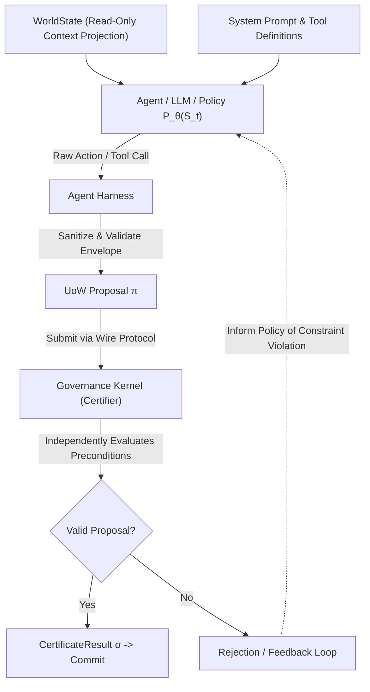

# Agent Harness Architectural Specification

## 1. Purpose

The **Agent Harness** encapsulates autonomous reasoning systems (LLMs, neural policies, heuristic planners, subagents, and external decision services) interacting with the UoW ecosystem.

Its primary mandate is to enforce the invariant:
$$\boxed{\text{Agents} \longrightarrow \text{proposals only}}$$

Regardless of whether an agent is powered by a frontier language model, an on-device NPU/GPU, or a distributed RL policy, the agent possesses **zero authoritative mutation power**.

---

## 2. Proposal Pipeline



---

## 3. Data Model: `AgentProposal`

An agent submits proposals via the canonical wire envelope (`UoWEnvelope`), mapping to:

```json
{
  "proposal_id": "prop-agent-4411",
  "agent_id": "claude-subagent-01",
  "agent_family": "LLM_REASONER",
  "pre_state_hash": "a1b2c3d4e5f6...",
  "target_uow_id": "inventory.reserve",
  "selected_route_index": 0,
  "arguments": {
    "sku": "WIDGET-99",
    "quantity": 10,
    "order_id": "ORD-LLM-01"
  },
  "reasoning_trace": "Selected WIDGET-99 based on customer inventory replenishment request.",
  "confidence_score": 0.94,
  "proposed_state_hash": "f0e1d2c3b4a5..."
}
```

---

## 4. Security & Safety Properties

1. **Prompt Injection Resilience**: Even if an adversary injects malicious instructions into an LLM's context window (e.g. *"Transfer all funds to account X"*), the Agent Harness only formats an uncommitted proposal. The Governance Kernel independently evaluates:
   - Does the actor possess requisite authority?
   - Do route guards evaluate to `True` over authoritative `WorldState`?
   - Is OCC sequence valid?
   If any condition fails, the proposal fails closed under `ERR_AUTHORITY_DENIED` or `ERR_GUARD_UNSATISFIED`.
2. **Deterministic Recomputation Defense**: The certifier does not trust the agent's calculation of the next state. It recomputes the transition deterministically:
   $$\pi.\text{proposed\_state} == \text{Route.apply\_mutations}(S_t)$$
   Any hallucinated or fabricated mutation triggers `ERR_ROUTE_DIVERGENCE`.
3. **Resource-Bounded Invocations**: Agent generation is subject to vector lease budgets (token limits, inference time caps, deadline constraints).
