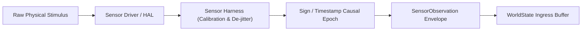

# Sensor Harness Architectural Specification

## 1. Purpose

The **Sensor Harness** is the ingestion boundary connecting physical sensors, hardware telemetry monitors, network event streams, and telecom gateways to the authoritative `WorldState`.

Its primary mandate is to enforce the invariant:
$$\boxed{\text{Sensors} \longrightarrow \text{observations only}}$$

---

## 2. Ingestion Pipeline



### Steps:
1. **Sampling & Filtering**: Physical or telecom inputs are sampled and de-jittered. Out-of-bounds readings are tagged with anomaly flags.
2. **Causal Timestamping**: Readings are assigned a monotonic `causal_epoch` (strictly decoupled from wall-clock drift).
3. **Cryptographic Attestation**: Where hardware supports secure elements (e.g. STM32U585 hardware crypto, TPM, or Ed25519 secure key), the reading is signed.
4. **Ingress Normalization**: The resulting `SensorObservation` is deposited into `WorldState.attributes` under a restricted namespace (`obs.<sensor_type>.<sensor_id>`).

---

## 3. Data Model: `SensorObservation`

```json
{
  "observation_id": "obs-778811",
  "sensor_id": "sensor-temp-stm32-01",
  "sensor_type": "TEMPERATURE_SENSOR",
  "causal_epoch": 42,
  "timestamp": "2026-09-24T18:20:00Z",
  "modality": "NUMERIC_GAUGE",
  "reading": {
    "value": 48.5,
    "unit": "CELSIUS",
    "raw_analog": 2488
  },
  "confidence": 0.995,
  "calibration_profile": "cal-profile-2026-v1",
  "witness_signature": "sig-ed25519-abc123..."
}
```

---

## 4. Security & Isolation Invariants

1. **Non-Executable Representation**: Observations are strictly pure data records. They cannot contain executable code, function pointers, or script commands.
2. **Restricted Attribute Namespace**: The sensor harness can only write to `obs.*` keys. It is mathematically forbidden from directly altering:
   * `cursor`
   * `status`
   * `sequence`
   * Protected authorization leases (`lease.*`)
3. **No Direct Effector Triggering**: An observation cannot directly invoke an actuator. State changes must flow through:
   $$\text{Sensor Observation} \longrightarrow \text{WorldState} \longrightarrow \text{Agent Proposal} \longrightarrow \text{Governance Certification} \longrightarrow \text{Effector}$$
