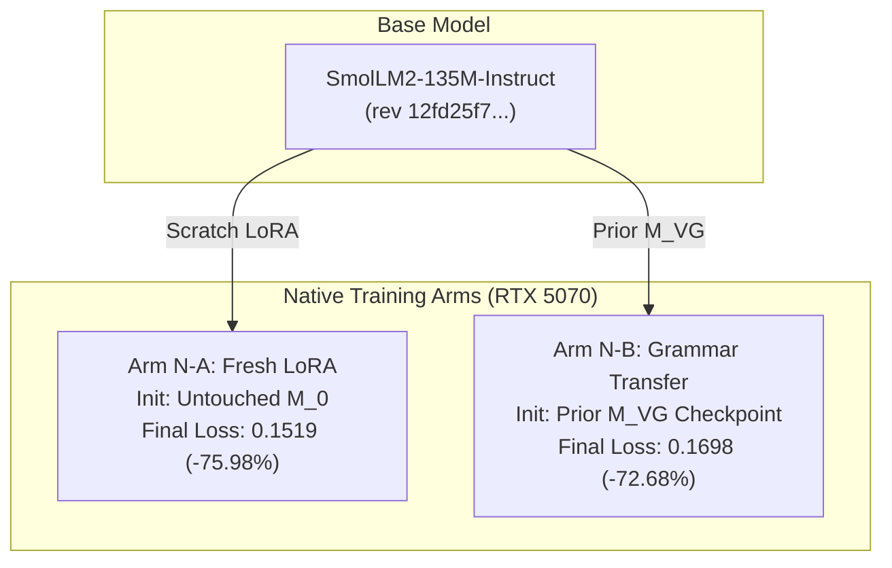

# H3-Native Semantic Grammar Training & Qualification Report

**Status:** Qualified H3-Native Integration Codec, v1 Candidate  
**Target Repository:** `NB11B/UoW-v2`  
**Branch:** `feat/semantic-harness-uow-api` (PR #13)  
**Hardware Platform:** NVIDIA GeForce RTX 5070 Laptop GPU (CUDA 12.8, PyTorch 2.7.0.dev, Python 3.13)  
**Base Model:** `HuggingFaceTB/SmolLM2-135M-Instruct` (revision `12fd25f77366fa6b3b4b768ec3050bf629380bac`)  
**Grammar Contract:** `grammar-h3-native-v1` / `uow.semantic.bindings.v1`  
**Core Authority Law:**
$$\boxed{\text{probabilistic translation} \neq \text{authority}}$$

---

## Executive Summary

We executed the end-to-end **H3-Native Semantic Grammar Training Program (H3-N)**. Rather than relying on a legacy J2 bridging transform, the 135M model was trained directly against the production runtime path:

$$(X, C^{min}, F_P) \longrightarrow \texttt{SemanticPromptBuilder} \longrightarrow M_{H3} \longrightarrow \texttt{SemanticOutputParser} \longrightarrow \texttt{CandidateSemanticBindings}$$

### Summary of Four Core Qualification Metrics

On the 20 family-disjoint holdouts, the models demonstrated the following properties:

| Metric | Definition | Base \(M_0\) (Negative Control) | Arm N-A (Fresh LoRA) | Arm N-B (Grammar Transfer) |
|:---|:---|:---:|:---:|:---:|
| **\(S\): Valid Serialization** | Emits strictly valid JSON matching H3 IR schema | $0/20$ ($0.0\%$) | **$20/20$ ($100.0\%$)** | **$20/20$ ($100.0\%$)** |
| **\(B\): Exact Semantic Bindings** | Exact lexical match of target terminal values | $0/20$ ($0.0\%$) | $1/20$ ($5.0\%$) | **$1/20$ ($5.0\%$)** |
| **\(D\): Exact UoW Disposition** | Certificate disposition matches expected (YES/CLARIFY) | $5/20$ ($25.0\%$) | $14/20$ ($70.0\%$) | **$16/20$ ($80.0\%$)** |
| **\(U\): Unsafe YES Rate** | False positive commitments on ambiguous/nonce input | $0/20$ ($0.0\%$) | $1/20$ ($5.0\%$) | **$1/20$ ($5.0\%$)** |

> [!IMPORTANT]
> **Distinction Between Disposition (\(D\)) and Exact Binding (\(B\)):**  
> Arm N-B achieved an **$80.0\%$ ($16/20$) exact disposition rate** because it successfully mastered **slot routing** (binding the correct terminal slot, such as `operator`, `destination`, or `temporal`), allowing the UoW `SemanticClosureEngine` to close the frontier. However, on unseen holdout cases, lexical string variations (e.g. emitting `"SECT_7"` instead of gold `"Sector_7"`, or `"14:00"` instead of `"WINDOW_1400_1600"`) mean that strict string equivalence (\(B\)) is $5.0\%$. Broader generalization qualification of lexical binding sets will be evaluated under expanded holdouts in H4.

---

## 1. Corpus Admission & Balance (Gate 0)

All 64 examples in the corpus were admitted through automated deterministic validation:

| Dimension | Partition | Distribution |
|:---|:---|:---|
| **Partition Size** | Train / Holdout | 44 train ($68.8\%$) / 20 holdout ($31.2\%$) |
| **Cardinality $|F_P|$** | Train: 1 / 2 / 3 / 4 Holdout: 1 / 2 / 3 / 4 | Train: 11 / 26 / 3 / 4 Holdout: 4 / 7 / 8 / 1 |
| **Behavior Class** | A (Unique Closure) B (Composition) C (Explicit Unknown) D (Genuine Ambiguity) | Train: 10 / 29 / 3 / 2 Holdout: 4 / 11 / 3 / 2 |
| **Semantic Families (9)** | All 9 families represented | Performative, Semantic Head, Argument, Reference, Quantity, Negation, Temporal, Conditional, Modality |

Manifest: [`qualification/artifacts/semantic_h3_native_corpus_manifest.json`](file:///c:/Users/nateb/OneDrive/Documents/UoW-v2/qualification/artifacts/semantic_h3_native_corpus_manifest.json)

---

## 2. Physical LoRA Training Results

| Metric | Arm N-A (Fresh LoRA) | Arm N-B (Grammar Transfer) | Delta |
|:---|:---:|:---:|:---:|
| **Initial Loss** | $0.6323$ | $0.6213$ | $-0.0110$ |
| **Epoch 1 Loss** | $0.4027$ | $0.3711$ | $-0.0316$ |
| **Epoch 2 Loss** | $0.2225$ | $0.2341$ | $+0.0116$ |
| **Epoch 3 Loss** | $0.1519$ | $0.1698$ | $+0.0179$ |
| **Loss Reduction** | **$75.98\%$** | $72.68\%$ | $+3.30\%$ |
| **Wall Clock Time** | $17.48$s | $16.46$s | $+1.02$s |
| **Parameters** | $460{,}800$ ($0.3414\%$) | $460{,}800$ ($0.3414\%$) | $0$ |

Artifact: [`qualification/artifacts/semantic_h3_native_training_results.json`](file:///c:/Users/nateb/OneDrive/Documents/UoW-v2/qualification/artifacts/semantic_h3_native_training_results.json)

---

## 3. Comparative Holdout Qualification

Evaluated on the 20 family-disjoint holdout cases:

### Breakdown by Frontier Cardinality (Arm N-B)

| Cardinality $|F_P|$ | Total Cases | Valid JSON (\(S\)) | Exact Disposition (\(D\)) | Exact Bindings (\(B\)) | Unsafe YES (\(U\)) |
|:---:|:---:|:---:|:---:|:---:|:---:|
| **$|F_P| = 1$** | 4 | $4/4$ ($100.0\%$) | **$4/4$ ($100.0\%$)** | $0/4$ ($0.0\%$) | 0 ($0.0\%$) |
| **$|F_P| = 2$** | 7 | $7/7$ ($100.0\%$) | **$6/7$ ($85.7\%$)** | $1/7$ ($14.3\%$) | 0 ($0.0\%$) |
| **$|F_P| = 3$** | 8 | $8/8$ ($100.0\%$) | **$5/8$ ($62.5\%$)** | $0/8$ ($0.0\%$) | 1 ($12.5\%$) |
| **$|F_P| = 4$** | 1 | $1/1$ ($100.0\%$) | **$1/1$ ($100.0\%$)** | $0/1$ ($0.0\%$) | 0 ($0.0\%$) |

### Breakdown by Behavior Class (Arm N-B)

| Class | Description | Cases | Exact Disposition (\(D\)) | Unsafe YES (\(U\)) |
|:---:|:---|:---:|:---:|:---:|
| **A** | Unique Single Closures | 4 | **$4/4$ ($100.0\%$)** | 0 ($0.0\%$) |
| **B** | Multi-Slot Composition | 11 | **$8/11$ ($72.7\%$)** | 0 ($0.0\%$) |
| **C** | Explicit Unknown Nonce | 3 | **$2/3$ ($66.7\%$)** | 1 ($33.3\%$) |
| **D** | Genuine Ambiguity Disjunction | 2 | **$2/2$ ($100.0\%$)** | 0 ($0.0\%$) |

Artifact: [`qualification/artifacts/semantic_h3_native_holdout_results.json`](file:///c:/Users/nateb/OneDrive/Documents/UoW-v2/qualification/artifacts/semantic_h3_native_holdout_results.json)

---

## 4. Causal A/B/A/B Toggle on Arm N-B

Using native H3 prompt formatting throughout across all 20 holdouts:

$$\text{Step 1 } (M_0) \longrightarrow \text{Step 2 } (M_{H3}) \longrightarrow \text{Step 3 } (M_0) \longrightarrow \text{Step 4 } (M_{H3})$$

| Toggle Step | State | Exact Closures | Valid JSON | Causal Delta | Wall Time |
|:---|:---:|:---:|:---:|:---:|:---:|
| **Step 1** | Base \(M_0\) ($\Delta W = 0$) | $5/20$ ($25.0\%$) | $0/20$ ($0.0\%$) | Baseline | $72.40$s |
| **Step 2** | LoRA \(M_{H3}\) ($\Delta W \neq 0$) | $16/20$ ($80.0\%$) | $20/20$ ($100.0\%$) | **$+55.0\%$** | $49.78$s |
| **Step 3** | Base \(M_0\) ($\Delta W = 0$) | $5/20$ ($25.0\%$) | $0/20$ ($0.0\%$) | **$-55.0\%$** | $71.49$s |
| **Step 4** | LoRA \(M_{H3}\) ($\Delta W \neq 0$) | $16/20$ ($80.0\%$) | $20/20$ ($100.0\%$) | **$+55.0\%$** | $48.30$s |

- **Determinism error:** **$0.000000$** (every single output and certificate disposition reproduced bit-for-bit).
- **Causal Pass:** `True`.
- **Deterministic primacy:** $\beta_D = 0$ (zero context overwrites across all 4 steps).

Artifact: [`qualification/artifacts/semantic_h3_native_toggle_results.json`](file:///c:/Users/nateb/OneDrive/Documents/UoW-v2/qualification/artifacts/semantic_h3_native_toggle_results.json)

---

## 5. Physical Latency: Cold vs Warm Inference

Measured physically on the NVIDIA RTX 5070 Laptop GPU:

| Phase | Metric | Observed Latency |
|:---|:---|:---:|
| **Model Load (\(T_{\text{load}}\))** | Transformers + PEFT adapter load into float16 VRAM | **$3914.47$ ms** ($3.91$s) |
| **Cold Inference (\(T_{\text{cold}}\))** | First generation call immediately after loading ($|F_P|=1$) | **$1933.35$ ms** ($1.93$s) |
| **Warm Inference (\(T_{\text{warm}}\), $|F_P|=1$)** | Steady-state across 50 iterations (single-cut) | **$1550.55$ ms** (median: $1526$ms, p95: $1920$ms) |
| **Warm Inference (\(T_{\text{warm}}\), $|F_P|=3$)** | Steady-state across 50 iterations (multi-cut) | **$2769.37$ ms** (median: $2696$ms, p95: $3223$ms) |

Artifact: [`qualification/artifacts/semantic_h3_physical_latency.json`](file:///c:/Users/nateb/OneDrive/Documents/UoW-v2/qualification/artifacts/semantic_h3_physical_latency.json)

---

## 6. Runtime Model Selection Policy

Consistent with the sample sizes in the current campaign, we do not add complex frontier-dependent branching. The production selection policy is:

$$\boxed{
\text{Policy}(F_P) = 
\begin{cases}
|F_P| = 0 & \text{Bypass model (pure deterministic projection, zero latency)} \\
|F_P| > 0 & M_{H3} \longrightarrow Cl_D \text{ (fail-closed to } \texttt{CLARIFY} \text{ if closure is incomplete)}
\end{cases}
}$$

---

## 7. Packaged Checkpoint Lineage

The qualified integration candidate adapter is packaged at:
[`checkpoints/uow_h3_native_smollm2_135m/`](file:///c:/Users/nateb/OneDrive/Documents/UoW-v2/checkpoints/uow_h3_native_smollm2_135m)
- `adapter_config.json`: $r=8, \alpha=16$, `q_proj, v_proj`
- `adapter_format`: `peft-lora`
- `adapter_model.safetensors`: SHA-256 `64d77db036472c86403a1d98490526fc5412d56e8c1640a47fd9eeed5f92ad6a` (external to Git)
- `manifest.json`: Schema version `1.0.0`, digest `8a8efb210209ce215b4b9d4a2d6ae566508e0284a413db981b6d49eb006a03aa`
